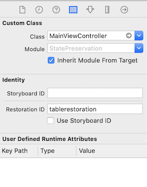
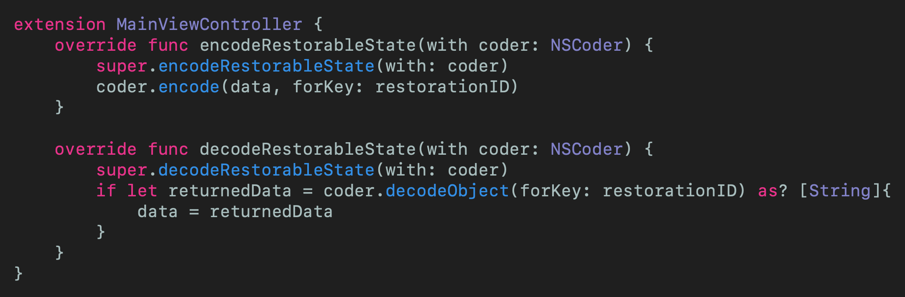

# State Preservation in UIKit
## Also restoration, if not what is the point?

<br/>
<sub>Photo by kyryll ushakov on Unsplash <sub>

# Terminology:
State: The particular condition that the App is in at a specific time

# Prerequisites:
- You will be expected to be aware how to make a [Single View Application](https://medium.com/swlh/your-first-ios-application-using-xcode-9983cf6efb71)

# The user-case
We've all been there. You're filling out your details for a shopping expedition on the new yoursupermarket App that you've just downloaded - you need more sponges for your "condition" and some vanilla powder for a cake. 

Then…you see a squirrel run by. This has to be shared with the world!

<br/>

You come back to your shopping cart and, you're back to the welcome screen.

This is the most awful thing that has happened ever. This is awful! Who do you take it out on? **yoursupermarket**. Customer satisfaction really is this important - you really need to get your customer experience up to scratch and get your customer back to the state they were on **before** closing the App.

In steps `State Preservation` and `Restoration`.

# The App
This App is going to feature a list of items that can be added to your basket using *yoursupermarket*. Awesome.

# The iOS 12 Version
## Removing the Scene Delegate
1. Remove the Scene delegate methods from `AppDelegate` and delete the Scene delegate file
2. Remove `UIApplicationSceneManifest` from the `Info.plist`
3. Add var `window:UIWindow?` in the `AppDelegate`

# App Delegate
In the App delegate we can opt-in to the ApplicationState restore and save.

```swift 
func application(_ application: UIApplication, shouldSaveApplicationState coder: NSCoder) -> Bool {
    return true
}
func application(_ application: UIApplication, shouldRestoreApplicationState coder: NSCoder) -> Bool {
    return true
}
```

## Assign a restoration id
In the storyboard we can add a restoration id: `tablerestoration` 



This is for the `UIViewController`, however we need to also set the Restoration ID for the `UITableView`. The latter has been created **programatically** in this version of the App - which means we need to set the restoriationIdentifier by defining the `restorationID` in the view controller:

```swift
let restorationID = "tableviewrestoration"
```

and then we can set this in the `viewDidLoad()` function.

```swift
tableView.restorationIdentifier = "tableviewrestoration"
```

## Functions in each UIViewController
Here we only have a single `UIViewController` and we can add in the following couple of functions - `func encodeRestorableState(with coder: NSCoder)` and `func decodeRestorableState(with coder: NSCoder)`



**It is recommended that you call super to allow any classes up the chain to perform restore operations.**

Therefore: BOOM.
Want the entire code? I can do that for you:


# The iOS 13 Version
## Removing the Scene Delegate
1. Remove the Scene delegate methods from `AppDelegate` and delete the Scene delegate file
2. Remove `UIApplicationSceneManifest` from the `Info.plist`
3. Add var `window:UIWindow?` in the `AppDelegate`

## restoration ID
In the storyboard we can add a restoration id:

`tablerestoration` which can be set in the Storyboard


This is for the `UIViewController`

## The AppDelegate
We replace the AppDelegate functions with the following:

```swift
var window: UIWindow?

func application(_ application: UIApplication, willFinishLaunchingWithOptions launchOptions: [UIApplication.LaunchOptionsKey : Any]? = nil) -> Bool {
        return true
    }
    
    func application(_ application: UIApplication, shouldRestoreSecureApplicationState coder: NSCoder) -> Bool {
        return true
    }
    func application(_ application: UIApplication, shouldSaveSecureApplicationState coder: NSCoder) -> Bool {
        return true
    }
    
    func application(_ application: UIApplication, viewControllerWithRestorationIdentifierPath identifierComponents: [String], coder: NSCoder) -> UIViewController? {
        return coder.decodeObject(forKey: "Restoration ID") as? UIViewController
        
    }
    func application(_ application: UIApplication, didDecodeRestorableStateWith coder: NSCoder) {
        UIApplication.shared.extendStateRestoration()
        DispatchQueue.main.async {
            UIApplication.shared.completeStateRestoration()
        }
    }
```

## View Controller
Within the ViewController I'm storing the tableView.contentOffset with the following:

```swift
override func encodeRestorableState(with coder: NSCoder) {
    super.encodeRestorableState(with: coder)
    coder.encode(tableView?.contentOffset.y, forKey: "tableView.contentOffset.y")
}

override func decodeRestorableState(with coder: NSCoder) {
    super.decodeRestorableState(with: coder)
    if let tableViewY = coder.decodeObject(forKey: "tableView.contentOffset.y") as? CGFloat {
        tableView?.contentOffset.y = tableViewY
    }
}
```

# Testing
Simply sending the App to the background is insufficient to test whether the Application state has been saved correctly (the order of the following is important):
- Launch the App in the simulator and make changes to the App in order to create a state. In the example above, the tableview can be scrolled and a cell selected
- Use the home button to send the App to the background; this can be done using the shortcut ⇧⌘H
- In Xcode stop the App execution

The App is no longer running, but there is a saved background state from within the App. We can then reload the App - and it will come back to the foreground with the current state saved.

# Why does it matter?
User experience is key. Ever used Apple Music, stopped playing and putting the App in the background? It'll lose the track - it's painful and a poor experience.

Want customer delight? You'll have to do better!

# Conclusion
Saving the state of an application is important for that user experience. In order to give your user that great experience it is a good idea to implement state preservation - it certainly isn't too difficult and could well give your App that edge over the competition.

Note: This is the iOS12 way of doing things, and you may run into issues if you are going to do this persistence on iOS13 or using iPADOS. The solution? [Apple have you covered](https://medium.com/r/?url=https%3A%2F%2Fdeveloper.apple.com%2Fdocumentation%2Fuikit%2Fuiviewcontroller%2Frestoring_your_app_s_state).
I hope this article has been of help to you, and you can see the code from this is included in the attached [Repo](https://medium.com/r/?url=https%3A%2F%2Fgithub.com%2Fstevencurtis%2FSwiftCoding%2Ftree%2Fmaster%2FAlamofireNetworking) to get the whole lot in one go!

If you've any questions, comments or suggestions please hit me up on [Twitter](https://twitter.com/stevenpcurtis)

