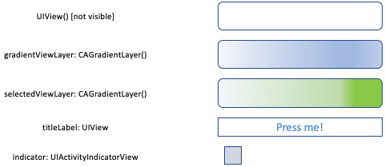
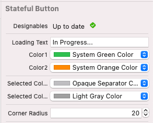

# Create a Stateful Loading Button in Swift
## Draw it correctly



# Before we start
When users hammer a button and you are making an API call, it can be a disaster. You really need to lock the button to stop a user doing that.

You could use `isEnabled`, but where is the user feedback for that?

You could look at this article, and create a rather nice class in order to do that. 

Difficulty: Beginner | Easy | **Normal** | Challenging<br>
This article has been developed using Xcode 12.2, and Swift 5.3

## Prerequisites
* You'll need to either be able to write [an iOS application](https://medium.com/swlh/your-first-ios-application-using-xcode-9983cf6efb71) or write some Swift code in [Playgrounds](https://medium.com/@stevenpcurtis.sc/coding-in-swift-playgrounds-1a5563efa089)

## Keywords and Terminology
CAGradientLayer: A layer that draws a colour gradient over any background colour
UIButton: A control that responds to user interactions

## The Repo
I've prepared a [Repo](https://github.com/stevencurtis/SwiftCoding/tree/master/StatefulButtonSubclass) to make things a little easier to follow. Do download that and read on!

## The theory
Rather that creating an extension for a `UIButton`, this project is a `UIButton` subclass that can be used in a project.

When a user hammers a button because an API call feels like it takes too long for the user, this button will stop all those API calls being made.

In effect, the button helps you out with the design of your project. In other words, it's important.

## The result
The result here is split into being able to instantiate the Stateful button from the Storyboard rather than just from code. Therefore [@IBDesignable and @IBInspectable](https://medium.com/@stevenpcurtis.sc/using-ibdesignable-and-ibinspectable-in-swift-36d3e6befaa1) are used to enable the user to set properties in the storyboard.

The properties can be set in the storyboard<br>
<br>

## The code
Generally I feel that it is easier for the user to be able to set properties from the storyboard.

```swift
// the text to be displayed on the button during loading
@IBInspectable
private var loadingText: String?

// the left-hand side colour of the gradientViewLayer
@IBInspectable
private var color1: UIColor?

// the right-hand side colour of the gradientViewLayer
@IBInspectable
private var color2: UIColor?

// the left-hand side colour of the selectedViewLayer
@IBInspectable
private var selectedColor1: UIColor?

// the right-hand side colour of the selectedViewLayer
@IBInspectable
private var selectedColor2: UIColor?

// the cornerRadius of the button (and the layers contained within)
@IBInspectable
public var cornerRadius: CGFloat
{
    set (radius) {
        self.layer.cornerRadius = radius
        self.layer.masksToBounds = radius > 0
    }

    get {
        return self.layer.cornerRadius
    }
}
```

the initializer to set programatically leads to a rather long parameter list (and this is something that I've covered in [another medium article](https://stevenpcurtis.medium.com/avoid-long-parameter-lists-in-swift-ab8983fa72cb))

```swift
public init (text: String, loadingText: String, color1: UIColor, color2: UIColor, selectedColor1: UIColor, selectedColor2: UIColor, cornerRadius: CGFloat, frame: CGRect)
{
    // set the properties
    self.loadingText = loadingText
    self.color1 = color1
    self.color2 = color2
    self.selectedColor1 = selectedColor1
    self.selectedColor2 = selectedColor2
    // call super
    super.init(frame: frame)
    // call self after the call to super
    self.setTitle(text, for: .normal)
    self.setTitleColor(UIColor.systemBlue, for: .normal)
    self.cornerRadius = cornerRadius
    // run the setup function
    setupButton()
}
```

We set up the `gradientViewLayer` within a `setupButton` function that is called from the initializer and in `layoutSubviews()`. It makes sense to call this from `layoutSubviews()` as this is called when the view's layout is updated, perhaps due to an orientation change.

```swift
// set the frame of the gradient view
gradientViewLayer.frame = self.bounds
// set the gradientViewLayer colours
gradientViewLayer.colors = [firstGradientColor, secondGradientColor]
// set the corner radius
gradientViewLayer.cornerRadius = self.cornerRadius
// the start point of the gradient
gradientViewLayer.startPoint = CGPoint(x: 0.0, y: 0.5)
// the end point of the gradient
gradientViewLayer.endPoint = CGPoint(x: 1.0, y: 0.5)
// insert the gradientViewLayer as a sublayer
self.layer.insertSublayer(gradientViewLayer, at: 0)
```

A similar process is taken for the selectedViewLayer, which I've used to have a different gradient for the inoperative `UIButton`.

**The shadow**
There isn't too much to the shadow, but I haven't allowed the user to change the properties of the shadow (although this would be relatively simple to do).

```swift
// setup the offset for the shadow
layer.shadowOffset = CGSize(width: 0, height: 3)
// setup the radius for the shadow
layer.shadowRadius = 3
// setup the opacity of the shadow
layer.shadowOpacity = 0.3
// setup the colour of the shadow
layer.shadowColor = UIColor.black.cgColor
```

**The indicator**
The indicator needs to be brought forwards to the front of all the views (so we can see it).

```swift
// property for either side of the indicator
let indicatorSide: CGFloat = 15
// setup the frame of the indicator
indicator.frame = CGRect(x: indicatorSide / 2, y: self.frame.height / 2 - indicatorSide / 2 , width: indicatorSide, height: indicatorSide)
// setup the colour of the indicator
indicator.color = UIColor.gray
// insert the indicator as the subclass
self.addSubview(indicator)
// bring the indicator to the front
indicator.bringSubviewToFront(self)
```

**Add an action when the button is pressed**
The action actually depends on the state that the `UIButton` is currently in. For this reason, I chose an `enum` for the button state.

```swift
self.addTarget(self, action: #selector(setNextAction(_:)), for: [.touchUpInside])
```

That selector? Let us take a look:

```swift
@IBAction func setNextAction(_ sender: StatefulButton? = nil) {
    // switch according to the button
    switch sender?.status {
    case .enabled:
        setLoading()
    case .loading:
        setEnabled()
    case .disabled:
        break
    case .selected:
        setEnabled()
    default:
        break
    }
}
```

changing the button to a selected UI version, and we need to be mindful to hit the completedAction if one does exist:

```swift
private func setSelected() {
    // hide the gradient
    self.hideGradient()
    // disable the button
    self.isEnabled = false
    // set the status
    self.status = .selected
    // hit the completion action, if it exists
    completionAction?(self.status)
}
```

Which seems about right to me!

## The complete code
```swift
import UIKit

enum ButtonStatus : String {
    case enabled = "Enabled"
    case loading = "Loading"
    case disabled = "Disabled"
    case selected = "Selected"
}

@IBDesignable
class StatefulButton: UIButton {
    
    // the gradient view for the normal use of the UIButton
    private let gradientViewLayer = CAGradientLayer()
    // the gradient view for when the button is disabled or selected
    private let selectedViewLayer = CAGradientLayer()
    
    // a block to be run when called
    var completionAction: ((ButtonStatus) -> Void)?
    
    // part of the button's API, to use a callback in the containing view
    public func whenButtonClicked(completion: @escaping (ButtonStatus) -> Void) {
        completionAction = completion
    }

    // the text to be displayed on the button during loading
    @IBInspectable
    private var loadingText: String?

    // the left-hand side colour of the gradientViewLayer
    @IBInspectable
    private var color1: UIColor?
    
    // the right-hand side colour of the gradientViewLayer
    @IBInspectable
    private var color2: UIColor?
    
    // the left-hand side colour of the selectedViewLayer
    @IBInspectable
    private var selectedColor1: UIColor?
    
    // the right-hand side colour of the selectedViewLayer
    @IBInspectable
    private var selectedColor2: UIColor?
    
    // the cornerRadius of the button (and the layers contained within)
    @IBInspectable
    public var cornerRadius: CGFloat
    {
        set (radius) {
            self.layer.cornerRadius = radius
            self.layer.masksToBounds = radius > 0
        }

        get {
            return self.layer.cornerRadius
        }
    }
    
    // the status of the busson, initially set to enabled
    private var status: ButtonStatus = .enabled
    
    //activity indicator
    private let indicator: UIActivityIndicatorView = UIActivityIndicatorView (style: UIActivityIndicatorView.Style.medium)
    
    override init(frame: CGRect) {
        super.init(frame: frame)
        setupButton()
    }
    
    required init?(coder aDecoder: NSCoder) {
        super.init(coder: aDecoder)
        setupButton()
    }
    
    public init (text: String, loadingText: String, color1: UIColor, color2: UIColor, selectedColor1: UIColor, selectedColor2: UIColor, cornerRadius: CGFloat, frame: CGRect)
    {
        // set the properties
        self.loadingText = loadingText
        self.color1 = color1
        self.color2 = color2
        self.selectedColor1 = selectedColor1
        self.selectedColor2 = selectedColor2
        // call super
        super.init(frame: frame)
        // call self after the call to super
        self.setTitle(text, for: .normal)
        self.setTitleColor(UIColor.systemBlue, for: .normal)
        self.cornerRadius = cornerRadius
        // run the setup function
        setupButton()
    }

    // a general setup for both the storyboard class and the programmatic instantiation
    func setupButton() {
        // setup requires the 4 colours for the two gradients to be set
        guard let firstGradientColor = color1?.cgColor, let secondGradientColor = color2?.cgColor, let firstSelectedColor = selectedColor1?.cgColor, let secondSelectedColor = selectedColor2?.cgColor else {
            return
        }
        
        // set the bounds of the gradient view
        gradientViewLayer.frame = self.bounds
        // set the gradientViewLayer colours
        gradientViewLayer.colors = [firstGradientColor, secondGradientColor]
        // set the corner radius
        gradientViewLayer.cornerRadius = self.cornerRadius
        // the start point of the gradient
        gradientViewLayer.startPoint = CGPoint(x: 0.0, y: 0.5)
        // the end point of the gradient
        gradientViewLayer.endPoint = CGPoint(x: 1.0, y: 0.5)
        // insert the gradientViewLayer as a sublayer
        self.layer.insertSublayer(gradientViewLayer, at: 0)
        
        // set the  bounds of the repl
        selectedViewLayer.frame = self.bounds
        // set the selectedViewLayer colours
        selectedViewLayer.colors = [firstSelectedColor, secondSelectedColor]
        selectedViewLayer.cornerRadius = self.cornerRadius
        // the start point of the gradient
        selectedViewLayer.startPoint = CGPoint(x: 0.0, y: 0.5)
        // the end point of the gradient
        selectedViewLayer.endPoint = CGPoint(x: 1.0, y: 0.5)
        // insert the selectedViewLayer as a sublayer
        self.layer.insertSublayer(selectedViewLayer, at: 0)
        
        // setup the offset for the shadow
        layer.shadowOffset = CGSize(width: 0, height: 3)
        // setup the radius for the shadow
        layer.shadowRadius = 3
        // setup the opacity of the shadow
        layer.shadowOpacity = 0.3
        // setup the colour of the shadow
        layer.shadowColor = UIColor.black.cgColor

        // property for either side of the indicator
        let indicatorSide: CGFloat = 15
        // setup the frame of the indicator
        indicator.frame = CGRect(x: indicatorSide / 2, y: self.frame.height / 2 - indicatorSide / 2 , width: indicatorSide, height: indicatorSide)
        // setup the colour of the indicator
        indicator.color = UIColor.gray
        // insert the indicator as the subclass
        self.addSubview(indicator)
        // bring the indicator to the front
        indicator.bringSubviewToFront(self)
        // add a target to the button
        self.addTarget(self, action: #selector(setNextAction(_:)), for: [.touchUpInside])
    }
    
    @IBAction func setNextAction(_ sender: StatefulButton? = nil) {
        // switch according to the button
        switch sender?.status {
        case .enabled:
            setLoading()
        case .loading:
            setEnabled()
        case .disabled:
            break
        case .selected:
            setEnabled()
        default:
            break
        }
    }
    
    @IBAction func setSelectedAction(_ sender: UIButton? = nil) {
        setSelected()
    }
    
    @IBAction func setLoadingAction(_ sender: UIButton? = nil) {
        setLoading()
    }
    
    @IBAction func setDeSelectedAction(_ sender: UIButton? = nil) {
        setEnabled()
    }
    
    func setEnabled() {
        // hide the indicator
        indicator.isHidden = true
        // stop the indicator animating
        indicator.stopAnimating()
        // re-enable user interaction
        self.isUserInteractionEnabled = true
        // set the title for the text
        self.setTitle(loadingText, for: .disabled)
        // show the gradient
        self.showGradient()
        // enable the button
        self.isEnabled = true
        // set the status of the button
        self.status = .enabled
        // hit the completion action, if it exists
        completionAction?(self.status)
    }
    
    private func setSelected() {
        // hide the gradient
        self.hideGradient()
        // disable the button
        self.isEnabled = false
        // set the status
        self.status = .selected
        // hit the completion action, if it exists
        completionAction?(self.status)
    }
    
    func setLoading() {
        // hide the activity indicator
        indicator.isHidden = false
        // start the animation for the activity indicator
        indicator.startAnimating()
        // stop user interaction
        self.isUserInteractionEnabled = false
        // set the button title
        self.setTitle(loadingText, for: .disabled)
        // disable the button
        self.isEnabled = false
        // set the status
        self.status = .loading
        // hide the gradient
        self.hideGradient()
        // hit the completion action, if it exists
        completionAction?(self.status)
    }
    
    // hide the gradient
    private func hideGradient() {
        gradientViewLayer.isHidden = true
    }
    
    // show the gradient
    func showGradient() {
        gradientViewLayer.isHidden = false
    }
    
    // called after a view's layout is updated
    override func layoutSubviews() {
        super.layoutSubviews()
        // call the setup when the layout is updated, perhaps due to an orientation change
        setupButton()
    }
}
```

# Conclusion

The [Repo](https://github.com/stevencurtis/SwiftCoding/tree/master/StatefulButtonSubclass) makes things rather easier to understand, but I hope this article has in some respects made it easier to understand. 

Thanks for reading.

If you've any questions, comments or suggestions please hit me up on [Twitter](https://twitter.com/stevenpcurtis) 
