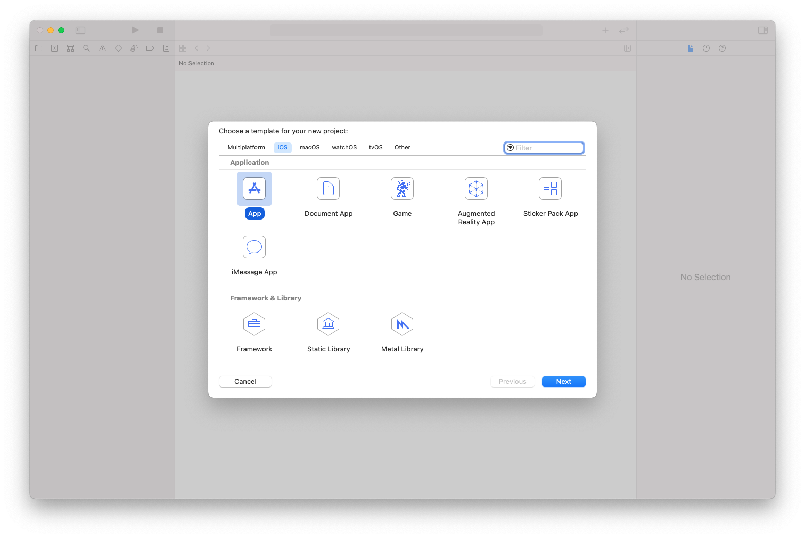
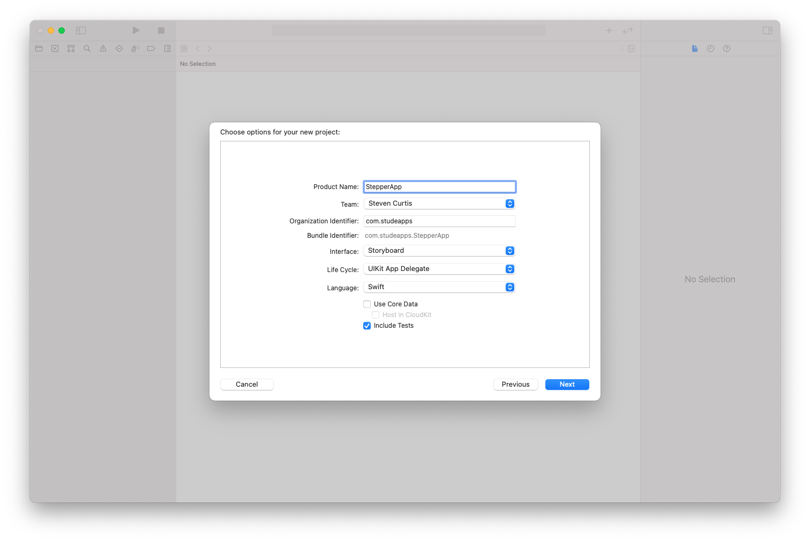
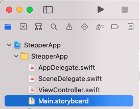
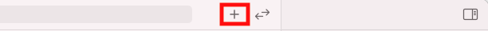
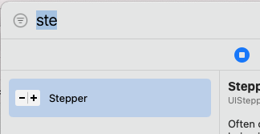
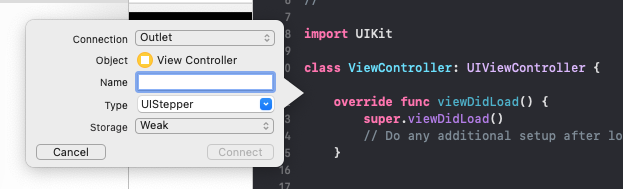
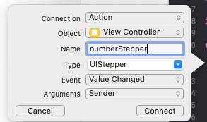
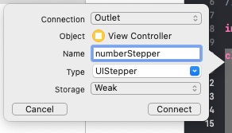
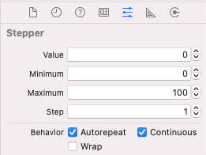

# Create UISteppers in Swift (Tutorial)
## Up-down

# Before we start
Difficulty: **Beginner** | Easy | Normal | Challenging<br/>
This article has been developed using Xcode 12.5, and Swift 5.4 

## Prerequisites:
* You need a working install of Xcode. A full guide of setting up an application is here: [Single View Application](https://medium.com/swlh/your-first-ios-application-using-xcode-9983cf6efb71) in Swift.
* It is useful to know something about [Storyboard Constraints](https://stevenpcurtis.medium.com/storyboard-constraints-18bcf6c5b0f9).

## Keywords and Terminology:
UIStepper: A control for incrementing or decrementing a value

A `UIStepper` is a great control and it allows users ot select a value. It is used to let users choose Integer values (that is, whole numbers), although you can change the step value (that is how much the resultant value increases or decreases) to a part-number and this makes the resultant number to be a part-number (that is, a double).

# The implementation
This project is going to create a `UIStepper` onto a `UIViewController`, and this is the tutorial to show you how!

## Using Storyboards
Open Xcode and create a new Single View App
<br>
Enter a suitable name for the app. Make sure that the Interface is set as Storyboard and the Language is set as Swift.
<br>
Select `Main.storyboard` on the left-hand side of the screen
<br>
now use the + at the top of the screen
<br>
Now search for stepper that will then appear on the selector
<br>
This can then be drag-dropped onto the storyboard. The best place is in the middle of the storyboard, and blue guidelines will appear to show that it is the middle of the view. We won't add [constraints](https://medium.com/@stevenpcurtis.sc/storyboard-constraints-18bcf6c5b0f9?sk=055faa48b727a50f54619ce7afc9be6f) in this particular article, but now would be the time to do that if you wanted!
With the `UIStepper` selected, you can now enter the assistant editor with Control-Option-Command-Enter.
Now you should control-drag from the `UIStepper` to the body of the `UIViewController` which will show the following

We will make a couple of changes - the connection will be the an Action, the name numberStepper and the type `UIStepper`
<br>
now all we are going to do is print the result to the screen, so the following will be the code when you have added the print statement:

```swift
class ViewController: UIViewController {
    @IBAction func numberStepper(_ sender: UIStepper) {
        print (sender.value)
    }
    override func viewDidLoad() {
        super.viewDidLoad()
        // Do any additional setup after loading the view.
    }
}
```

the result to the console will be:

```swift
1.0
0.0
```

depending on if you press the - or the +. Now don't be surprised if the stepper isn't in the middle of the view, since we didn't add [constraints](https://medium.com/@stevenpcurtis.sc/storyboard-constraints-18bcf6c5b0f9?sk=055faa48b727a50f54619ce7afc9be6f).

For some uses you would want to access the `UIStepper` instance itself, and to do so you can control-drag from the `UIStepper` to the view and choose Outlet and then give the `UIStepper` a name.
<br>
and then press connect.

The completed code is:
```swift
class ViewController: UIViewController {
    @IBOutlet weak var numberStepper: UIStepper!
    @IBAction func numberStepper(_ sender: UIStepper) {
        print (sender.value)
    }
    override func viewDidLoad() {
        super.viewDidLoad()
        // Do any additional setup after loading the view.
    }
}
```

You can change properties using the storyboard by selecting Main.storyboard, choosing the selector and then you can adjust the values as you would like!




## Using Code
There are plenty of programmers who prefer to add components using code.

Here is the code:

```swift
class ViewController: UIViewController {
    override func viewDidLoad() {
        super.viewDidLoad()
        setupComponents()
        setupConstraints()
    }
    var programaticStepper: UIStepper = UIStepper()
    func setupComponents() {
        // add the stepper to the view
        self.view.addSubview(programaticStepper)
        // we will take care of constraints
        programaticStepper.translatesAutoresizingMaskIntoConstraints = false
        // declare which function should be called when the stepper value is changed
        programaticStepper.addTarget(self, action: #selector(stepperChanged), for: .valueChanged)
    }
    func setupConstraints() {
        NSLayoutConstraint.activate([
            // center the stepper horizontally and vertially
            programaticStepper.centerYAnchor.constraint(equalTo: self.view.centerYAnchor),
            programaticStepper.centerXAnchor.constraint(equalTo: self.view.centerXAnchor)
        ])
    }
    
    @objc func stepperChanged(_ sender: UIStepper){
        print (sender.value)
    }
}
```

now we can change the properties with code too - and I would choose to do this at the end of the `setupComponents` function defined above:

```swift
// declare which function should be called when the stepper value is changed
programaticStepper.addTarget(self, action: #selector(stepperChanged), for: .valueChanged)
// Resume programaticStepper value from the beginning when it reaches the maximum
programaticStepper.wraps = false
// Set programaticStepper max value to 10
programaticStepper.maximumValue = 10
// If tap and hold the button, programaticStepper value will continuously increment
programaticStepper.autorepeat = true
```

# Conclusion
Adding a `UIStepper` is actually quite easy when coding in Swift. This is, however a really good component and you should consider using it in your code in order to create fantastic App that still conform to the Apple HCI guidelines.

Will this help you in your work? You'd think so.

If you've any questions, comments or suggestions please hit me up on [Twitter](https://twitter.com/stevenpcurtis) 
