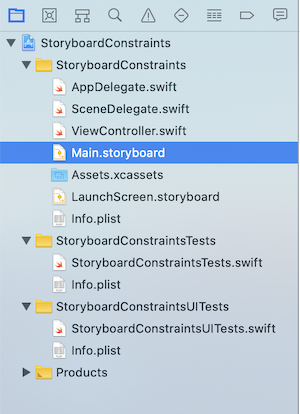
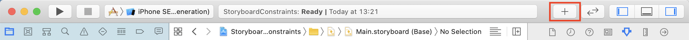
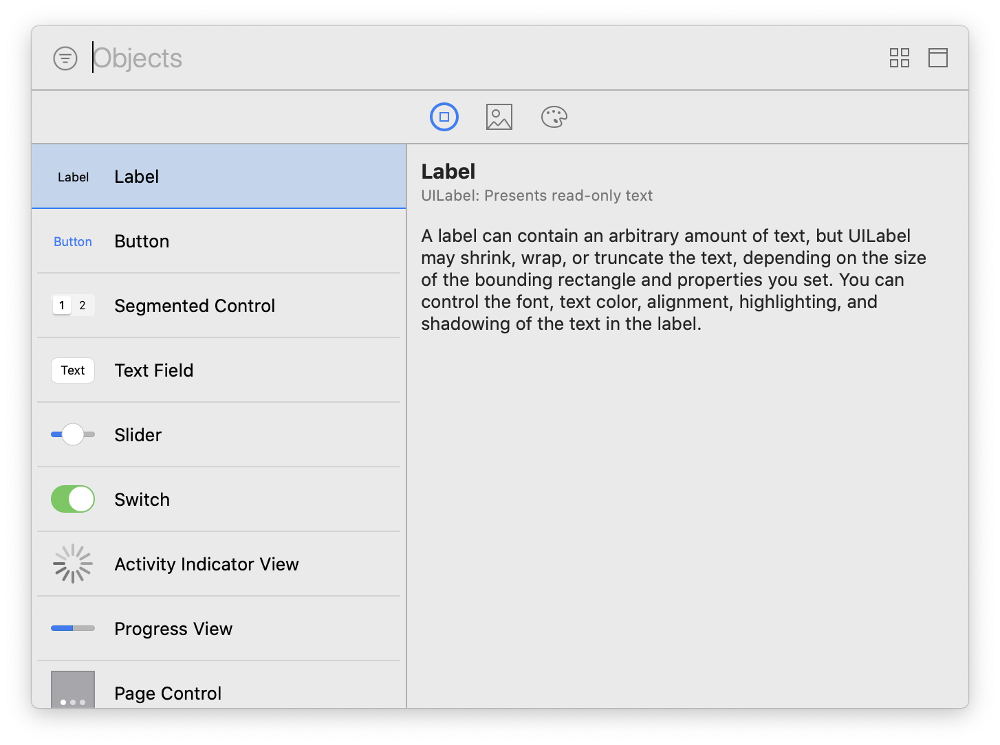
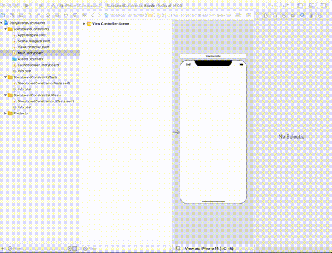
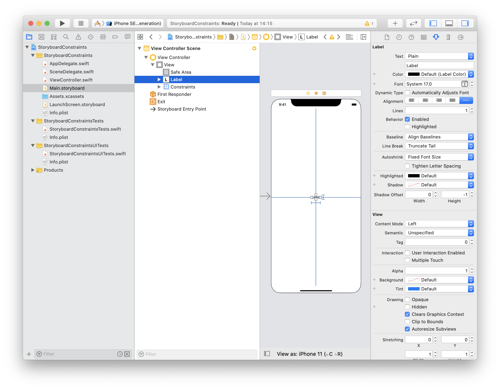
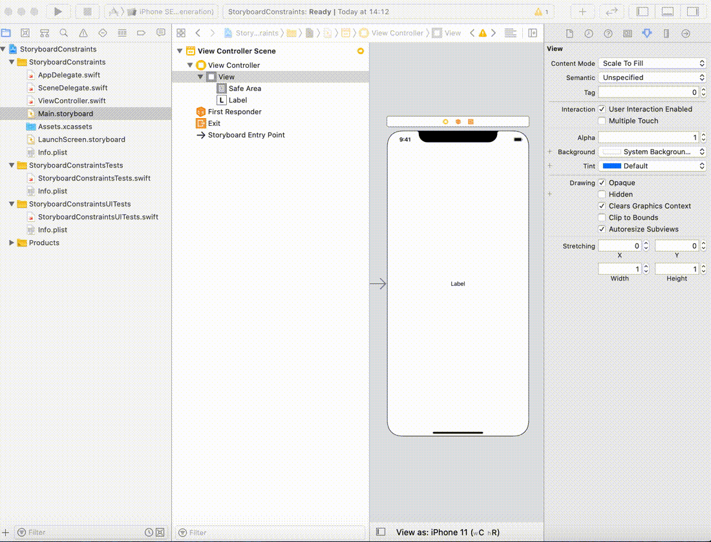
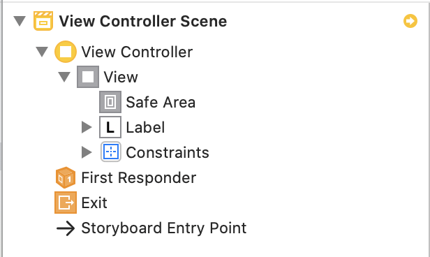

# Storyboard Constraints
## Help autolayout out, visually

 
Photo by Jon Ly on Unsplash

Difficulty: **Beginner** | Easy | Normal | Challenging 
This article has been developed using Xcode 11.4.1, and Swift 5.2.2.
Checked with Xcode 11.5, and Swift 5.2.4

## Prerequisites: 
* You will be expected to be aware how to make a [Single View Application](https://medium.com/swlh/your-first-ios-application-using-xcode-9983cf6efb71) in Swift.

# The example with a UILabel 
This project is going to show how to create a UILabel with a fixed width and height, placed nicely onto the Storyboard.

## Move to the storyboard
### Adding the UILabel
You can access the Storyboard by selecting it in the project navigator 
 
From here we add a `UILabel` to the storyboard by selecting **add object** which is a plus at the top of the Xcode window  
 
which allows us to select the `UILabel`  
 
which is then drag and dropped onto the storyboard - if you get it just in the centre blue guidelines appear making it clear that the object is in the center of the view. An animated GIF to make this clear? OK
 
### Adding the constraints
Finally! The heart of this article. The technique to add constraints if to control-drag from object to object.
CenterX from `UILabel` to `UIStoryboard`
CenterY from `UILabel` to `UIStoryboard`
Height from `UILabel` to `UILabel`
Width from `UIlabel` to `UILabel`

Doing so leads to the following constraints:
 

With an animated GIF to show how this is done:
 

Note that in this video I used both the label as displayed on the `UIViewController` and the one on the left-hand side of the screen on the View Controller Scene 
 

### but wait...
have you seen the little yellow dot that is on the left hand side. That's an Interface Builder warning. 

In this case? It's just that the label might cause clipping and Xcode recommends that we make the width >= 42 rather than 42 itself. If you want to do that to get rid of the warning, why don't you do that? You certainly can (just click the yellow dot and you'll be able to)

# Conclusion
Adding constraints in the storyboard is a common thing you'll need to do as an iOS developer. I hope this article has given you a little bit of a hand, and resolved any issues that you've got.

If you've any questions, comments or suggestions please hit me up on [Twitter](https://twitter.com/stevenpcurtis) 

