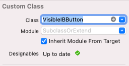

# Subclass or Extend classes in Swift
## UIView, UIButton, UIControls, oh gosh!

# Before we start
Difficulty: **Beginner** | Easy | Normal | Challenging<br>
This article has been developed using Xcode 12.5, and Swift 5.4

## Keywords and Terminology
Class: An object that defines properties and methods in common
Subclass: A class that inherits from a superclass
Superclass: The class that is being inherited from

# This article
## Background
I wrote an article about [the SOLID principles, and mentioned that classes should be open for extension and closed for modification](https://stevenpcurtis.medium.com/the-solid-principle-applied-to-swift-974e29b94d23) and written some [articles about extensions in Swift](https://stevenpcurtis.medium.com/extensions-in-swift-68cfb635688e) . At the same time, I've written articles about [subclassing UIView](https://medium.com/@stevenpcurtis.sc/subclassing-a-uiview-d372c67b7f3) so which should be done and when?

# Which should we use, Extension or Subclassing
## The Senior Dev answer 
It depends.

OK, that is the common joke about when we need to choose something in computer science so let us actually go into some detail about the reasoning behind this decision before you sit at a computer and try something.

## The difference between the two
**Extensions**
You can only *add* to an existing class, and are not allowed to have stored properties in order to do so. So in effect you can only add new methods and computed vars to add additional functionality to a class.

Because extensions are global this functionality is added to any instance of the class that you extend.

**Subclasses**
You can add new properties (constant *let* and *var*) and also override functions in order to change code functionality.

A common use of subclassing is `UIViewController` subclasses, and using `UIKit` the first file you see (a ViewController.swift file) will be a subclass of `UIViewController`.

To use your functionality you will need to use the instance of your new class (this functionality, and the properties you define, will not be available in standard instances of the superclass).

Subclasses are also nice in that you can give your code a separate name, and we aren't putting all of the functionality into the usual `UIKit` classes.

## The quick rules
If you are adding general purpose functionality that should be available to every instance of a class - then use an extension
If you want to create functionality that only applies to some instances of a class -use a subclass.

## Limitations of subclassing
It really does annoy me that a common interview question is to define the difference between a class and a struct, and you should mention that you cannot subclass a struct (the clue really is in the name of sub*class*). Still, it is something that might not be obvious to readers of this article.

# The example
Now, if you like to view the end result in interface builder remember to Editor>Refresh all views. Also when creating a subclass which is @IBDesignable it is important to make sure both the class and the module are selected in Interface Builder.

## Why not use a stackview / MVVM etc. ?
This isn't production ready code. The UIButton instances have been placed in the Storyboard to make this article quick to produce and avoid the complexity these prerequisites will use.

## The subclassed UIButton
This is an implementation of the following button:


This is just the type of design (ok - the type of design. The actual design of something would be better, but still) that might be used throughout an App in various ways.

This makes a *reasonable argument* for a subclass - we are going to reuse this code over and over for different `SubclassedUIButton` instances. The classes can be used from the storyboard as properties are @IBInspectable and the class is @IBDesignable.

```swift
import UIKit

@IBDesignable class SubclassedUIButton: UIButton {
    // the left-hand side subview that will be added to the button
    let lhsView = UIView()
    
    // cannot be called cornerRadius since the Extension has a property with that name!
    @IBInspectable var crnrRadius: CGFloat = 0 {
        // use property observers to run code when this is changed
        didSet {
            layer.cornerRadius = crnrRadius
            layer.masksToBounds = crnrRadius > 1
        }
    }
    
    override init(frame: CGRect) {
        super.init(frame: frame)
        // run the customize version to set the colours and the UIView
        customize()
    }

    required init?(coder aDecoder: NSCoder) {
        super.init(coder: aDecoder)
        // run the customize version to set the colours and the UIView
        customize()
    }

    override func layoutSubviews() {
        super.layoutSubviews()
        // Whenever the frame changes, run the customize function
        customize()
    }
    
    @IBInspectable var lhsBackgroundColor: UIColor?
    
    func customize() {
        
        // confine subviews to the bounds of the view
        self.clipsToBounds = true
        
        // set the 
        layer.cornerRadius = crnrRadius
        
        // set the backgroundColor of the Button
        backgroundColor = UIColor.green
        
        // set the edge inserts for the title, so it is centered on the right-hand side of the UIButton
        self.titleEdgeInsets = UIEdgeInsets(top: 0, left: 50, bottom: 0, right: 0)
        
        // set the backgroundColor of the left-hand side. this defaults to green
        lhsView.backgroundColor = lhsBackgroundColor ?? UIColor.green
        
        // create the frame of the UIView
        lhsView.frame = CGRect(x: 0, y: 0, width: 50, height: 50)
        
        // add the left-hand side to the UIButton
        addSubview(lhsView)
    }
}
```

## The UIButton extension
This is an extension that sets the cornerRadius, BorderWidth and borderColor.


This allows us to set these proeprties (potentially from the storyboard as these are @IBInspectable), and use them in absolutely any `UIButton` subclass throughout our applicaiton. Since we are fairly likely to do that for properties such as a cornerRadius it is reasonable to use an extension for this approach.

There is **one issue** though. If you wish to use your @IBDesignable class in Interface builder you need to not only make your class @IBDrsignable and your properties @IBInspectable but also make a class that conforms to `UIButton`. Therefore any `UIButton` uses this exension, but we would need to set VisbileIBButton (in the example below) to our class in the storyboard like:

THIS:



which of course then uses the class below, but more importantly the extension:

```swift
class VisibleIBButton: UIButton {}

@IBDesignable
extension UIButton
{
    @IBInspectable
    public var cornerRadius: CGFloat
    {
        set (radius) {
            self.layer.cornerRadius = radius
            self.layer.masksToBounds = radius > 0
        }

        get {
            return self.layer.cornerRadius
        }
    }

    @IBInspectable
    public var borderWidth: CGFloat
    {
        set (borderWidth) {
            self.layer.borderWidth = borderWidth
        }

        get {
            return self.layer.borderWidth
        }
    }

    @IBInspectable
    public var borderColor:UIColor?
    {
        set (color) {
            self.layer.borderColor = color?.cgColor
        }

        get {
            if let color = self.layer.borderColor
            {
                return UIColor(cgColor: color)
            } else {
                return nil
            }
        }
    }
}
```

Remember that to use an extension, you don't need to use the original Class. Oh, and also, you can't subclass a struct (that said, isn't it obvious that you can't sub*class* something which isn't a class?).

# Conclusion
This article has gone through the differences between subclassing and using an extension. 

The [Repo](https://github.com/stevencurtis/SwiftCoding/tree/master/SubclassOrExtend) makes things rather easier to follow in this project, and I do recommend you download this project.

If you've any questions, comments or suggestions please hit me up on [Twitter](https://twitter.com/stevenpcurtis) 
