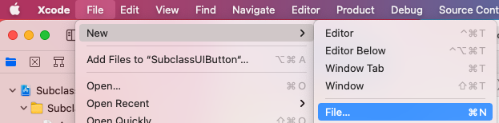
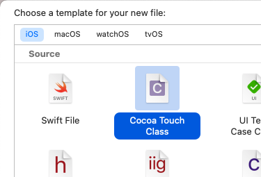
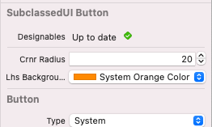
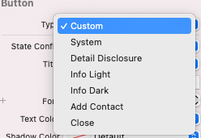

# Subclassing UIButton
## The what and the why

# Before we start
Difficulty: Beginner | **Easy** | Normal | Challenging<br>
This article has been developed using Xcode 12.2, and Swift 5.3

## Keywords and Terminology
Class: An object that defines properties and methods in common
Subclass: A class that inherits from a superclass
Superclass: The class that is being inherited from
UIButton: A control that responds to user interactions
UIControl: The base class for controls, which are visual elements that convey a specific action or intention in response to user interaction

# This article
## Background
Sometimes subclassing a `UIButton` is in some ways similar to [subclassing a UIView](https://medium.com/@stevenpcurtis.sc/subclassing-a-uiview-d372c67b7f3). In [that article](https://medium.com/@stevenpcurtis.sc/subclassing-a-uiview-d372c67b7f3) I quoted some documentation that recommended subclassing a `UIVIew` only when the standard views do not provide the capabilities that you require.

The thing is, a `UIButton` has quite a few capabilities in order to work as a developer using your class might expect. 

`UIButton` instances have intializers that require the use of private types. 

## Setting up a basic class
You create a file through Xcode's menu: File>New File...

Then choose Cocoa Touch Class

We can then name the class


## The code

```swift
import UIKit

@IBDesignable class SubclassedUIButton: UIButton {
    // the left-hand side subview that will be added to the button
    let lhsView = UIView()
    
    // cannot be called cornerRadius since the Extension has a property with that name!
    @IBInspectable var crnrRadius: CGFloat = 0 {
        // use property observers to run code when this is changed
        didSet {
            layer.cornerRadius = crnrRadius
            layer.masksToBounds = crnrRadius > 1
        }
    }
    
    override init(frame: CGRect) {
        super.init(frame: frame)
        // run the customize version to set the colours and the UIView
        customize()
    }

    required init?(coder aDecoder: NSCoder) {
        super.init(coder: aDecoder)
        // run the customize version to set the colours and the UIView
        customize()
    }

    override func layoutSubviews() {
        super.layoutSubviews()
        // Whenever the frame changes, run the customize function
        customize()
    }
    
    @IBInspectable var lhsBackgroundColor: UIColor?
    
    func customize() {
        
        // confine subviews to the bounds of the view
        self.clipsToBounds = true
        
        // set the
        layer.cornerRadius = crnrRadius
        
        // set the backgroundColor of the Button
        backgroundColor = UIColor.green
        
        // set the edge inserts for the title, so it is centered on the right-hand side of the UIButton
        self.titleEdgeInsets = UIEdgeInsets(top: 0, left: 50, bottom: 0, right: 0)
        
        // set the backgroundColor of the left-hand side. this defaults to green
        lhsView.backgroundColor = lhsBackgroundColor ?? UIColor.green
        
        // create the frame of the UIView
        lhsView.frame = CGRect(x: 0, y: 0, width: 50, height: 50)
        
        // add the left-hand side to the UIButton
        addSubview(lhsView)
    }
}
```

## Using the Storyboard
The storyboard can display a subclass if we incorporate [@IBDesignable and @IBInspectable](https://medium.com/@stevenpcurtis.sc/using-ibdesignable-and-ibinspectable-in-swift-36d3e6befaa1) into our code. That is, adding the `@IBInspectable` attribute for properties and the `@IBDesignable` attribute means that we can see changes that are made in the storyboard inspector



and the result can be shown right on the storyboard.


## Why don't we subclass UIControl?
`UIControl` is the base class for controls, but is an abstract class so generally, we would create instances of `UIButton` rather than `UIControl` ([from the documentation](https://developer.apple.com/documentation/uikit/uicontrol)). Within the documentation (mentioned in the previous line) we see the following quote:

"If you subclass `UIControl` directly, your subclass is responsible for setting up and managing your control’s visual appearance. Use the methods for tracking events to update your control’s state and to send an action when the control’s value changes."

Not only that, `UIButton` has a type that specifies the style of a button (the following image shows this in the Storyboard)



So uf we subclass `UIControl` alone we are responsible for setting more about the visual appearance than we would be by subclassing a `UIButton` - and it is for this reason that we have subclassed a `UIButton`.

## Why don't we extend UIButton?
There is a full article on this, [at this link](https://github.com/stevencurtis/SwiftCoding/tree/master/SubclassOrExtend)

The *quick rules* is as follows:
If you are adding general purpose functionality that should be available to every instance of a class -use an extension
If you want to create functionality that only applies to some instances of a class -use a subclass.

# Conclusion

The [Repo](https://github.com/stevencurtis/SwiftCoding/tree/master/SubclassUIButton) makes things rather easier to follow in this project, and I do recommend you download this project.

If you've any questions, comments or suggestions please hit me up on [Twitter](https://twitter.com/stevenpcurtis) 
