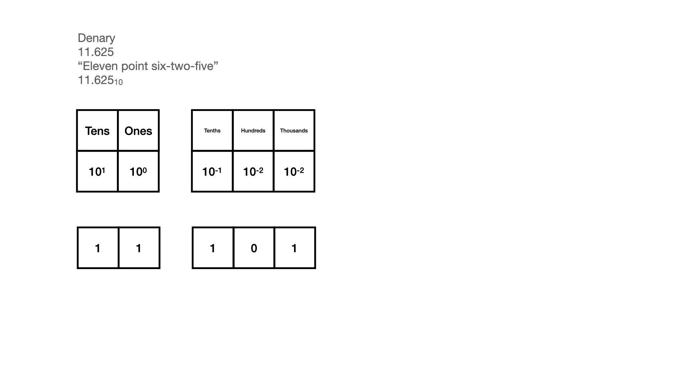
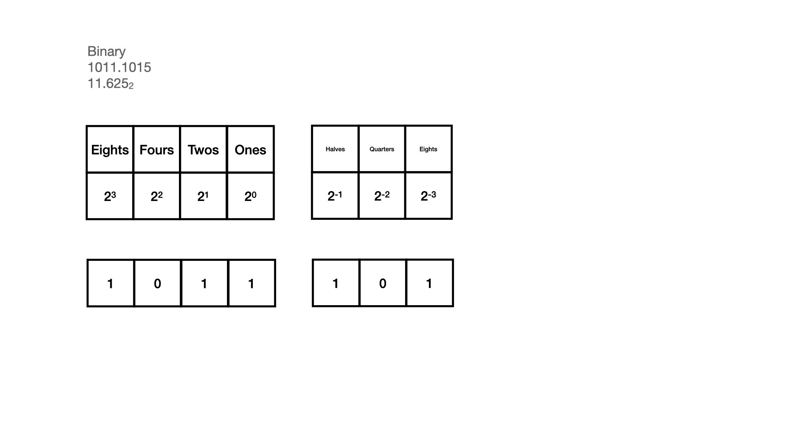
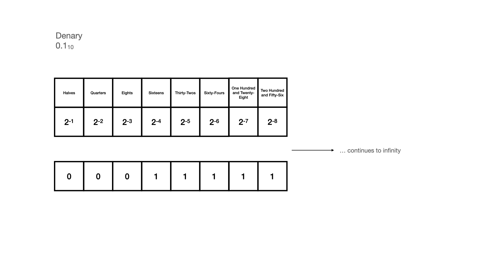

# My Computer Can't Count
## Seriously, this isn't working

I've previously written an article about [Binary](https://stevenpcurtis.medium.com/binary-for-programmers-17e99d198a9c) that goes into detail about how the number system works.

Essentially you are operating in base 2 rather than base 10, and therefore could in 1's, 2's, 4's and 8's rather than 1's, 10's, 100's and 1000's

# In Swift
All you need to do is open a [New Swift application](https://stevenpcurtis.medium.com/your-first-swift-application-without-a-mac-79598ad839f8) and you can get moving by performing the following:

```swift
print(0.1 + 0.2)
```

The answer?
It's `0.30000000000000004`. Surely some mitsake?

We need to investigate!

# The Number Equivalents
We usually represent a Denary Decimal number by using a period in the number; something like 11.625.

We can represent this in both Denary and Binary. Great!

<br>

<br>

But this actually represents a problem.

# The Issue
If you wish to represent 0.1 (Denary) in Binary, there is an issue. There will always be a rounding error (unless you have infinite space for the binary number, and unfortunately we do not have infinite space).

<br>

0.5 + 0.25 + 0.125 + 0.0625 + 0.03125 + 0.015625 + 0.0078125 + 0.00390625 = 0.99609375

Let us be clear. 0.99609375 != 0.1

# Conclusion
The "My Computer Can't Count" title is a joke. Of course computers can count and add! However, there are difficulties with floating point number that should not be underestimated, and converting floating point numbers contributed to the Ariane 5 disaster so perhaps it is time that we worked to understand these numbers and how they are dealt in our machines properly.
Oh, and also remember  0.99609375 != 0.1, because of course it doesn't.

If you've any questions, comments or suggestions please hit me up on [Twitter](https://twitter.com/stevenpcurtis)
