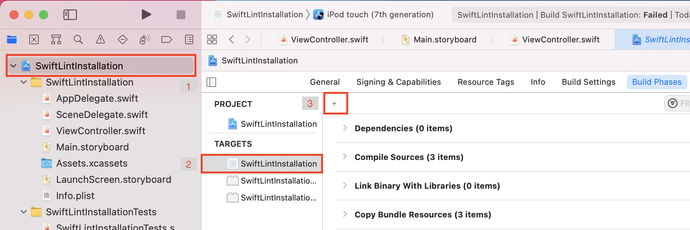
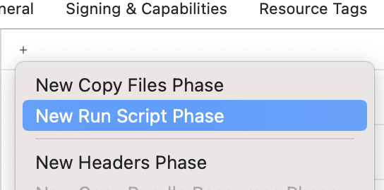
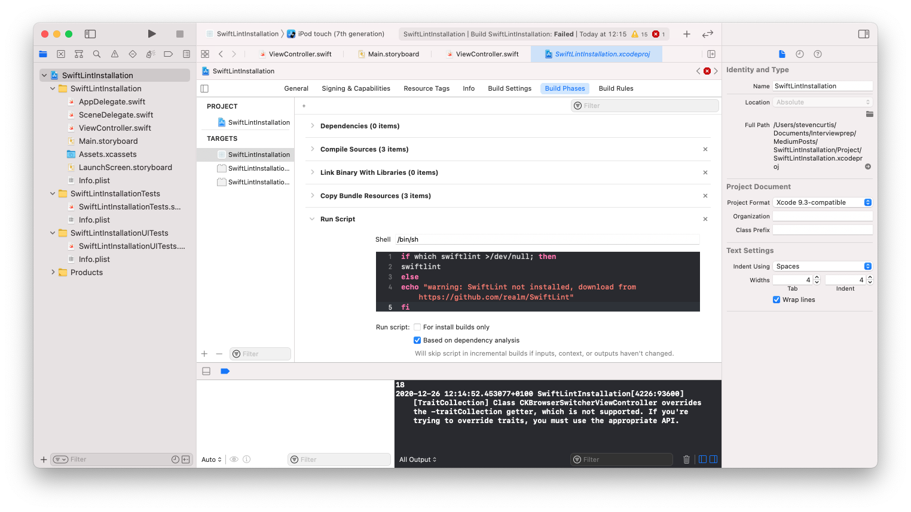
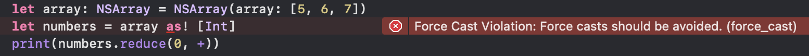
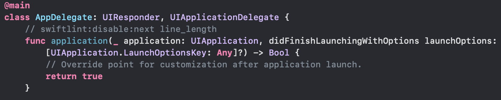

# Installing and Using SwiftLint
## Get rid of unreadable habits

<br/>
<sub>Image by Art Lasovsky on Unsplash<sub>

Difficulty: **Beginner** | Easy | Normal | Challenging<br/>
This article has been developed using Xcode 11.4.1, and Swift 5.2.2
Updated for Xcode 11.5

Look, I’m not the best person at anything. Enforcing my own coding standards for my own projects? Awful. I can’t even speel well in my Medium Posts.
Is there some way that I automate writing better Swift?


# Before we start
## Who is this guide for?
You might say that the steps for this article are contained in the repo for SwiftLint: [https://github.com/realm/SwiftLint](https://github.com/realm/SwiftLint), indeed they are.
But this is a *beginners guide* with a repo that contains a example of the implementation and the code that I’ve run through.

## What is SwiftLint for?
SwiftLint is for enforcing Swift coding style and conventions. This means that your code will be easier to read, understand and maintain. This does not make your code automatically (in inverted commas) ‘good’, but it helps enforce one of the components that makes code actually good.

In practice this means that you’ll get errors and warnings that other developers might give you during a code review like avoid [force-unwrapping](https://medium.com/@stevenpcurtis.sc/avoiding-force-unwrapping-in-swift-6dae252e970e).

Part of this is that we might get that feedback in a Code Review, but it can be a bit boring for all concerned and perhaps take too much time in a busy workday. What if we could automate that work away, and get developers to check in good-quality code from the very beginning?

In steps SwiftLint!

## The installation
Installing and running SwiftLint should (in my opinion) be global. This means you will be able to check for code quality for any file on your Mac. To do so we can use [Homebrew](https://brew.sh/), which is a good system to install the software that you need on your Mac to make things run rather well (as a developer at least).

If you don’t already have Homebrew installed, you should go to your [Terminal](https://medium.com/@stevenpcurtis.sc/the-mac-terminal-998eb9f42b5) perhaps by using the `Command⌘ — Space` key combination and type “Terminal”, and then type the following command
`ruby -e “$(curl -fsSL https://raw.githubusercontent.com/Homebrew/install/master/install)"`

## Basic usage: The command line
If you have some code that isn’t great (for all sorts of reasons, but I’ve produced this as an example for [force-unwrapping](https://medium.com/@stevenpcurtis.sc/avoiding-force-unwrapping-in-swift-6dae252e970e) rather that an example of anything else, sorry).

```swift
let array: NSArray = NSArray(array: [5, 6, 7])
let numbers = array as! [Int]
print(numbers.reduce(0, +))
```

If you’re not using SwiftLint (and SwiftLint isn’t going to save code that doesn’t make sense like that above, but you will get a rather nice message if you go to the [Terminal](https://medium.com/@stevenpcurtis.sc/the-mac-terminal-998eb9f42b5) (in the project folder) and type in:

```swift
SwiftLint
```

This gave me the following in my Terminal Window:


Now for now the most important part of this is that first line. Rather than a warning, this is an error:

```swift
Force Cast Violation: Force casts should be avoided. (force_cast)
```

We shouldn’t be using force casts unless we have a good reason!
It also gives us the file and the line number:

```swift
ViewController.swift:14:29
```

And true enough, on line 14 (place 29) we have that pesky force unwrap. But before we do something about it, SwiftLint can help us out with some of the other problems.

Back in the Terminal, we can type:

```swift
swiftlint autocorrect
```

and many of the warnings go: swiftlint has helped us out! We still have that error though, but let us see if Xcode can help us out in seeing just where that error is.

## Basic usage: Xcode
In Xcode wouldn’t it be great if we could get a pointer to where the errors are? It is true that we can use Build Scripts in Swift to help us out. To do so, we click on the Project in the file navigator, then click the primary app target, and go to Build Phases then press + to add a run script. In the case of the included project the project is called `SwiftLintInstallation` — you can see the three steps that need to take place int he following screenshot:



after clicking on the + you will see you can choose “New Run Script Phase”, which is good because that is just what you want.



You can now enter the following as the script:

```swift
if which swiftlint >/dev/null; then
swiftlint
else
echo "warning: SwiftLint not installed, download from https://github.com/realm/SwiftLint"
fi
```

which means you can get something like the following:



Now switching over to the code (`ViewController.swift` will get you to the error). This gives the following (you may need to build `Command⌘ — B`):



Great! We know where the error is, and can now work to solve it!

I personally wrote the following code:

```swift
let array: NSArray = NSArray(array: [5, 6, 7])
let numbers = array as? [Int]
print(numbers?.reduce(0, +) as Any)
```

but you can solve this type of error however you want. However, there are still 4 warnings!


## Disabling warnings
You can [turn off warnings](https://github.com/realm/SwiftLint/#disable-rules-in-code) for lines with swiftlint!

For example the first error on `AppDelegate.swift` is a line length violation, and this is solvable with the line `// swiftlint:disable:next line_length`



There are many repetitions of this rule that I’ve disabled, and also one instance of `unused_optional_binding` that I’ve disabled with the following:

```swift
// swiftlint:disable:next unused_optional_binding
```

Now it is true that you don’t need disable for each and every instance of the `line_length` rule, and you can flat disable the warning with

```swift
// swiftlint:disable line_length
```

which will be disabled until the end of the file. However, I have NOT done this, as there may be other longer lines within this file and I would not wish to blanket disable this rule. You opinion on this may very well differ from mine, and it is just that: an opinion.

Oh, and you can also disable the next (as demonstrated), the current with this (which would be on the same line) or previous. This would look like the following:

```swift
// swiftlint:disable:next line_length
// swiftlint:disable:this line_length
// swiftlint:disable:previous line_length
```
# Conclusion
I’d recommend you take a look at the attached repo to have a look at how I’ve got this small it of code to work without any errors or warnings. I’d recommend that you don’t let any code go into production with any errors (of course you shouldn’t!), or any warnings at all.

Using Swiftlint is certainly one way of helping you to do that, and whether you are using the command line to do this I’d recommend you do use these tools to help you create better code.

Creating better code is something we all want to do. With that, I hope that this code has helped you out!

Thanks for reading!

Any questions? You can get in touch with me [HERE](https://twitter.com/stevenpcurtis))
