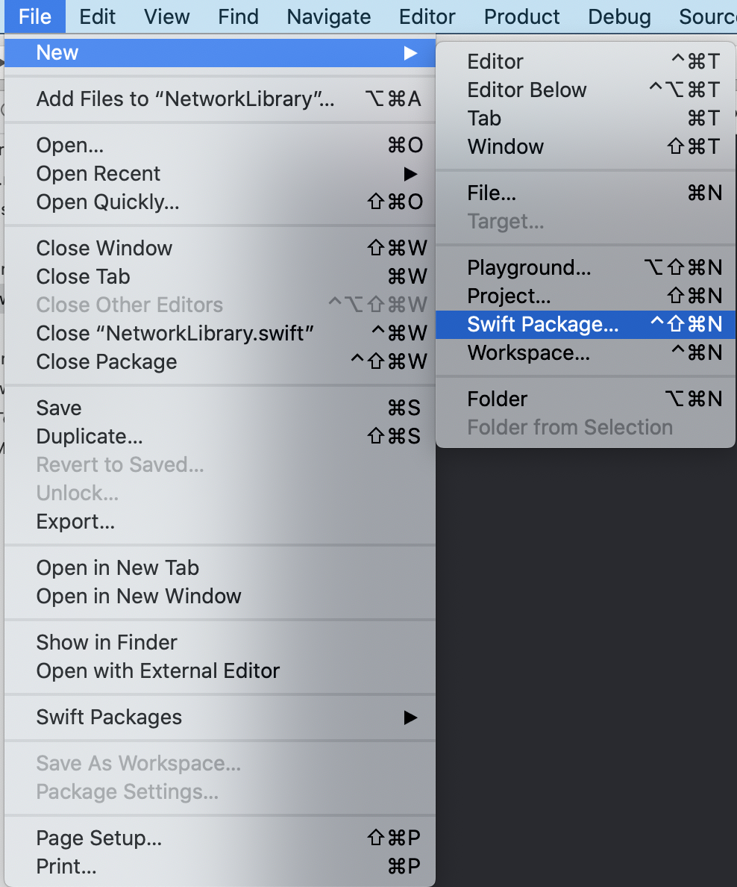
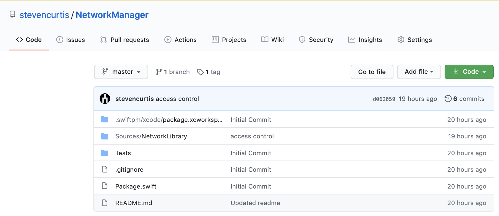
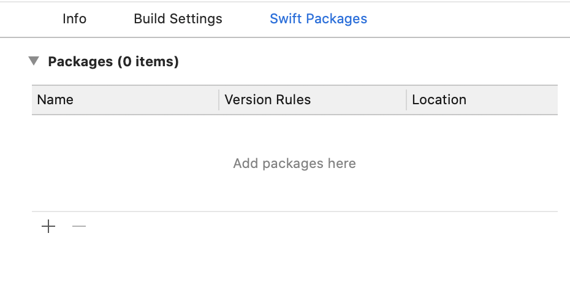
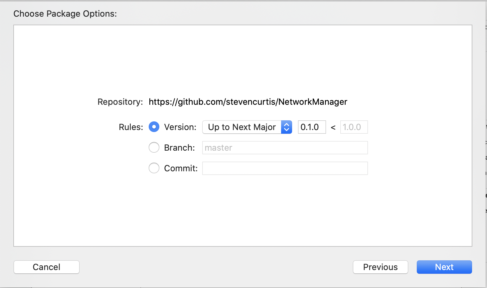
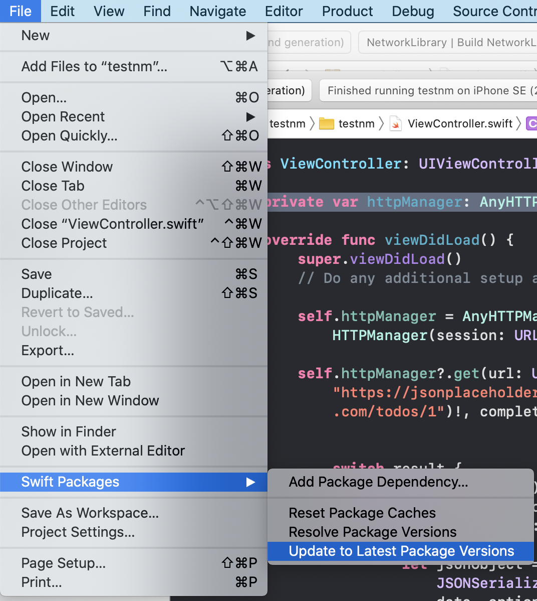

# Create a Swift Package
## Network-me-do

<br/>

Difficulty: Beginner | Easy | **Normal** | Challenging
This article has been developed using Xcode 11.4.1, and Swift 5.2.2

This is an article about how I've created a rather nice Swift Package for people to use a networking manager that I've made. 

That's rather nice, isn't it (probably not, no).

# Prerequisites
- [Some knowledge of the terminal](https://medium.com/@stevenpcurtis.sc/the-mac-terminal-998eb9f42b5)
- [Git commands](https://medium.com/@stevenpcurtis.sc/common-git-commands-4663bab829c6)

# Creating a New Swift Package
You'll need to open up Xcode, and create a Swift Package by going to `File>New>Swift Package...`

<br/>

You will then choose a suitable location for your new Swift Package!

# Setting up your Network Library
You are then given the ability to write a rather lovely `README.md` that can be used to help the users of your lovely library!

Mine is called `Network Library` and looks something like the following:

<br/>

Now we need will delete the `NetworkLibrary.swift` file (I'm not going to use this in my particular implementation), and the `NetworkLibraryTests.swift` file (because I'm not intending on using that particular file).

# Doing your coding
I've actually set up my files and tests in a (for want of a better word) "normal" project. To do do I've dragged the relevant files and tests into the `NetworkLibary.swift` file.

You might choose to do some file>new shenanigans and some actual coding, and that is fine. I expect that you will be able to handle this. 

Add the relevant platforms that your framework will support - my particular package will be limited to supporting iOS 11.

```swift
platforms: [
  .iOS(.v11)
],
```

# Uploading to Git
I choose to use the command line to upload my work, and make it avaliable to the world!

If you're following along, you won't be able to upload to `https://github.com/stevencurtis/NetworkManager.git` as that would mess up my work bad!

You'll need to traverse to the relevant folder where you have your (probably stunning work) ad these commands will probably help you out (If you're not sure about [Git commands take a look](https://medium.com/@stevenpcurtis.sc/common-git-commands-4663bab829c6)).

```swift
git init
git remote add origin https://github.com/stevencurtis/NetworkManager.git
git branch -M master
git add .
git commit -am "Initial Commit"
git branch -M master
git push -u origin master
```

This pushes the work to your [repo](https://github.com/stevencurtis/SwiftCoding/tree/master/SwiftPackage/testnm). This would be something like this (again, if your name isn't stevencurtis and you're not working on a network manager your screenshot may vary).

 

To imake this stuff work now we are going to need tags. That sounds like fun.

## Tags
Tags are like branches that don't change, and [Semantic versioning](https://medium.com/@stevenpcurtis.sc/upgrade-to-semantic-versioning-31342b11ce97) applies.

Semantic versioning is split up into three parts separated by a period. -  Major . Minor . Patch

For swift package manager we prefix these with **v**, meaning that we might make our first version something like the following

`v0.1.0`

which would then be followed with 

`v0.1.1`

(for a patch release)

**Set release on github**
There is a rather friendly button that allows you to create a new release - but make sure that you get the tag name right (probably `v.0.1.0` in the first instance).
.
 
 You can even use the interface to delete the release and tag, it is all a bit of fun!

Now this is quite messy, and I prefer to use the terminal to do this

**Set release on through the terminal**
We do have to set the teg, and then push to the terminal [commands](https://www.drupixels.com/blog/git-tags-guide-create-delete-push-tags-remote-and-much-more).

In any case, here are the terminal commands that I would write when we are in the correct folder in the terminal:

```swift
git tag -l "v0.1.0"
git push origin  v0.1.0
```

## Using the package in a project
You can select the `Project>Swift Packages` and there is a friendly -looking + button. 
 
 
 Go on - press it.
 
 You can then add the git url of the package - mine is `https://github.com/stevencurtis/NetworkManager` so then you can press next.
 
 You'll be asked to choose which version you want to pull your repo up to. Tradition says that you should go up to the next major release - and luckily this is the default given to us by Xcode.
 
 
 
pressing next will get the package to resolve, and of course you should add the package to your target. 

This is it - wonderful!

Then in your target `UIViewController` or wherever, and you `import NetworkLibrary` - and then I'm able to (say) create a property with my `AnyHTTPManager` - `private var httpManager: AnyHTTPManager<URLSession>?`. Take a look at the repo for more details.

It's working! Yes!

## Updating the package
If you wish to update your package (and you probably will at some point), you will need to update the tag using the process above and push to the remote. When this is done, the repo will be updated and then within Xcode.

The method to update your Swift package is relatively simple - go to `File>Swift Packages>Update to Latest Package Versions`.

 

It will all be update-me-do. 

Isn't that nice?

# Conclusion
Creating your own package whether public or private is extremely useful. The rule of three means that you shouldn't be repeating your code over and over - and this gives you a way to avoid doing just that. Isn't that nice?

If you've any questions, comments or suggestions please hit me up on [Twitter](https://twitter.com/stevenpcurtis) 

