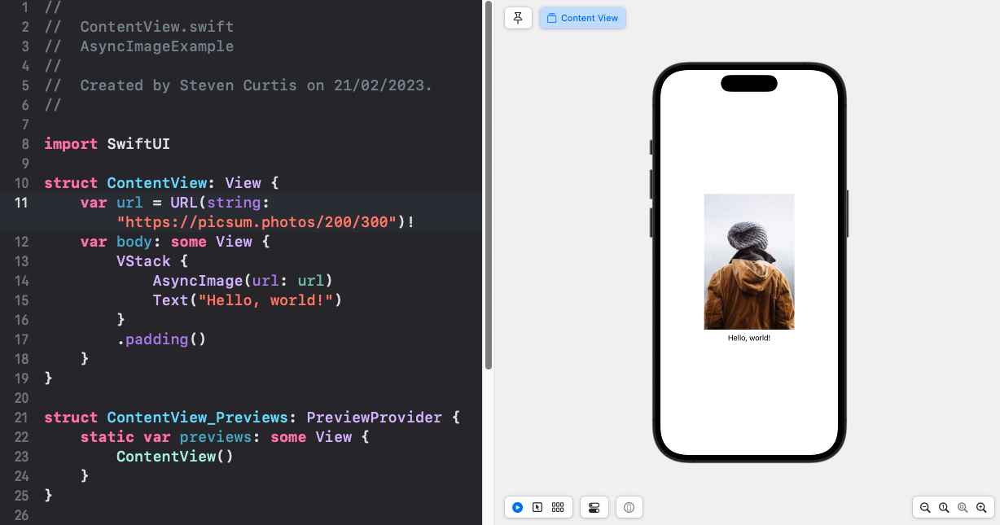

# SwiftUI's AsyncImage
## How AsyncImage Simplifies Image Loading in Swift
Photo by Ferenc Almasi on UnsplashAsyncImage

AsyncImage is something that people say was desperately needed as an addition to SwiftUI. Essentially, AsyncImage is a view that asynchronously loads and displays an image from a URL. Since it automagically manages both downloading and image caching (using URLCache) and the developer experience has been so much better than the solutions we had iOS 15's API.

Let's take a look.
Difficulty: **Beginner** | Easy | Normal | Challenging

This article has been developed using Xcode 14.2, and Swift 5.7.2

## Prerequisites
Be able to produce a ["Hello, World!" SwiftUI project](https://stevenpcurtis.medium.com/hello-world-swiftui-92bcf48a62d3)

# Before iOS 15
I've seen solutions which wrapped URLSession's dataTask to publish the data from an ImageLoader class. Now I've previously written about [Third-party frameworks](https://stevenpcurtis.medium.com/i-stopped-using-third-party-frameworks-for-my-swift-projects-heres-what-happened-a45e00b67b49) but in this case it was often preferable to use something like Kingfisher's KFImage to give the appropriate response.

# AsyncImage
To use AsyncImage, you simply pass in the URL of the image you want to display, along with optional placeholder and error views, and it handles the rest.

*Should be simple.*



It…just...works!
I've used the following code:

```swift
struct ContentView: View {
    var url = URL(string: "https://picsum.photos/200/300")!
    var body: some View {
        VStack {
            AsyncImage(url: url)
            Text("Hello, world!")
        }
        .padding()
    }
}
```

which according to the [documentation](https://developer.apple.com/documentation/swiftui/asyncimage) could perhaps be improved if I set the…

## Placeholder
Which can be the spinner which is set in SwiftUI as the `ProgressView()`. The `ProgressView()` is displayed first and then the image is downloaded and sized correctly.


```swift
struct ContentView: View {
    var url = URL(string: "https://picsum.photos/200/300")!
    var body: some View {
        VStack {
            AsyncImage(url: url)
            Text("Hello, world!")
            AsyncImage(url: url) { image in
                image.resizable()
            } placeholder: {
                ProgressView()
            }
            .frame(width: 150, height: 150)
        }
        .padding()
    }
}
```

# AsyncImage with a progress loader (pro case)

```swift
import SwiftUI

struct ContentView: View {
    var url = URL(string: "https://picsum.photos/200/300")!
    
    var body: some View {
        VStack {
            AsyncImage(url: url) { phase in
                switch phase {
                case .empty:
                    ProgressView("Loading...")
                case .success (let image):
                    image
                        .resizable()
                        .aspectRatio(contentMode: .fit)
                case .failure:
                    Text("Failed to load image")
                @unknown default:
                    Text("Unknown error")
                }
            }
        }
    }
}
```

Yeah, I prefer this to using the if let pattern like in the Apple Docs. I'll repeat this right here, in case you don't want to follow the link:

```swift
AsyncImage(url: URL(string: "https://example.com/icon.png")) { phase in
    if let image = phase.image {
        image // Displays the loaded image.
    } else if phase.error != nil {
        Color.red // Indicates an error.
    } else {
        Color.blue // Acts as a placeholder.
    }
}
```

# Conclusion
Thank you for reading.

The addition of AsyncImage to SwiftUI has been a game-changer in simplifying the process of asynchronously loading and displaying images from a URL. Prior to iOS 15, developers had to rely on various solutions, including third-party frameworks like Kingfisher, to handle the task.

 With AsyncImage, developers can simply pass in the URL of the image they want to display, along with optional placeholder and error views, and the view handles the rest, including image downloading and caching.
 In addition, AsyncImage provides an easy way to add a progress loader while the image is loading, further improving the user experience. 
 
Overall, AsyncImage is a valuable addition to SwiftUI that streamlines the process of image loading and makes it more intuitive for developers who really want to get ahead in their SwiftUI coding.

Anyway, happy coding!
