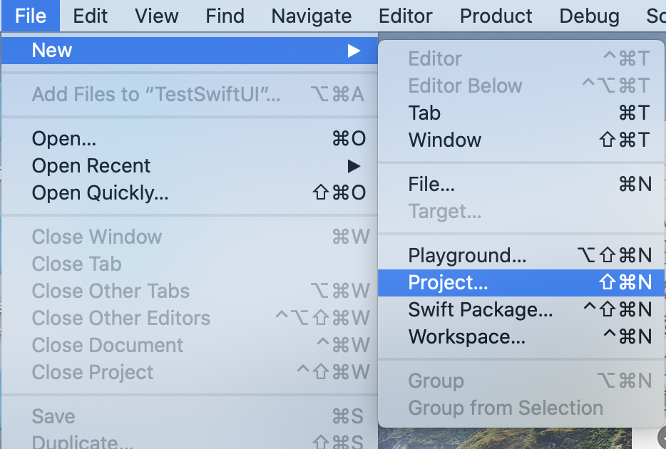
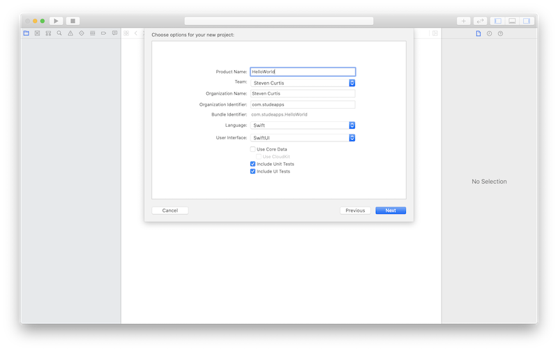
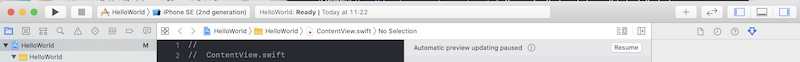
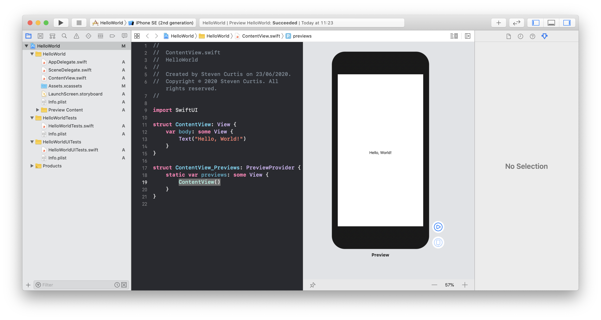
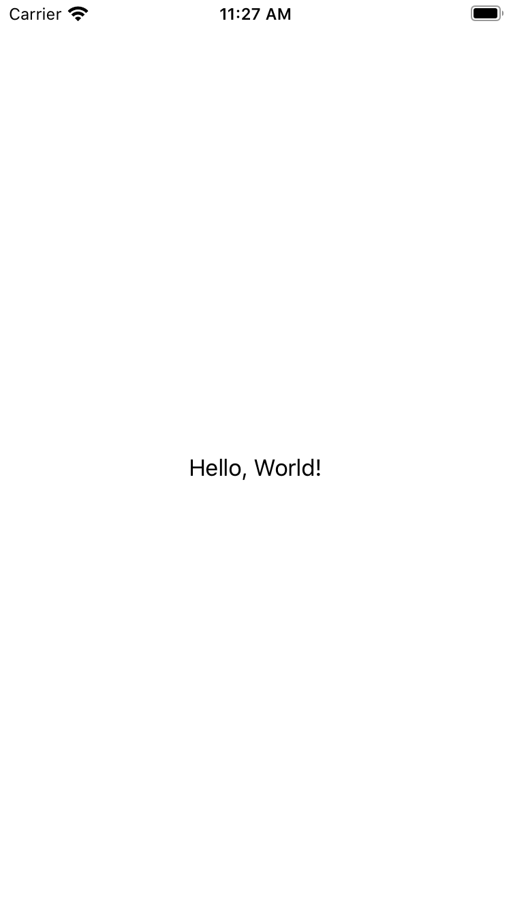
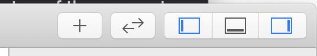
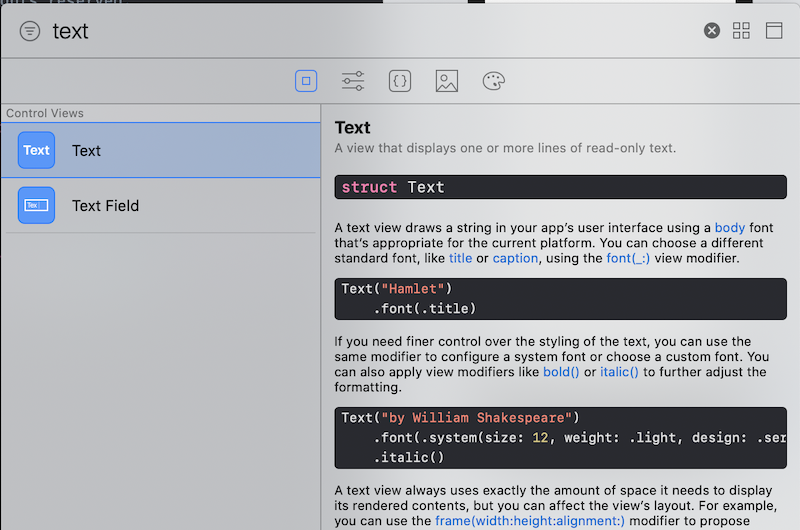
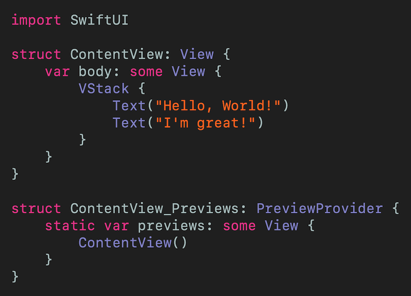

# "Hello, World" SwiftUI
## Let's get started

 
Photo by Yu Kato on Unsplash

SwiftUI has been around for over a year. Now we have had longer than a *Year* to start working with SwiftUI. Isn't it time we got started?

Difficulty: **Beginner** | Easy | Normal | Challenging 
This article has been developed using Xcode 11.5, and Swift 5.2.4

# Prerequisites:
* Be able to produce a [“Hello, World!”](https://medium.com/@stevenpcurtis.sc/your-first-swift-application-without-a-mac-79598ad839f8) Swift application
* Be able to download a [repo](https://medium.com/@stevenpcurtis.sc/downloading-repos-from-github-13a017951450) from GitHub (If you choose you want to!)

# Terminology
Swift: An open source programming language for macOS, iOS, watchOS and tvOS and others
SwiftUI: A simple way to build user interfaces Across Apple platforms

# Why Hello World!?
Simple tutorials usually begin with a “Hello world” tutorial. Those outside the programming community can feel that this is an unusual thing to choose, as it seems to have been picked simply because it is a simple word String (or just String) to print to the screen.

But why would anyone choose that particular String?

We can start at the beginning. There is a [book](https://www.amazon.com/gp/product/0131101633/ref=as_li_tl?ie=UTF8&camp=1789&creative=9325&creativeASIN=0131101633&linkCode=as2&tag=studeapps0f-20&linkId=fa3706596c369d20c229ea955796ec31) about C programming which used a “Hello, World!” example — although this was actually lifted from a Programming in C: A Tutorial (1974) book.
The actual “Hello, World!” application that tutorials ask you to produce vary in sophistication and implementation, but the basic idea is that you print “Hello, World!” in some form.
We are going to display “Hello,World!” on a label displayed on the phone screen.

# The step-by-step
## Creating a new Project in Xcode
You need to have Xcode installed on your Mac. This can be downloaded from [HERE](https://developer.apple.com/xcode/). If you don’t already have this installed, do so now.
Once you have done that, you can click on the Xcode icon  
 

This opens up the IDE, and the first thing we are going to do is create a new project.

Select `Single View App`

then name your project appropriately, making sure the language is set as `Swift` and the user interface `SwiftUI`

You’ll be asked where to place your project, and I’ll leave you to choose somewhere in your Documents folder or similar.

## Viewing the preview
You can see the current preview in Xcode by telling it to update the Canvas.

So to see the canvas press Option-Command-Enter on your keyboard. 
If Automatic preview updating is paused, click on the resume button towards the top of the screen to kick it into action. 

You should now be able to see the preview!

## Running on the simulator
To run the code on the simulator there is a keyboard command to help you out. ⌘ and R at the same time will kick the simulator into gear, making it appear and load your App. 

## Changing the text
Look, you've got me. The App automatically displays "Hello, World". But we are going to add some more text to make this a little more...interesting. 

We are going to add an object, so towards the top-right hand corner of the screen we will press +. Yes, that one.

This brings up an attractive menu for us to choose, and here I've typed in "Text" to make it easy to find the text. Easy it is!

Then you need to drag the text block to *just under* the *Hello, World* one - this is tricky to show without an animated gif movie. Luckily that is what I've prepared: 

We can then change the text on the left hand side on the `ContentView.swift` file. That is, instead of `"Placeholder`" make the text say `"I'm great!"`.

The result will look something like this:

If you want the finished code you can download it from [https://github.com/stevencurtis/SwiftCoding/tree/master/SwiftUI/HelloWorld](https://github.com/stevencurtis/SwiftCoding/tree/master/SwiftUI/HelloWorld)

# Conclusion
Writing Hello, World! like this on a label is a big step as a first real iOS program. If you’ve followed through this tutorial from scratch you’ve done a great job!

If you've any questions, comments or suggestions please hit me up on [Twitter](https://twitter.com/stevenpcurtis) 

Why not sign up to my [newsletter](https://subscribe.to/swiftcodingblog/)

