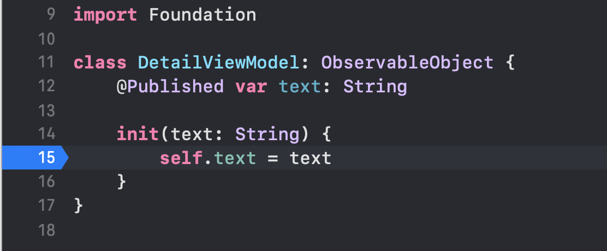

# Lazy NavigationLink for SwiftUI
## We don't want to preload every ViewModel!

<br/>
<sub>Photo by elizabeth lies on Unsplash<sub>

Difficulty: Beginner | **Easy** | Normal | Challenging<br/>
This article has been developed using Xcode 11.7, and Swift 5.2.4

You want to display some content in a `List`. You place a breakpoint and...well there is a nasty surprise. 

Read on!

## Prerequisites: 
* You will be expected to make a [Single View SwiftUI Application](https://medium.com/@stevenpcurtis.sc/hello-world-swiftui-92bcf48a62d3) in Swift.

## Terminology
SwiftUI: A simple way to build user interfaces Across Apple platforms

# The motivation
The destination views for navigation links are created when the body for the `List` is updated - and therefore raises the individual view models.

How did this situation occur?

# The code
I've rather lazily (on topic for this article!) called the initial view `ContentView.swift`. Sorry for that.

This means that we create the `SwiftUI` view and feed it a view model  in the `SceneDelegate` file.

```Swift
let viewModel = ContentViewModel()

// Create the SwiftUI view that provides the window contents.
let contentView = ContentView(viewModel: viewModel)

// Use a UIHostingController as window root view controller.
if let windowScene = scene as? UIWindowScene {
    let window = UIWindow(windowScene: windowScene)
    window.rootViewController = UIHostingController(rootView: contentView)
    self.window = window
    window.makeKeyAndVisible()
}
```

and the content view takes us to a `DetailView` by displaying information from a view model in a `List`
```Swift
struct ContentView: View {
    @ObservedObject var viewModel: ContentViewModel
    
    init(viewModel: ContentViewModel) {
      self.viewModel = viewModel
    }
    
        var body: some View {
            NavigationView {
                List {
                    ForEach(viewModel.animals, id: \.self) {
                        animal in
                        NavigationLink(
                            destination:
                            DetailView(viewModel: DetailViewModel(text: animal))
                        ) {
                            Text(animal)
                        }
                    }
                }
                .navigationBarTitle("Animals")
                .listStyle(GroupedListStyle())
            }
        }
}
```

where the information is contained in a `ContentViewModel` class 

```Swift
class ContentViewModel: ObservableObject {
    @Published var animals = ["🦒", "🦮", "🐖" , "🦔", "🦓", "🦢", "🦋"]
    
    init() {
        DispatchQueue.main.asyncAfter(deadline: .now() + 1, execute: {
            self.animals = ["🦒", "🦒", "🦒" , "🦒", "🦒", "🦒", "🦒"]
        })
    }
}
```

Note that I simulate updating the data (perhaps from a remote source) by updating an `@Published` var with a `DispatchQueue.main.asyncAfter` - this isn't intended to be production ready code (and it certainly isn't in this instance).

```Swift
class ContentViewModel: ObservableObject {
    @Published var animals = ["🦒", "🦮", "🐖" , "🦔", "🦓", "🦢", "🦋"]
    init() {
        DispatchQueue.main.asyncAfter(deadline: .now() + 1, execute: {
            self.animals = ["🦒", "🦒", "🦒" , "🦒", "🦒", "🦒", "🦒"]
        })
    }
}
```

So we then have a `DetailView` and `DetailViewModel` pair to display the emoji on the screen (simple - right)?

The `DetailView`
```Swift
struct DetailView: View {
    @ObservedObject var viewModel: DetailViewModel
    var body: some View {
        Text(viewModel.text)
    }
}

struct DetailView_Previews: PreviewProvider {
    static var previews: some View {
        DetailView(viewModel: DetailViewModel(text: "test"))
    }
}
```

The `DetailViewModel`

```Swift
class DetailViewModel: ObservableObject {
    @Published var text: String
    
    init(text: String) {
        self.text = text
    }
}
```

## The issue
The App works file. It displays the emoji after you click on a row in the `List`.

Great!

However, what if we place a [breakpoint](https://medium.com/@stevenpcurtis.sc/debug-using-breakpoints-in-xcode-705cc9ce6d4c) in the initializer of the view model.



and...we hit the breakpoint again and again!


What is going on? The view model is instantiated without ever being displayed on screen. This seems like an absolute disaster! Why would it do that?

Each time you instantiate the `NavigationLink` your view and view model are instantiated. 

## The solution
You can use [lazy](https://medium.com/@stevenpcurtis.sc/the-lazy-variables-what-and-why-in-swift-619cb951ee0f) instantiation 

So we 

```swift
struct LazyView<Content: View>: View {
    var content: () -> Content
    var body: some View {
        self.content()
    }
}
```

and then we can hit that `LazyView` from `NavigationLink`

```swift
NavigationLink(destination: LazyView {
    DetailView(viewModel: DetailViewModel(text: animal))
    })
{
    Text(animal)
}
```

and...problem solved! 
When you click on one of the items in `List` the breakpoint is only hit once you click on the item.

Fantastic

# Conclusion
The approach taken loosely follows MVVM and I've whacked a few tests in there too. I hope this is of use to those reading.
 
 In any case, have a nice day.
 
 If you've any questions, comments or suggestions please hit me up on [Twitter](https://twitter.com/stevenpcurtis) 
