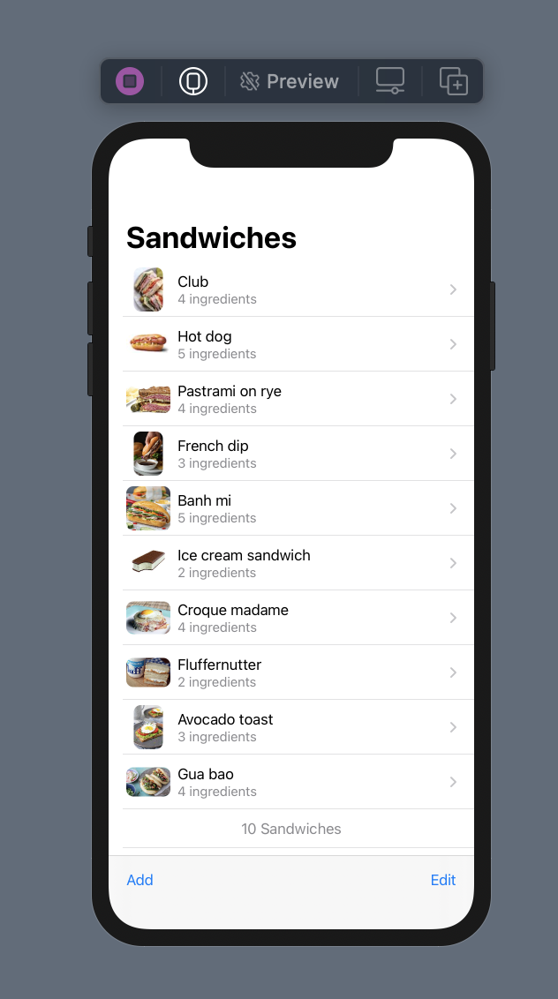

# Recreating the Sandwiches SwiftUI WWDC Code
## Without the Hot Dogs References

<br/>
<sub>Photo by Mae Mu on Unsplash<sub>

Remember [that Video](https://developer.apple.com/videos/play/wwdc2020/10119/) with Sandwiches at WWDC. This post uses the following assets:

[assets](https://github.com/jaypricer/resources-intro-swiftui-wwdc20-10119)

And we are trying to recreate the WWDC code to create the following:



Difficulty: **Beginner** | Easy | Normal | Challenging<br/>
This article has been developed using Xcode 12.0, and Swift 5.3

#Terminology:
SwiftUI: A simple way to build user interfaces across Apple platforms

## Prerequisites:
* You will be expected to be aware how to make a [SwiftUI](https://medium.com/@stevenpcurtis.sc/hello-world-swiftui-92bcf48a62d3) project

## Setup 
This setup gives us a new project; I've called mine "RecreateSandwiches" but you are free to call yours whatever you would like.


I will then show the classes that I've created in turn. If you'd like to skip to the [repo](https://github.com/stevencurtis/SwiftCoding/tree/master/SwiftUI/RecreateSandwiches) 

Oh, and note that the iPad version works in portrait rather than landscape mode. 

## RecreateSandwichesApp
```swift
@main
struct RecreateSandwichesApp: App {
    @StateObject private var store = testData
    var body: some Scene {
        WindowGroup {
            ContentView(store: store)
        }
    }
}
```

## ContentView and SandwichCell
```swift
struct ContentView: View {
    @ObservedObject var store: SandwichStore
    
    var body: some View {
        NavigationView {
            List {
                ForEach(store.sandwiches) { sandwich in
                    SandwichCell(sandwich: sandwich)
                }
                .onMove(perform: moveSandwiches)
                .onDelete(perform: deleteSandwiches)
                HStack {
                    Spacer()
                    Text("\(store.sandwiches.count) Sandwiches")
                        .foregroundColor(.secondary)
                    Spacer()
                }
            }
            .navigationTitle("Sandwiches")
            .toolbar {
                Button("Add", action: makeSandwich)
                Spacer()
                EditButton()
            }
        }
        
    }
    
    func makeSandwich() {
        withAnimation {
            store.sandwiches.append(Sandwich(name: "Patty melt",
                ingredientCount: 3 ))
        }
    }
    
    func moveSandwiches(from: IndexSet, to: Int) {
        withAnimation {
            store.sandwiches.move(fromOffsets: from, toOffset: to)
        }
    }

    func deleteSandwiches(offsets: IndexSet) {
        withAnimation {
            store.sandwiches.remove(atOffsets: offsets)
        }
    }
    
}

struct ContentView_Previews: PreviewProvider {
    static var previews: some View {
        Group {
            ContentView(store: testData)
            ContentView(store: testData)
            ContentView(store: testData)
                .frame(width: 1.0)
            ContentView(store: testData)
                .frame(width: 1.0)
                
            ContentView(store: testData)
        }
    }
}


struct SandwichCell: View {
    var sandwich: Sandwich
    
    var body: some View {
        NavigationLink( destination: SandwichDetail(sandwich: sandwich)) {
            Image(sandwich.thumbnailName)
                .cornerRadius(8)
            
            VStack(alignment: .leading) {
                Text(sandwich.name)
                Text("\(sandwich.ingredientCount) ingredients")
                    .font(.subheadline)
                    .foregroundColor(.secondary)
            }
        }
    }
}
```

## SandwichDetail

```swift
struct SandwichDetail: View {
    @State private var zoomed = false
    var sandwich: Sandwich
    
    var body: some View {
        VStack {
            Spacer(minLength: 0)
            Image(sandwich.imageName)
                .resizable()
                .aspectRatio(contentMode: zoomed ? .fill : .fit)
                .onTapGesture {
                    withAnimation{
                        zoomed.toggle()
                    }
                }
            
            Spacer(minLength: 0)
            
            if sandwich.isSpicy && !zoomed {
                HStack {
                    Spacer()
                    Label("Spicy", systemImage: "flame.fill")
                    Spacer()
                }
                .padding(.all)
                .font(Font.headline.smallCaps() )
                .background(Color.red)
                .foregroundColor(.yellow)
                .transition(.move(edge: .bottom))
            }
        }
        .navigationTitle(sandwich.name)
        .edgesIgnoringSafeArea(.bottom)
    }
    
}

struct SandwichDetail_Previews: PreviewProvider {
    static var previews: some View {
        Group {
            NavigationView {
                SandwichDetail(sandwich: data[0] )
            }
            NavigationView {
                SandwichDetail(sandwich: data[1] )
            }
        }
    }
}
```

## SandwichStore

```swift
class SandwichStore : ObservableObject {
    @Published var sandwiches: [Sandwich]
    
    init(sandwiches: [Sandwich] = []) {
        self.sandwiches = sandwiches
    }
}

let testData = SandwichStore(sandwiches: data)
```

## Sandwich

```swift
struct Sandwich: Identifiable {
    var id = UUID()
    var name: String
    var ingredientCount: Int
    var isSpicy: Bool = false
    
    var imageName: String { return name }
    var thumbnailName: String { return name + "-Thumbnail" }
}

let data = [
    Sandwich(name: "Caprese", ingredientCount: 4, isSpicy: false),
    Sandwich(name: "California Quinoa Burger", ingredientCount: 4, isSpicy: false),
]
```

# Conclusion
If you'd like to go through the [WWDC Video](https://developer.apple.com/videos/play/wwdc2020/10119/) you've now got the code to help you!

This is a good thing for everyone concerned, and I'll leave my [repo](https://github.com/stevencurtis/SwiftCoding/tree/master/SwiftUI/RecreateSandwiches) up for people use in the future. 

If you've any questions, comments or suggestions please hit me up on [Twitter](https://twitter.com/stevenpcurtis) 