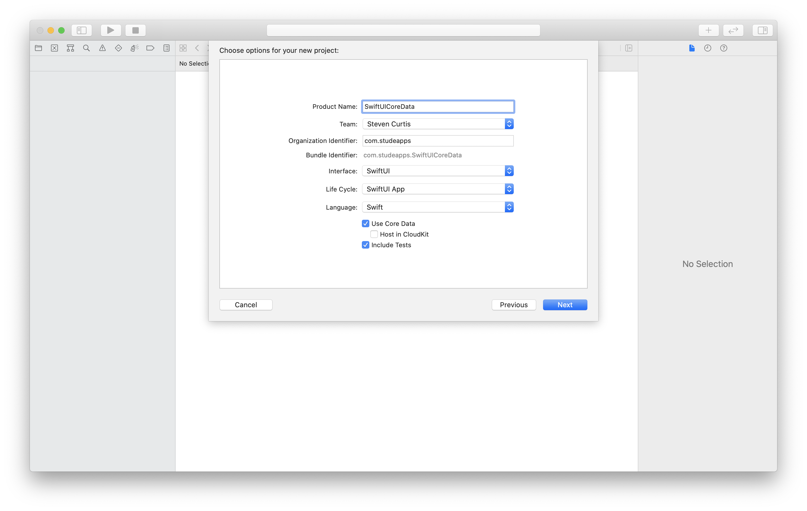

# SwiftUI: Using CoreData 
## Use my version!

<br/>
<sub>Photo by Amanda Frank<sub>

Difficulty: Beginner | Easy | **Normal** | Challenging<br/>
This article has been developed using Xcode 12, and Swift 5.3

Create project
<br/>

Note that I've pressed the rather friendly Core Data tick box

# The approach
I have been [a cheerleader for a modular Core Data Approach](https://medium.com/@stevenpcurtis.sc/core-data-basics-testing-39d127380680) - this means that it should be trestable. Apple have created their Core Data template, and this seems to suggest that the Core Data reaches right into the views in SwiftUI.

To that? I say there must be a testable way. However, I'm still going to use the `Persistence.swift` file (so this article may age badly as the template changes.

## The Tests
These tests are in no way complete. In fact, testing saving and the number of objects we have after that operation isn't ideal. However, this is a basis of how we might test a DataManager module and we can test that in a modular fashion. 
```swift
class DataManagerTests: XCTestCase {
    var storeCordinator: NSPersistentStoreCoordinator!
    var managedObjectModel: NSManagedObjectModel!
    var store: NSPersistentStore!

    override func setUpWithError() throws {
        try super.setUpWithError()
        managedObjectModel = NSManagedObjectModel.mergedModel(from: [Bundle.main])
        storeCordinator = NSPersistentStoreCoordinator(managedObjectModel: managedObjectModel)
        do {
            try storeCordinator.addPersistentStore(ofType: NSInMemoryStoreType, configurationName: nil, at: nil, options: nil)
        } catch {
            XCTFail("Failed to create a persistent store, \(error)")
        }
    }
    
    func testGetManagedObjectError() {
        let managedObjectContext = NSManagedObjectContext(concurrencyType: .mainQueueConcurrencyType)
        managedObjectContext.persistentStoreCoordinator = storeCordinator
        let entity = NSEntityDescription.entity(forEntityName: Constants.entityName, in: managedObjectContext)!
        let CDM = DataManager(objectContext: managedObjectContext, entity: entity)
        XCTAssertThrowsError(try CDM.getManagedObjects() )
    }

    func testSaveObject() {
        let expectation = XCTestExpectation(description: #function)
        let managedObjectContext = NSManagedObjectContext(concurrencyType: .mainQueueConcurrencyType)
        managedObjectContext.persistentStoreCoordinator = storeCordinator
        let entity = NSEntityDescription.entity(forEntityName: Constants.entityName, in: managedObjectContext)!
        let CDM = DataManager(objectContext: managedObjectContext, entity: entity)
        let date = Date(timeIntervalSince1970: 1602773585)
        CDM.save(date: date, completion: {
            let entitites = try! CDM.getManagedObjects()
            XCTAssertEqual(entitites.count, 1)
            expectation.fulfill()
        })
        wait(for: [expectation], timeout: 3.0)
    }
}
```

Remember: I'm not saying that the `DataManager` in terms of testing is perfect, but it a nudge in the right direction. 

Actually that is true of the main data manager; I'm not comfortable with my naming of `objectArray` either, but this is a pointer in the right direction rather than complete production-ready code.

```swift
import UIKit
import CoreData

public protocol DataManagerProtocol {
    func getManagedObjects() throws -> [NSManagedObject]
    func save(date: Date, completion:  @escaping ( ()-> Void) )
    init()
}

struct TaskModel: Identifiable {
    var id: UUID?
}

final class DataManager: ObservableObject, DataManagerProtocol {
    @Published var objectArray = [NSManagedObject]()
    
    private var managedObjectContext: NSManagedObjectContext! = nil
    private var entity: NSEntityDescription! = nil
    
    init (objectContext: NSManagedObjectContext, entity: NSEntityDescription) {
        self.managedObjectContext = objectContext
        self.entity = entity
        let objects = try? getManagedObjects()
        objectArray = objects ?? []
    }
    
    required init() {
        let pc = PersistenceController()
        managedObjectContext = pc.container.viewContext
        managedObjectContext.mergePolicy = NSMergeByPropertyObjectTrumpMergePolicy
        
        let objects = try? getManagedObjects()
        objectArray = objects ?? []
        
        
        if let entityDescription = NSEntityDescription.entity(
            forEntityName: Constants.entityName,
            in: managedObjectContext) {
            entity = entityDescription
        }
    }
    
    func delete(object: NSManagedObject, completion: (() -> Void)? = nil) {
        for obj in objectArray {
            if obj.value(forKey: Constants.timeAttribute) as? Date == object.value(forKey: Constants.timeAttribute) as? Date {
                self.managedObjectContext.delete(object)
                self.saveContext{
                    print ("deleted")
                    let objects = try? self.getManagedObjects()
                    self.objectArray = objects ?? []
                }
            }
        }
    }
    
    func getManagedObjects() throws -> [NSManagedObject] {
        let fetchRequest = NSFetchRequest<NSManagedObject>(entityName: Constants.entityName)
        do {
            objectArray = try managedObjectContext.fetch(fetchRequest)
        } catch let error as NSError {
            throw ErrorModel(errorDescription: "Core Data Error. Could not fetch. \(error), \(error.userInfo)")
        }
        if objectArray.isEmpty {throw ErrorModel(errorDescription: "No Managed Objects")}
        return objectArray
    }
    
    
    func getEntityManagedObject() -> (NSEntityDescription, NSManagedObjectContext) {
        return (self.entity, self.managedObjectContext)
    }
    
    func save(date: Date, completion: @escaping  ( ()-> Void) ) {
        managedObjectContext.perform {
            // Add the single item
            let taskObject = NSManagedObject(entity: self.entity, insertInto: self.managedObjectContext)
            taskObject.setValue(date, forKeyPath: Constants.timeAttribute)            
            self.objectArray.append(taskObject)
            
            self.saveContext(completion: {
                completion()
            })
        }
    }
    
    func saveContext(completion: @escaping () -> Void) {
        managedObjectContext.perform {
            do {
                try self.managedObjectContext.save()
                completion()
            } catch let error as NSError {
                print("Could not save. \(error), \(error.userInfo)")
            }
        }
    }
}
```

Oh yes, don't leave print logs in your code like that if it is for production use (and perhaps deal with errors in a professional way to).

## Linking to SwiftUI:
This is where the work is done. This means that we are going to inject the data manager (so mocking is possible, although here I can use the preview data in the persistence controller):

```swift 
import SwiftUI

@main
struct SwiftUICoreDataApp: App {
    let persistenceController = PersistenceController.shared

    var body: some Scene {
        WindowGroup {
            ContentView(dataManager: DataManager())
                .environment(\.managedObjectContext, persistenceController.container.viewContext)
        }
    }
}

struct SwiftUICoreDataApp_Previews: PreviewProvider {
    static var previews: some View {
        Text("Hello, World")
    }
}
```

## The ContentView

```swift
import SwiftUI
import CoreData

struct ContentView: View {
    @ObservedObject var dataManager: DataManager

    var body: some View {
        NavigationView {
            List {
                ForEach(dataManager.objectArray, id: \.self) { obj in
                    Text( (obj.value(forKey: Constants.timeAttribute) as! Date).description )
                }
                .onDelete(perform: deleteItems)
            }
            .navigationBarItems(leading:
                                    Button(action: {
                                        self.addItem()
                                    }) {
                                        Text("Add")
                                    }, trailing: EditButton()
            )
        }
    }
    
    private func addItem() {
        dataManager.save(date: Date(), completion: {
            print ("completed save")
        })
    }

    private func deleteItems(offsets: IndexSet) {
        for index in offsets {
            print ("index \(index)")
            dataManager.delete(object: dataManager.objectArray[index])
        }
    }
}

private let itemFormatter: DateFormatter = {
    let formatter = DateFormatter()
    formatter.dateStyle = .short
    formatter.timeStyle = .medium
    return formatter
}()

struct ContentView_Previews: PreviewProvider {
    static var previews: some View {
        ContentView(
            dataManager: DataManager()).environment(
                \.managedObjectContext,
                PersistenceController.preview.container.viewContext
            )
    }
}
```

Then you can choose to ⌘U to run the tests and, well they are all ✅. The mark of a successful project? Well, in this case the tests are there for you to improve and to work on and get sufficient coverage to make this a production project, so in my opinion this comes under a "good start".

# Conclusion
Want to look at the whole thing? [network manager](https://github.com/stevencurtis/SwiftCoding/tree/master/SwiftUI/SwiftUICoreData) has the whole network manager, which some will find easier to follow along with.

This project isn't (yet) production-ready, but it is a good start and is something for you to work on and think about how to make your projects better. SwiftUI isn't scary, and I hope this demonstration has gone some way to give you some direction in your own coding.

Thanks for reading!
 
 If you've any questions, comments or suggestions please hit me up on [Twitter](https://twitter.com/stevenpcurtis) 