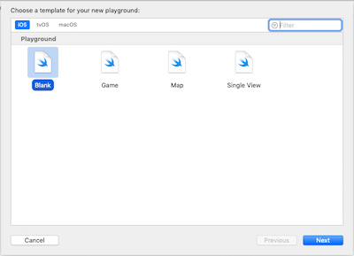
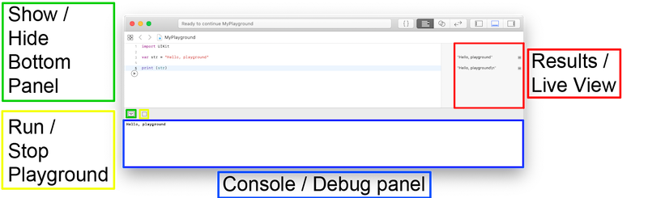
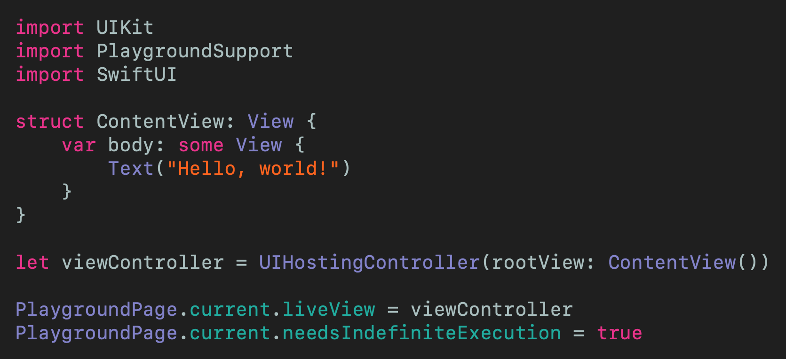
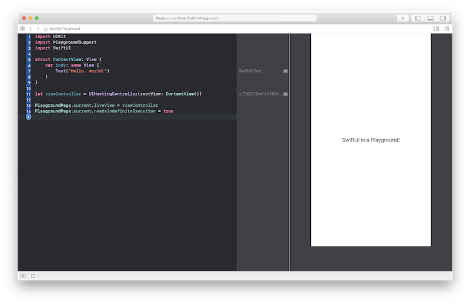

# Use SwiftUI in a Playground
## Let your imagination run wild!

 

Playgrounds are a fantastic way of producing code, and you don't even need a device in order to do so.
But how can you combine your love of SwiftUI with your love of Playgrounds? Read on.

Difficulty: Beginner | **Easy** | Normal | Challenging 
This article has been developed using Xcode 12.1, and Swift 5.3

## Prerequisites:
* Install either Xcode on a Mac, or playgrounds on [iPhone or iPad](https://medium.com/r/?url=https%3A%2F%2Fapps.apple.com%2Fsg%2Fapp%2Fswift-playgrounds%2Fid908519492)

Recommended: Be able to produce a "Hello, World!" Swift application (guide [HERE](https://medium.com/@stevenpcurtis.sc/your-first-swift-application-without-a-mac-79598ad839f8))

## Terminology
Playgrounds: A development environment that can be used to create Swift code

Swift: An open source programming language for macOS, iOS, watchOS and tvOS

## Creating a Playground: On a Mac

You do need to have downloaded and installed Xcode on your machine

You can then go through the menu **File > New Playground**

I then choose **iOS > New Playground** in the following screen. By choosing iOS we get UIKit imported for us (which is great, as we need that)

 

You'll need to choose a destination for your Playground as you go. Here is a visual guide:

 

You'll have seen from that video, when I run `var str = "Hello, playground") print("Hello, playground")` console/debug panel appears at the bottom of the screen. Which brings us to a good opportunity to highlight the main areas of the screen:

 

## The SwiftUI section
The key here is to use `UIHostingController` to, well, host your content view.

You'd like a code example? No problem:

 

This displays the traditional **Hello, world!** `String` right in the middle of the screen on the right of the `Playground `- SwiftUI style!
If you can't see the result (which should look like the following):

If you can't see the result (which should look like the following):

 

You can use the live view shortcut by typing **option-command-enter** on your keyboard that toggles the live view on and off. Woudn't that be great?

## Conclusion
Yeah playgrounds! Yeah SwiftUI.

Together? Finally.

This is the article that has (hopefully) helped you to do just that.

If you've any questions, comments or suggestions please hit me up on [Twitter](https://medium.com/r/?url=https%3A%2F%2Ftwitter.com%2Fstevenpcurtis)

