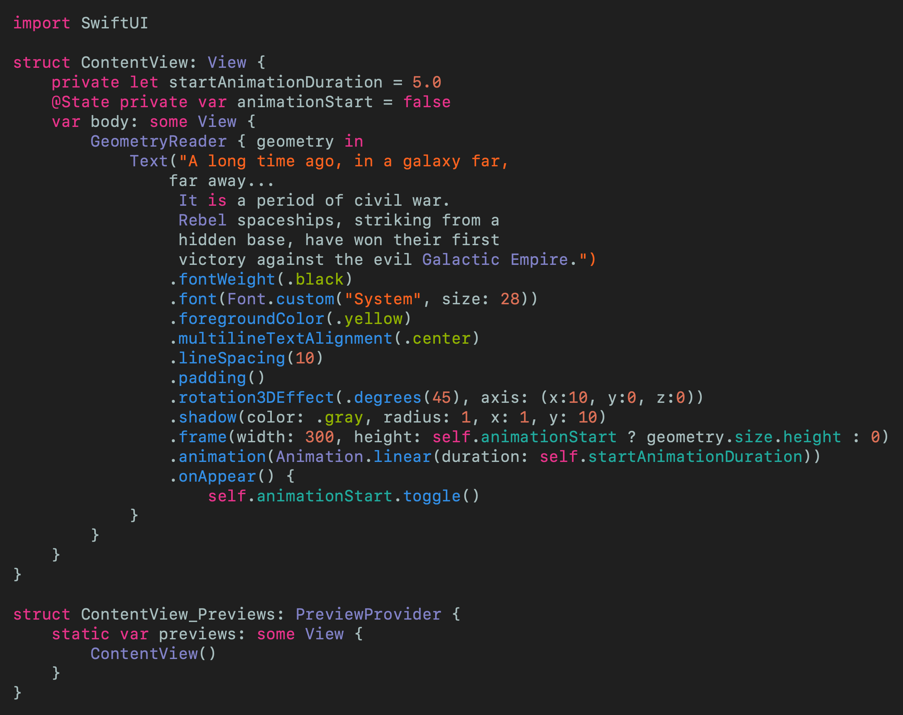

# Text Scroll using SwiftUI
## Like Star Wars? Done!

 
Photo by Daniel Cheung on Unsplash

Imagine that you want to create a scrolling view Star-Wars style. Well, Imagine no longer!

Difficulty: **Beginner** | Easy | Normal | Challenging 
This article has been developed using Xcode 11.5, and Swift 5.2.4

# Prerequisites:
* Be able to produce a [“Hello, World!”](https://medium.com/@stevenpcurtis.sc/your-first-swift-application-without-a-mac-79598ad839f8) Swift application
* Be able to produce a ["Hello, World"](https://medium.com/@stevenpcurtis.sc/hello-world-swiftui-92bcf48a62d3) SwiftUI application

# The example
This example is a nice one about how to scroll text up the screen in `SwiftUI` using instance methods on the `Text` struct. 

## That one thing
To find out the height of the device I used `GeometryReader` which is wrapped around the Text view. 

## That's enough!
Let us see the code, let us see the code. Ok: here it is.

 
[Click for Gist](https://gist.github.com/stevencurtis/1dab2d8697b553df831cadd069fadab1)

# Conclusion
Look, this text scroll does not work perfectly. However, this is an interesting tutorial exploring how to lay out `Text` and change the properties of the text in Swift that can be expanded into your `SwiftUI` projects.

Have fun!

If you've any questions, comments or suggestions please hit me up on [Twitter](https://twitter.com/stevenpcurtis) 

Why not sign up to my [newsletter](https://subscribe.to/swiftcodingblog/)
