# How Implicit Return Types Removed that Annoying Swift Inconsistency
## Deal with that Error

 
Photo by Ilyuza Mingazova on Unsplash

Apple have added a good number of features to SwiftUI at the recent WWDC conference. 
So, without delay, we shall get stuck in!

Difficulty: **Beginner** | Easy | Normal | Challenging 
This article has been developed using Xcode 12 beta

# Prerequisites:
* You will need to download the Xcode Beta (12) from Apple's developer website
* Be able to produce a [“Hello, World!”](https://medium.com/@stevenpcurtis.sc/your-first-swift-application-without-a-mac-79598ad839f8) Swift application

# The examples
These code examples are presented in a List in a `SwiftUI` App. Take a look at the repo 
[https://github.com/stevencurtis/SwiftCoding/tree/master/SwiftUI/Tips/NewIniOS14](https://github.com/stevencurtis/SwiftCoding/tree/master/SwiftUI/Tips/NewIniOS14) to have a full look.

The mini-app looks something (exactly) like the following:

 

## Before we get stuck in...

There is a new starting point for `SwiftUI` applications! It's all very nice, and here instantiates a `ContentView()` instance and you can even perform some more setup within this `struct`. Awesome!

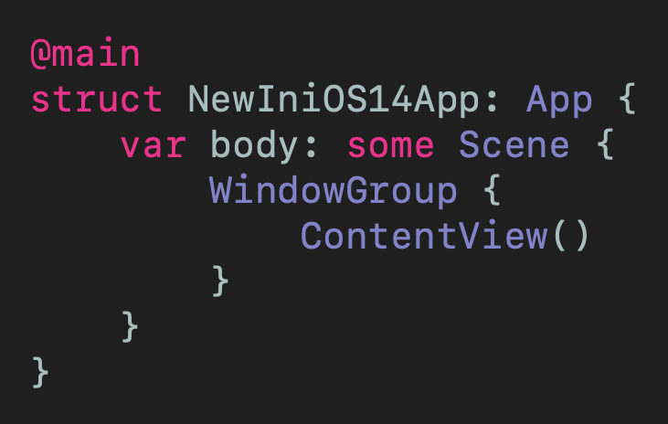 

## TextEditor
`SwiftUI` Now has `TextEditor` for handling scrolling text across multiple lines. Here the text is stored in `yourText` which is `@State`.

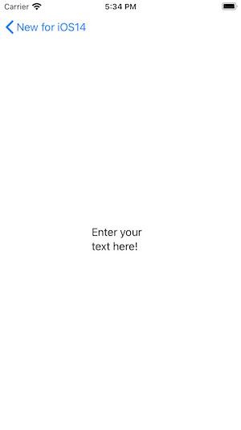 

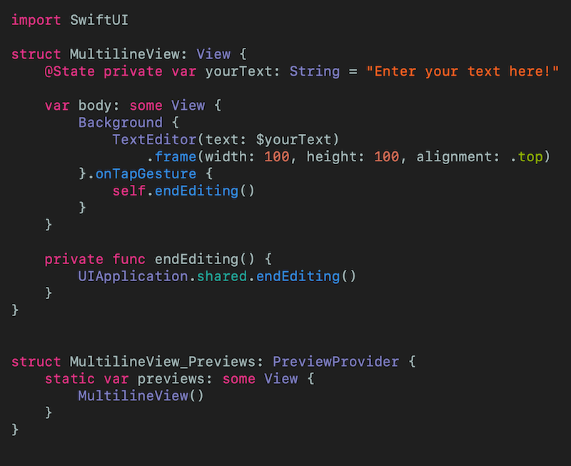 
[Click for Gist](https://gist.github.com/stevencurtis/19b36538ae4c4852bb41aaec08508e12)

## ProgressView
Wonderful! A `ProgressView` that acts as a progress bar - for example  used to inform the user about the progress of their downloads!

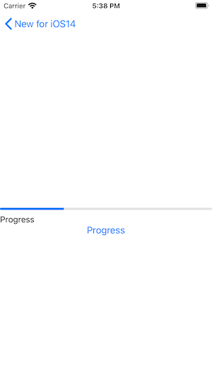 

 
[Click for Gist](https://gist.github.com/stevencurtis/19b36538ae4c4852bb41aaec08508e12)

## ProgressSpinner
If you want a `UIActivityMonitor` you can use a `ProgressView` without a value. This is...a way of showing that some work is going on. Great!

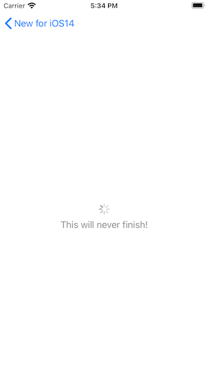 

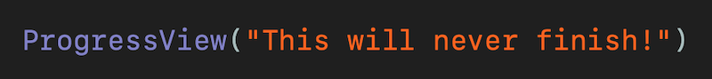 
[Click for Gist](https://gist.github.com/stevencurtis/a8e06538704f6fd86005049579d497dc)

## Map
Want to embed a map a s a view? `SwiftUI` has you covered. I've set this particular map around where I'm staying at the moment - the wine's opening soon so are you popping round? You can look up your own 'abode' by using Google to get your latitude and longitude for the coordinates and set a span for how zoomed out the map is.
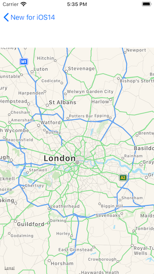 

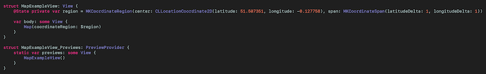 
[Click for Gist](https://gist.github.com/stevencurtis/7a3b7cfd1075c5228b24fdfeb5f19223)

## Changes
You can attach `onChange()` to views so `SwiftUI` checks when changes have been made to a view, and runs code when changes are made.

For example, this will print name changes as they are typed:
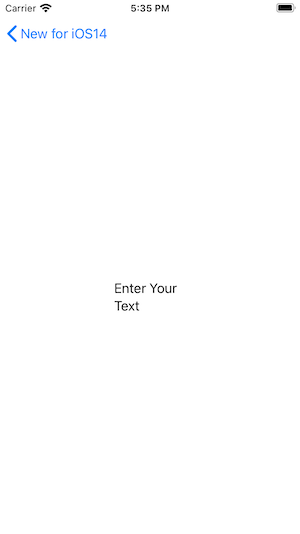 

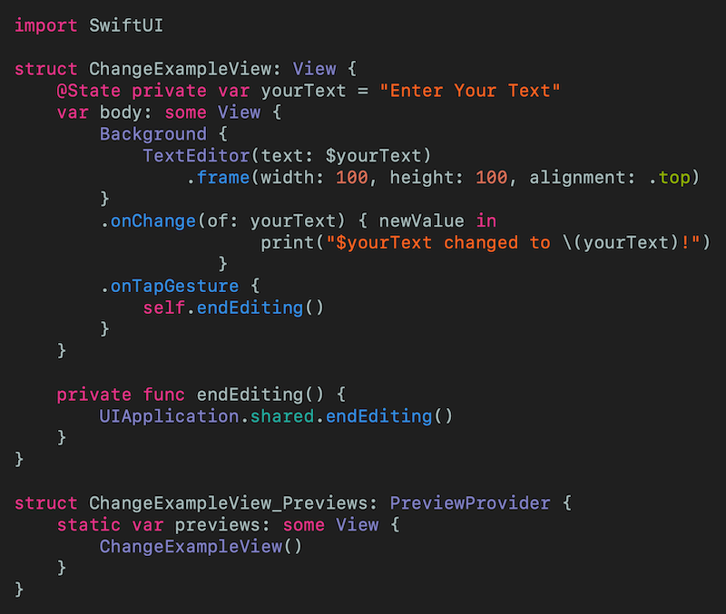 
[Click for Gist](https://gist.github.com/stevencurtis/3ef27e4c5604b69683a144caeb50eddc)

## Link
Open a link in Safari? Now you can!
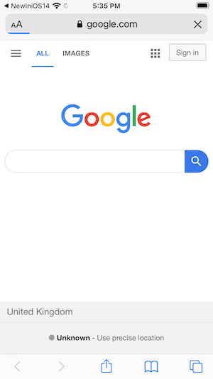 

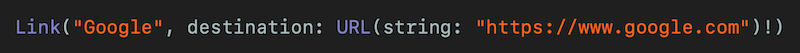 
[Click for Gist](https://gist.github.com/stevencurtis/eb249d6b735d3c294d18c5b3bca9125d)

## Color Picker
`SwiftUI` finally has a native ColorPicker! You'll need to bind a value (something like a background color), but when you do you'll get this quite wonderful graphic view for picking your color - isn't that great? 

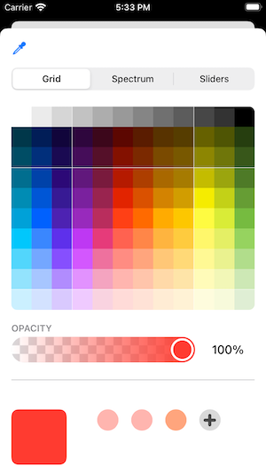 

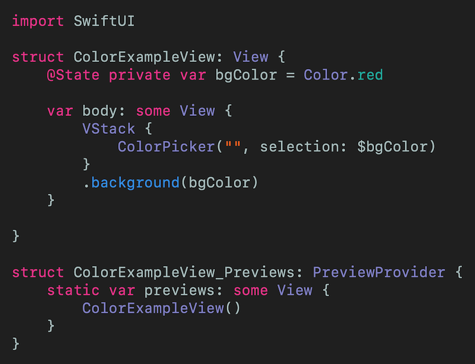 
[Click for Gist](https://gist.github.com/stevencurtis/76dd65bf5d54a0851852fc4fbb183dd8)

## PageTabViewStyle
If you want a swipable set of views this is your feature. Yes!!
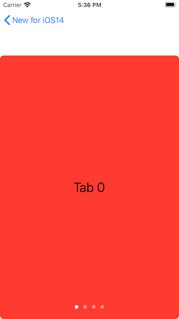 

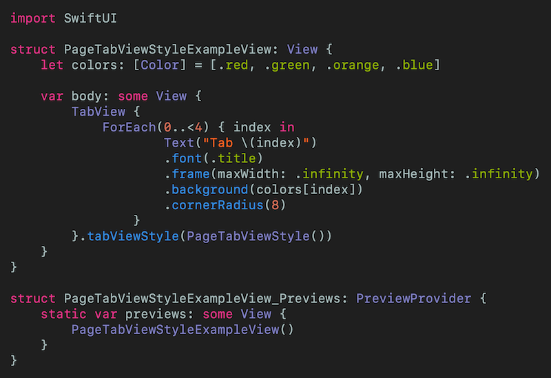 
[Click for Gist](https://gist.github.com/stevencurtis/0adb96bdc12bcd7852366bc2a6cc2bcd)

## LazyVGridExampleView
You can set new containers for grid-based layouts setting childviews using `LazyHGrid` or `LazyVGrid`. Each of these elements are `GridItems` and can be set as follows: 

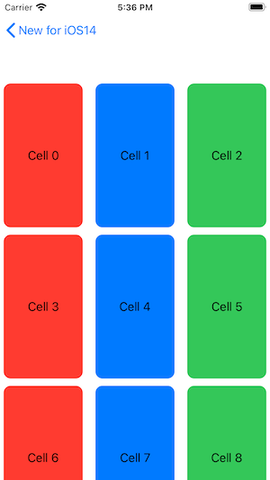 

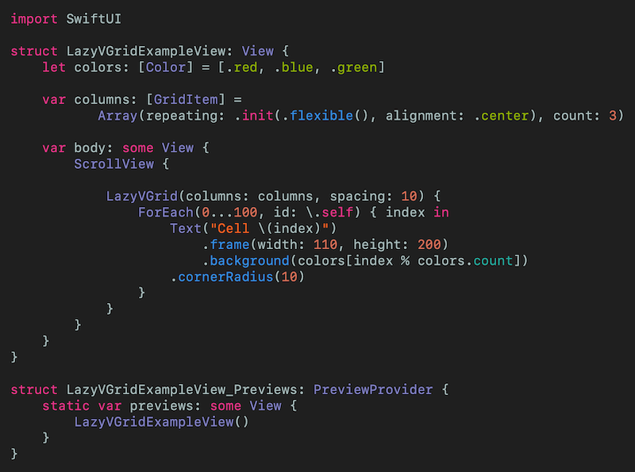 
[Click for Gist](https://gist.github.com/stevencurtis/f0f5cab346851829c3f01f3e02d309be)

# Conclusion
I hope this article has helped you understand what is happening in this WWDC season, and has been of use to you.

Have fun!

If you've any questions, comments or suggestions please hit me up on [Twitter](https://twitter.com/stevenpcurtis) 

Why not sign up to my [newsletter](https://subscribe.to/swiftcodingblog/)
