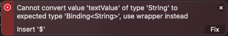

# What is a ProjectedValue in SwiftUI?
## Kind of what is sounds like


<sub>Image by Glenn Carsetens-Peters</sub>

# Before we start
Difficulty: **Beginner** | Easy | Normal | Challenging<br>
This article has been developed using Xcode 12.2, and Swift 5.3

## Prerequisites
* You will be expected to make a [Single View SwiftUI Application](https://medium.com/@stevenpcurtis.sc/hello-world-swiftui-92bcf48a62d3) in Swift.

## Keywords and Terminology
Binding: The mapping of one thing to another.
projectedValue: A projection of the binding value that returns a binding.
State: A property wrapper type that can read and write a value managed by SwiftUI.
String: A collection of Characters.
Text: A view that displays one or more lines of read-only text.
TextField: A control that displays an editable text interface.

# This project
## Background
[Apple's documentation](https://developer.apple.com/documentation/swiftui/binding/projectedvalue) is actually rather nice for this, but does rely on the reader understanding `@State` and `Binding`, and doesn't give a repo with code that can be downloaded and run on your local machine.

## The non-working illustrative version

```swift
struct ContentView: View {
    @State private var textValue: String = "Hello, World!"

    var body: some View {
        Text(textValue)
            .padding()
        TextField("", text: textValue)
            .textFieldStyle(RoundedBorderTextFieldStyle())
            .padding(.horizontal, 10)
            .autocapitalization(.none)
    }
}

struct ContentView_Previews: PreviewProvider {
    static var previews: some View {
        ContentView()
    }
}
```

this gives the following error message:

```swift
Cannot convert value 'textValue' of type 'String' to expected type 'Binding<String>', use wrapper instead

Insert '$'
```



where Swift is intimating that we need to prefix `textValue` with a dollar symbol `$`. 

Of course we can do that, with the resultant `TextField` as following:

```swift
TextField("", text: $textValue)
    .textFieldStyle(RoundedBorderTextFieldStyle())
    .padding(.horizontal, 10)
    .autocapitalization(.none)
```

## Looking at that error message
`textValue` in a String, yet `TextField` must be bound to a `Binding` of the type `String` (that is, `Binding<String>`. 

This makes sense, since a `TextField` can edit the value to which it is bound. Therefore, giving it a plain String makes no sense because what would happen when we edit the `TextField`? This would be undetermined behaviour.

The solution is to use a wrapper instead, because `TextField` can edit the value. So in this instance, the property is marked as a `@State` and is involved in a two-way binding by connecting the projected value to the component.

## Under the hood - projected values
**The @State property wrapper**
A projected value is useful in that it can provide an interface for a specific property wrapper. 

Rather than using a `ContentView` here, for simplicity I've created a `struct` called `MyObject` since Property wrappers are not yet supported in top-level code.

Let us investigate this code:

```swift
struct MyObject {
    @State private var textValue: String = "Hello, World!"
    func outputValues() {
        print (1 ,type(of: textValue), textValue)
        print (2, type(of: _textValue), _textValue)
        print (3, type(of: $textValue), $textValue)
    }
}
let myObject = MyObject()
myObject.outputValues()
``` 

The output of this is as follows:

```swift
1 String Hello, World!
2 State<String> State<String>(_value: "Hello, World!", _location: nil)
3 Binding<String> Binding<String>(transaction: SwiftUI.Transaction(plist: []), location: SwiftUI.LocationBox<SwiftUI.ConstantLocation<Swift.String>>, _value: "Hello, World!")
```

The first output (1) is `textValue` which is an ordinary `String` this is quite a relief because what else could it be?
Now (2) is the property wrapper type which means the wrapped value is stored in the heap, and when it changes invalidates the View - giving SwiftUI the ability to update views when values change. The `State` is not the value in itself, which is accessible through 1.
(3) is interesting, since it returns the binding, that is something that can be bound to a component (for example the `TextField` in the example at the top of this article).

Effectively `@State` asks SwiftUI to [observe](https://medium.com/swift-coding/the-observer-pattern-in-swift-97a0e6fafa58) changes and update the view accordingly, and this happens when a property on a `struct` is altered to provide a new instance of the `struct` and Swift can work out the difference between two `struct` instances. This makes it clear that `@State` should only be used on `struct` instances of a view rather than their `class` counterparts.

**The @Published property wrapper** 
[Property wrappers are more than just `@State`](https://github.com/stevencurtis/SwiftCoding/tree/master/SwiftUI/PropertyWrappers), and if we want changes to be visible to more than a single view is is usually the property wrapper we would generally choose `@Published`.

By marking a property as @Published, Swift generates a publisher that sends updates to any subscriber when the property changes.
An example of this is the class below, where the String will send updates when the String itself if changed.

```swift
class MyClass: ObservableObject {
    @Published var textValue: String = "Hello, World!"
}
```

We can access the textValue property using dot notation to get or set the value (much like any other property).

```swift
let myObject = MyClass()
let currentValue = myObject.textValue // "Hello, World!"
myObject.textValue = "New value"
let newValue = myObject.textValue // "New value"
```

**The @Binding property wrapper**
The `@Binding` property wrapper provides a way to create a two-way binding between a view and a piece of data that is owned by another view or view controller.

Binding is described in my [article](https://stevenpcurtis.medium.com/swiftuis-property-wrappers-a8771e8ef39b), but it is important to grasp that it is a two-way binding between a view and data.

**The three property wrappers**
Knowledge of these three property wrappers, @State, @Published and @Binding combine for type(of: value), type(of: _value) and type(of: $value) respectively which return the value, the wrapped value and the projected value respectively.

Project a binding? Use the $value variant to return a binding to that string (phew).

# Conclusion
The [Repo](https://github.com/stevencurtis/SwiftCoding/tree/master/SwiftUI/BindingPropertyWrapper) makes things rather easier to follow in this project, and I do recommend you download this project.

As might perhaps be expected, this type of code is easier with examples than it is from explanation. I hope that this article has given you enough of a steer about what this code might be used for, and how you might incorporate it into your code.
Anyway, thanks for reading!

If you've any questions, comments or suggestions please hit me up on [Twitter](https://twitter.com/stevenpcurtis) 
