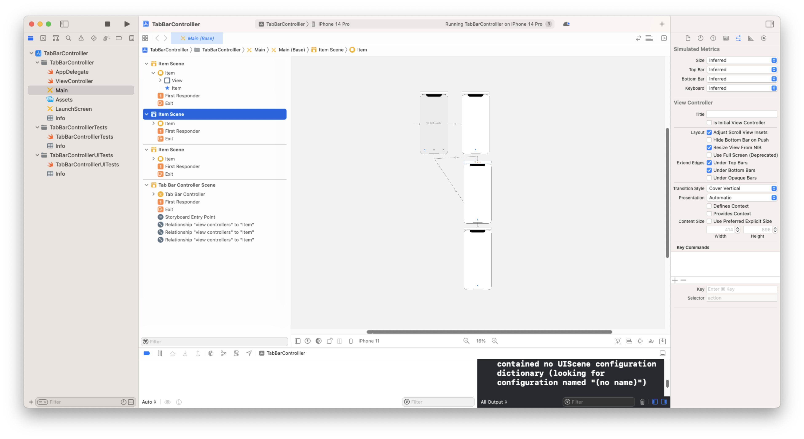
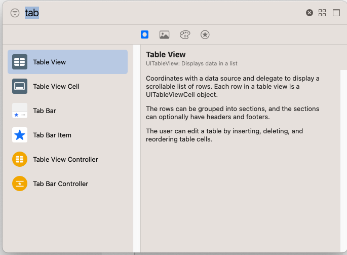
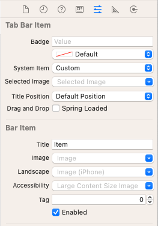
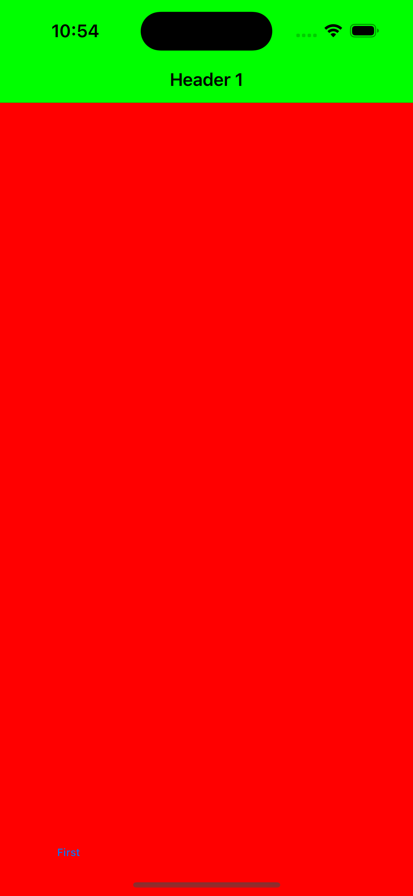

# Adding a UITabBarController
## Can be tricky in iOS15

For so long I'd only implemented UITabBarController using a storyboard. Can I do it now, programmatically? Must be possible. 

# Before we begin
Difficulty: **Beginner** | Easy | Normal | Challenging
This article has been developed using Xcode 14.2, and Swift 5.7.2

# Terminology:
SwiftUI: A simple way to build user interfaces across Apple platforms

## Prerequisites:
You will be expected to be aware how to make a SwiftUI project

# Using Storyboards
I remember doing this now. There isn't any code but it's still quite hard to see anything



If I remember it was pretty trivial to add a tabbarcontroller to the scene



It's more than possible to change the text on the item by using the attributes inspector, but it's all fairly trivial.



It all works a-ok.
But what about my usual way to create a project? Using iOS 15?

# Using a Programmatic Method
All of the shenanigans are going to take place in the `scene(_:willConnectTo:options:)` function in the `SceneDelegate`. I'll give you the completed code and then walk you though:

```swift
func scene(_ scene: UIScene, willConnectTo session: UISceneSession, options connectionOptions: UIScene.ConnectionOptions) {
    guard let windowScene = (scene as? UIWindowScene) else { return }
    
    let tabBarController = UITabBarController()
    
    let firstViewController = ViewController()
    firstViewController.title = "First"
    let firstNavController = UINavigationController(rootViewController: firstViewController)
    firstNavController.navigationBar.topItem?.title = "Header 1"
    
    let navBarAppearance = UINavigationBarAppearance()
    navBarAppearance.configureWithOpaqueBackground()
    UINavigationBar.appearance().standardAppearance = navBarAppearance
    UINavigationBar.appearance().scrollEdgeAppearance = navBarAppearance
    navBarAppearance.backgroundColor = .green
    
    let secondViewController = SecondViewController()
    secondViewController.title = "Second"
    let thirdViewController = UIHostingController(rootView: ThirdView())
    
    tabBarController.setViewControllers([firstNavController, secondViewController, thirdViewController], animated: false)
    
    window = UIWindow(windowScene: windowScene)
    window?.rootViewController = tabBarController
    window?.makeKeyAndVisible()
}
```

Setting up the `UITabBarController` is fairly trivial.

```swift
let tabBarController = UITabBarController()
```

You'd argue that setting up the snappily titled firstViewController here is fairly trivial.

```swift
let firstViewController = ViewController()
firstViewController.title = "First"
let firstNavController = UINavigationController(rootViewController: firstViewController)
firstNavController.navigationBar.topItem?.title = "Header 1"
```

The title appears on the `UITabBarController`, and the top item appears at the top of the header.
To make the `UITabBarController` opaque is actually a little tricky here.

```swift
let navBarAppearance = UINavigationBarAppearance()
navBarAppearance.configureWithOpaqueBackground()
UINavigationBar.appearance().standardAppearance = navBarAppearance
UINavigationBar.appearance().scrollEdgeAppearance = navBarAppearance
navBarAppearance.backgroundColor = .green
```

Which is annoying, and something which might be easily forgotten.
In this code I've created another viewController to make it clear the tab bar controller is working when it's run from the repo.

```swift
let secondViewController = SecondViewController()
secondViewController.title = "Second"
let thirdViewController = UIHostingController(rootView: ThirdView())
```

We then set the viewControllers by dropping them into the `UITabBarController`

```swift
tabBarController.setViewControllers([firstNavController, secondViewController, thirdViewController], animated: false)
```

before we do the usual setting of the rootViewController.

```swift
window = UIWindow(windowScene: windowScene)
window?.rootViewController = tabBarController
window?.makeKeyAndVisible()
```

Which makes it all run like this:



# Conclusion

UITabBarController wasn't this hard when it simply required the storyboard. However, now it's done - it's done.
I hope that helps someone out there!
