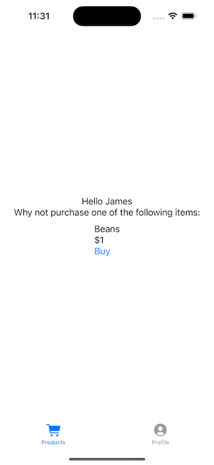

# Harnessing the Power of Tab Bars in SwiftUI
## We all used to enjoy UITabBarController, right?

I've seen loads of articles which relate to tabs in SwiftUI 

Difficulty: **Beginner** | Easy | Normal | Challenging

## Prerequisites
- Be able to produce a ["Hello, World!" SwiftUI project](https://stevenpcurtis.medium.com/hello-world-swiftui-92bcf48a62d3)

## Keywords and Terminology
TabView: A SwiftUI container that provides a tab-based interface. Users can switch between multiple views through tabs at the bottom of the screen.
UITabBarController: A UIKit class which manages a tab-based interface. Users can switch between multiple view controllers through tabs at the bottom of the screen.

# What is a TabBar anyway?
As iOS developer we often get designers asking us to deliver tab-based interfaces.

They give users reasonable control over which view controller they see at any given time.

However, we are talking here about *SwiftUI*. We aren't talking about view controllers or screens here. We are talking about views.

So how can we get several views to be displayed in a rather nice tab view?

Something like the following?



# The TabView
In SwiftUI `TabView` is roughly equivalent to a `UITabBarController` in UIKit. It is effectively a container which you can use to manage multiple child views in a tab-based interface.

In my code example (in the repo) I avoid setting the tabs in the `App` struct or within the views themselves.

So the driver of my logic is `MainTabView`:

```swift
struct MainTabView: View {
    var body: some View {
        TabView {
            ProductsView(userStore: testProfile, productStore: testProductsData)
                .tabItem {
                    Label("Products", systemImage: "cart.fill")
                }
                .tag(0)

            UserView(userStore: .init(user: .init(firstName: "Username", surname: "UserSurname")))
                .tabItem {
                    Label("Profile", systemImage: "person.crop.circle.fill")
                }
                .tag(1)
        }
    }
}
```

This then references the `ProductsView` and `UserView` using the following code:

**ProductsView**

```swift
struct ProductsView: View {
    @ObservedObject var userStore: ProfileStore
    @ObservedObject var productStore: ProductsStore
    var body: some View {
        VStack(spacing: 10) {
            VStack {
                Text("Hello \(userStore.user?.firstName ?? "")")
                Text("Why not purchase one of the following items:")
            }
            VStack(alignment: .leading) {
                ForEach(productStore.products, id: \.name) { product in
                    Text(product.name)
                    Text(product.price)
                    Button("Buy") { }
                }
            }
        }
    }
}
```

**UserView**

```swift
struct UserView: View {
    @ObservedObject var userStore: ProfileStore
    var body: some View {
        VStack(alignment: .leading) {
            Text(userStore.user?.firstName ?? "")
            Text(userStore.user?.surname ?? "")
            Button("Change username") { }
        }
    }
}
```

# Conclusion
I hope this article has been of help to you, and I guess I'll see you next time?
