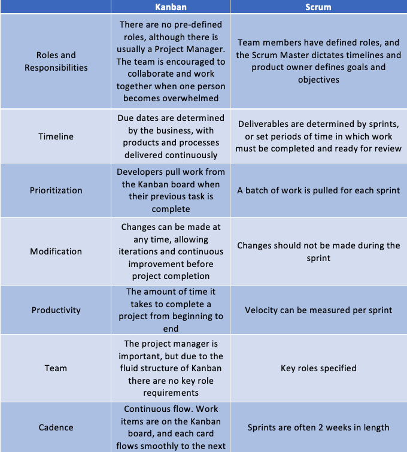

# Kanban or Scrum?
## Agile can be implemented in a few different ways…

 
Photo by Natalie Pedigo on Unsplash

# Choosing the right system for your team

There are several ways to implement the Agile framework within your organisation or team - and since both are designed to work with Agile Methodologies neither option is necessarily wrong.

Some leaders think about trying to choose between Kanban boards and Scrum boards and this can be very challenging if you haven't used either before and exploring the differences is something this article has been created to help you our with.

## Understanding the difference between Scrum and Kanban

This isn't the limit of the the differences between Scrum and Kanban, but here are some of the differences rather attractively presented in a table:

 

And in a diagram:

!Comparison(Images/Comparison.png) 

## So..
Scrum is a structured agile approach. Nobody gets fired for choosing scrum, yet in the background there is Kanban.

Kanban helps to limit work-in-progress and move from doing to done. By allowing changes in progress if there are fast moving changes to the project Kanban can allow teams to react quickly and produce great software.

# Conclusion
As ever, this is always down to you and your project situation. 
If you've any questions, comments or suggestions please hit me up on Twitter
