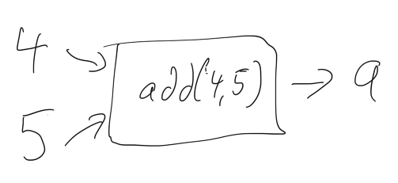
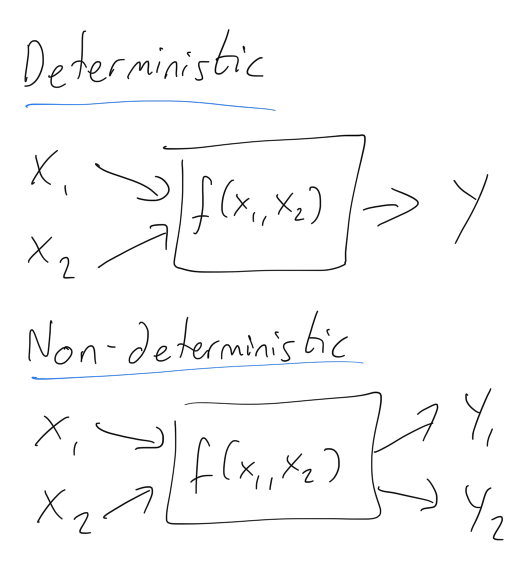

# Data Races in Programming
## And how to prevent them

When a programmer creates software they typically wish that software to be predictable.
Many pieces of software are *deterministic* so given a set of inputs the same output is always given. Although *non-deterministic* algorithms have their uses (for example to approximate answers) this focuses on *deterministic* functions.

# Determinism and Data Races

In the following java class, we would generally wish the output to always be the same for the same input. In the example below, we would expect the sum of 4 and 5 to be  9.

```java
public static int add(int number, int num){
    return number + num;
}

int result = add(4, 5); // 9
```



This helps testing, as the input wholly predicts the output. More generally we can see the difference between deterministic and non-deterministic functions in the diagram below:



The issue for non-deterministic functions is that the output may be Y₁ or it may be Y₂ for identical input set X₁ and X₂.

# Multithreaded Programming and Data Races 
Multiple tasks or threads may access a shared resource which can lead to undefined or unpredictable behaviour. 
This is known as a *data race* and programming can be slow and problematic due to the non-deterministic nature of the issue. A bug or error may occur for only a small subset of executions which appear to not be reproducible.
In this simple example below, Thread 1 and Thread 2 are in a race! Which one will win? Without any protection mechanism either Thread 1 OR Thread 2 can complete first:


So either sequence can happen:
sequence 1
+ Thread 1
+ Thread 2
sequence 2
+ Thread 2
+ Thread 1

Either sequence is valid. This might not seem a problem when we output to the console, but if any surrounding code contained a dependency for this output the data race becomes a bug.
Since data races do not reliably follow the sequence in which instructions can be expected to run a test can generate different results in sequential runs making reproduction and fixes tricky.

# Preventing Data Races
## Design
The best protection for protecting against data races is good design. Avoiding shared resources and minimizing interactions between threads make it less likely that you will encounter the issues described above. Minimizing side-effects through pure functions, avoiding shared global state and favouring immutable over mutable values are all techniques that can be used to limit the problems that may be encountered.
## Locks
Mutual Exclusion Locks (Mutexes) are commonly used to avoid data races. If two tasks need to use a shared resource (Task1 and Task2) we should lock the mutex before access and release after access. If both Task1 and Task2 wish to access the same resource (with Task1 wishing to access the resource first) Task2 will need to wait until Task1 is complete.
It can be more complex to place the mutex locks correctly, and confirming the code is correct can be a difficult task (as can debugging issues with data races).
## Tools
Static analysis tools can detect data races and suggest fixes. Using tools can of course make software development easier and come much recommended.

# Conclusion
Thank you for reading.
Data races can be tricky to detect and fix because they can be hard to reproduce. Problems with data races can be compounded by the fact that incorrect placement of mutexes may not not fix the issue.
Happy coding, and perhaps I'll see you next time?
