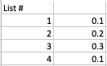
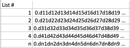

# The Strange Case of Georg Cantor
## And the Diagonalization argument


Georg Cantor played a pivotal role in the creation of set theory, and his theory of transfinite numbers has been considered to be shocking.

Called by peers as a scientific charlatan, renegade and corrupter of youth it is said that his leading mathematical work led him to an unexpected end.

**So what happened, why do we treat new ideas with such scepticism and what can we learn from this?** 

# Infinite dreams
Cantor grasped with the understanding and meaning of infinity in mathematics.

Galileo had already concluded that two concentric circles must both be comprised of an infinite number of points. This goes against the intuition that the larger circle appears to contain more points.

We can image this by sweeping our line around the circle. No matter how small the number of degrees we move around the circles, there is a precise 1-to-1 mapping between the points of the circles.

<br>

However Galileo ultimately concluded that *less*, *equal* and *greater* apply to infinite sets but not to infinite sets in an apparent contradiction that is now known as Galileo's paradox.

Over two hundred years after Galileo's death in 1642, the birth of a mathematician in Germany of a man who could accept this compromise would revolutionise mathematics forever.

This great work cam from a man scarred from leaving his childhood home in Russia for Germany, and never felt at ease in Germany.

# Infinite sets
Cantor claimed that since we can add numbers together (1 to 1, 3 to 5 and so on) then it should be possible to add infinity and infinity. 

If you can add infinity therefore there are other, larger infinite sets. Moreover, there might be infinitely many sets of infinite numbers with different sizes. 

This means that there would no longer be a *single* infinity.

`Nothing would be the same again`

# Cantor's poor treatment
Cantor thought that God had communicated all of this theories to him. Several theologians saw Cantor's work as an affront to the infinity of God.

Set theory was not well developed and many mathematicians saw his work as abstract nonsense.

There developed vicious and personal attacks towards Cantor. Perhaps destabilised by his fragmented childhood Cantor developed attack of depression.

```
...how much happier I would be to be scientifically active, if only I had the necessary mental freshness.
```

As his mental condition worsened he continued to publish papers. His 1894 paper listing the way all even numbers up to 1000 could be written as the sum of two primes representing this period since a verification of Goldbach's conjecture was already 40 years old.

Whenever Cantor suffered from periods of depression he turned towards philosophy and literary interests. He eventually died of a heart attack in a sanatorium in 1917.

# What we can learn
We still seem to cling to ideas that we've put significant effort into achieving. We can see significant mirroring of this situation regarding the use of social networks and the way people cling to their ideas.

Today it seems that scepticism and personal tack are becoming a common part of the scientific process. This is a challenge for humankind as the process for creating scientific breakthroughs relies on peer-review and collaboration. 

It is important to approach new ideas with an open mind and not be discouraged by opposition, and be determined in advancing knowledge and understanding.

# The argument
Georg's most famous discover is the *diagonal argument*. This argument is used for many applications including the Halting problem.

In its original use, Georg used the *diagonal argument* to develop set theory.

During Georg's lifetime the concept of infinity was not well-defined, meaning that an infinite set would be simply seen as an unlimited set.

Natural numbers (counting numbers, positive integers) can form a set

```
N = {1,2,3,4}
```

the set above contains just 4 elements. To add the next counting number, we add 1 to the largest number in the set and add it.

`Adding 1 to any number gives a higher number.`

## No highest number

This in turn means there is no highest number since adding one to the highest number would resolve to a number that would be <= the highest number.

Rearranging this equation shows why this does not stand

```
ⁿHighest + 1 <= ⁿHighest
1 <= ⁿHighest - ⁿHighest
1 <= 0
```
Since 1<= 0 is false there is no highest number.

## A set is the same size as one of its own proper subsets
Since every natural number has an immediate successor Georg defined **countable infinity**

Countably infinite sets have some surprising properties (perhaps unsurprising because of the amount of abuse Georg faced within his lifetime) 

It might be expected that there are only half as many even numbers as counting numbers. However, natural numbers and even numbers have a one-to-one correspondence:

```
1 → 2
2 → 4
3 → 6
```

A one-to-one correspondence means that the number of pairings represents the set's size.

That means that the number of even numbers and natural numbers

```
1 → 2
2 → 4
3 → 6

n → 2n
```

This implies that the set of natural numbers is the same size as one it's proper subsets.

**This is weird**
Finite sets = A proper subset is always smaller than the original set
Infinite sets = Some proper subsets are the same size as the original set

## Cardinality
Infinity ∞ is too broad a word to describe what is happening here. We need something more than the size of a set. We need to understand the **countable infinity cardinality ℵ0** of sets.

## The indirect proof
1. Identify the statement `S` to be proved
2. Assume `¬S` (The negation of the statement `S` to be proved)
3. Using logical reasoning, deduce a statement `A` and it's negation `¬A` from the assumption `¬S`
4. Show that `A ∧ ¬A` is a contradiction, meaning that both `A` and `¬A` cannot be true at the same time. Therefore we assume `¬S → A ∧ ¬A` is true
5. The contradiction is deduced from the assumption `¬S` using the logic expressed here: 
```
¬S → A ∧ ¬A
¬(¬S) ∨ (A ∧ ¬A)
¬¬S ∨ (A ∧ ¬A)
S ∨ (A ∧ ¬A)
S ∨ FALSE {since A ∧ ¬A == FALSE}

¬S → A ∧ ¬A == TRUE {from 4 above}
S ∨ FALSE == TRUE {follows}
S == TRUE {follows}
```

leading us to conclude logically that `S` is true.

In following this pattern Georg invented the diagonal argument.

S: Real numbers between 0 and 1 could not be put into one-to-one correspondence with all natural numbers. 
Georg assumed this statement `S` to be true.

A partial list of real numbers might be something like the following:
<br>

We need a general representation. This can be represented with symbols

<br>

If there is a one-to-one correspondence with counting and real numbers, it should be impossible to find another real number that is not in the list. This contradiction would mean our initial initial assumption is false and real numbers do not have the same cardinality as natural numbers.

```
m = 0.(d11+1 mod 10)(d22+1 mod 10)(d33+1 mod 10)(d44+1 mod 10)(d55+1 mod 10)(d66+1 mod 10)...(dnn+1 mod 10)
```

We take the diagonal elements of the list, d11, d22, d33, d44, d55 and add 1 to them (although if d = 9, d + 1 = 0). We assume that `m` must have a position in the original list.

The position of `m`? There is no place for the new number. For any counting number n, the new number cannot be put in the original list since dnn exists and our new number has dnn + 1.

This is a contradiction of the statement, and therefore counting numbers and real numbers do NOT have the same cardinality. 

# Conclusion
If you'd like a more in-depth discussion of the proof please do look at the [source](https://www.coopertoons.com/education/diagonal/diagonalargument.html#ok).

Have a good day/night/week/weekend/holiday/birthday!

Thanks for reading!

If you've any questions, comments or suggestions please hit me up on [Twitter](https://twitter.com/stevenpcurtis) 
