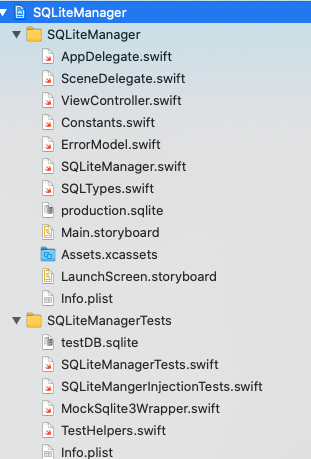

# Writing FIRST Swift Tests
## Be a FIRST-class Developer!

<br/>
<sub>Photo by Nina Mercado on Unsplash<sub>

# Terminology:
Unit test: Software testing where individual units or components of the software is Software testing where individual units or components of the software is tests

# Why test
Testing your classes is really important, giving confidence in your code and allowing programmers to both maintain your code (Good) and proof that your code meets the contract of what it should do.

When changes are made to code during development, breaking changes proves that code needs to be looked at again until all of the tests pass.

This is [Test Driven Development](https://medium.com/@stevenpcurtis.sc/test-driven-development-tdd-in-swift-b903b31598b6), but having FIRST tests actually goes further than that.

# What are FIRST tests?
* Fast
* Independent
* Repeatable
* Self-validating
* Timely

so let us dive in and see what each of these mean in turn:
**Fast**
Tests need to be quick, in such a such a way that developers won't be discouraged from using them. Developers won't run all the tests regularly if they take too long to run, and then what is the point in having them?

**Independent**
Tests should be independent of the state of the previous test. If you have a database that deletes a record, the next test shouldn't fail because that particular record is missing! In Swift we have the option of using `override func setUpWithError() throws` which runs at the beginning of each test to do any necessary prep work.

**Repeatable**
Repeatable means that tests do not depend on the environment that they belong in. If a test fails it is because the code that is running on that test fails, not a dependency and because another test is running at a similar time. The tests should always run with the expected output,

**Self-validating**
We are helped out with the way that the iOS SDK sets up tests for us, in that they either pass or fail. There should be no need for someone running the tests to understand how they are set up or how they run - either they pass or they don't.

**Timely**
Tests shouldn't be left until the end of a sprint, any production cycle or even when you have finished (in your opinion) your code. They should be written as and when they are useful to be run. Some will see this as an interpretation of [Test Driven Development](https://medium.com/@stevenpcurtis.sc/test-driven-development-tdd-in-swift-b903b31598b6), but it doesn't have to be. You should be writing tests to prove that your code is of sufficient quality for the job that it is performing. 

# Example
Watch the following video for my [SQLiteManager](https://youtu.be/qVu0ow0mats) shows how this can be added into a genuine project. 

Essentially, if you are using a database you could choose to have a version in your production and test target and test target (in this case I have `production.sqlite` and `testDB.sqlite`) 



This is fine, but within tests we would not have a **repeatable** set of tests - because if you make any change in the `test.db` (like deleting a record) - so the following test:

```swift
    func testDeleteDB() {
        let expectation = XCTestExpectation(description: #function)
        let mgr = SQLiteManager("testDB")
        mgr.open(withdbpathfunc: TestHelpers().testPath, withCompletionHandler: { result in
            switch result {
            case .failure(let error):
                print(error)
            case .success(let success):
                try! mgr.delete(table: "mytable", deleteValues: PairedVals(column: "ID", data: .integer(2)), success!, completion: {
                    let result = TestHelpers().readFromTable(table: "mytable", success!)
                    XCTAssertEqual(result, [["1", "Apple"], ["3", "Fries"]])
                    expectation.fulfill()
                }
                )
            }
        })
        wait(for: [expectation], timeout: 3.0)
    }
```

makes the following test unreliable (because no matter the order of the tests in Xcode, we cannot guarentee the order that the test run) -

```swift
    func testReadDB() {
        let expectation = XCTestExpectation(description: #function)
        let mgr = SQLiteManager("testDB")

        mgr.open(withdbpathfunc: TestHelpers().testPath, withCompletionHandler: { result in
            switch result {
            case .failure(let error):
                print(error)
            case .success(let success):
                let result = mgr.readDB(from: "mytable", success!)
                XCTAssertEqual(result, [["1", "Apple"], ["2", "Bread"], ["3", "Fries"]])
                expectation.fulfill()
            }
        })
        wait(for: [expectation], timeout: 3.0)
    }
```

So the right method of approaching this problem is to use a wrapper for `Sqlite3` functions, and invoking the power of [Dependency Injection](https://medium.com/@stevenpcurtis.sc/learning-dependency-injection-using-swift-c94183742187) in Swift.

The mock looks something like the following:

```swift
@testable import SQLiteManager
import SQLite3

class MockSqlite3Wrapper: Sqlite3WrapperProtocol {
    
    var columns = 0
    
    var outputStrings: [[String]] = [["1", "Hello", "World"], ["2", "a", "b"], ["3", "c", "d"]]

    func sqlite3_column_text(_ op: OpaquePointer!, _ iCol: Int32) -> UnsafePointer<UInt8>! {
        if columns < 3 {
            let outputString = outputStrings[counter][columns]
            let data = outputString.data(using: String.Encoding.utf8, allowLossyConversion: false)!
            let dataMutablePointer = UnsafeMutablePointer<UInt8>.allocate(capacity: data.count)
            data.copyBytes(to: dataMutablePointer, count: data.count)
            let dataPointer = UnsafePointer<UInt8>(dataMutablePointer)
            columns += 1
            return dataPointer
        }
        columns = 0
        return nil
    }
    
        struct MockSqliteRun {
        var close: Bool = false
        var finalize: Bool = false
        var step: Bool = false
        var open: Bool = false
        var prepare: Bool = false
        var column: Bool = false
        var bindInt: Bool = false
        var bindText: [String] = []
    }
    
        
    var whichRun: MockSqliteRun = MockSqliteRun()
    func sqlite3_close(_ pointer: OpaquePointer!) -> Int32 {
        whichRun.close = true
        return 0
    }
    
    func sqlite3_finalize(_ pStmt: OpaquePointer!) -> Int32 {
        whichRun.finalize = true
        return 0
    }
    
    var counter = -1
    var stepdone = false
    
        func sqlite3_step(_ pointer: OpaquePointer!) -> Int32 {
        whichRun.step = true
        if (stepdone) {return SQLITE_DONE}
        if counter < 1 {
            counter += 1
            return SQLITE_ROW
        }
        return SQLITE_DONE
    }
    
        func sqlite3_open_v2(_ filename: UnsafePointer<Int8>!, _ ppDb: UnsafeMutablePointer<OpaquePointer?>!, _ flags: Int32, _ zVfs: UnsafePointer<Int8>!) -> Int32 {
        // in order to pass out the reference to the db
        SQLite3.sqlite3_open_v2(filename, ppDb, flags, zVfs)
        whichRun.open = true
        return 0
    }
    
    func sqlite3_prepare_v2(_ db: OpaquePointer!, _ zSql: UnsafePointer<Int8>!, _ nByte: Int32, _ ppStmt: UnsafeMutablePointer<OpaquePointer?>!, _ pzTail: UnsafeMutablePointer<UnsafePointer<Int8>?>!) -> Int32 {
        whichRun.prepare = true
        SQLite3.sqlite3_prepare_v2(db, zSql, nByte, ppStmt, pzTail)
        return SQLITE_OK
    }
    
        func sqlite3_column_int(_ oP: OpaquePointer!, _ iCol: Int32) -> Int32 {
        whichRun.column = true
        return 0
    }
    
    func sqlite3_bind_int(_ oP: OpaquePointer!, _ first: Int32, _ second: Int32) -> Int32 {
        whichRun.bindInt = true
        return SQLITE_OK
    }
    
    func sqlite3_bind_text(_ oP: OpaquePointer!, _ first: Int32, _ second: UnsafePointer<Int8>!, _ third: Int32, _ ptrs: (@convention(c) (UnsafeMutableRawPointer?) -> Void)!) -> Int32 {
        whichRun.bindText.append( String(cString: second) )
        return SQLITE_OK
    }   
}   
```

You can then call this with something like the following:

```swift
    var wrapper: MockSqlite3Wrapper!
    var mgr: SQLiteManager!
    
    override func setUpWithError() throws {
        // Put setup code here. This method is called before the invocation of each test method in the class.
        wrapper = MockSqlite3Wrapper()
        mgr = SQLiteManager("testDB", wrapper: wrapper)
    }
    
    func testDeleteDB() {
        let expectation = XCTestExpectation(description: #function)
        wrapper.stepdone = true
        mgr.open(withdbpathfunc: TestHelpers().testPath, withCompletionHandler: { result in
            switch result {
            case .failure(let error):
                print(error)
            case .success(let success):
                try! self.mgr.delete(table: "mytable", deleteValues: PairedVals(column: "1", data: .text("Hello")), success!, completion: {
                    XCTAssertEqual(self.wrapper.whichRun.bindText, ["Hello"])
                    expectation.fulfill()
                })
            }
        })
        wait(for: [expectation], timeout: 3.0)
    }
```

which is repeatable, since we are never actually deleting the records from a database. I bit more effort, true, but in effect we are able to create tests that actually test our code that can be run in a reasonable time and are repeatable.

If you've got some specific questions about this, you can certainly get in touch with me [on Twitter](https://twitter.com/stevenpcurtis)

# Conclusion
Testing is important! As you move through your career this becomes more so - you never want to ship code that is anything less than excellent! In order to help you on your way, you might like to know about [TDD, ATDD and BDD](https://medium.com/@stevenpcurtis.sc/testing-differences-between-tdd-atdd-and-bdd-eeeeae862a2d) as well as the [theoretical testing of iOS apps](https://medium.com/better-programming/testing-ios-apps-beyond-the-basics-2d451766940c) and [Injection testing](https://medium.com/swlh/injecting-services-into-swift-apps-for-testing-39623f48941c).

If you've any questions, comments or suggestions please hit me up on [Twitter](https://twitter.com/stevenpcurtis)