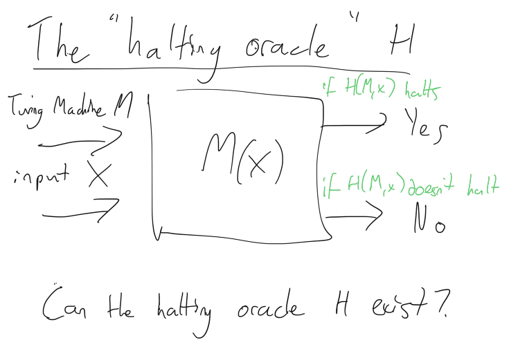

# The Halting Problem
## Why should we care?

Have you ever had a program crash on you? A program which the OS closes with the message "This program is not responding" or some other barely decipherable message?

You might be incredibly lucky and have never seen such a message. Well done to you! You should be aware that others *do* have such issues and they're annoying!

If you've been blighted by such computer behaviour you might ask yourself a crucial question. Why doesn't a phone App store (or similar) act to prevent this software being released? Shouldn't they have a clever program which will prevent a program that never completes from ever being released?

The answer has two words. The Halting Problem.

## The halting problem
This is where a program `H` (more specifically a Turing Machine) should determine if a decision problem `P` for a given input `I` will ever halt.

It is important to note that for a Turing machine a program and an input are essentially the same thing. That is, the input of a Turing machine is actually the initial state of the machine itself.

Halting means that the program will either accept it and halt or reject it an halt.

**The halting oracle H**
This machine takes an input of another machine (M) and a program to run on that machine (X). Our fantastical halting oracle for any given machine (M) and program (X) should be able to say if program is accepted and halts or doesn't halt.

We can describe this with the following equation:
`H(M,X) -> Halt | Not Halt`

*The machine is called H, which takes the machine to be tested M and an input X

We can seek to *prove* that this this machine exists using diagonalization.

**The diagonalize D**
This is proof that our halting oracle can never exist. 

To do so we assume that H *does exist* and solve the halting problem.

D is a "negation" machine, and feeds our oracle with two copies of the input. Not that since a machine and the input are indistinguishable you may as well input the input string as the machine.

[Images/diagonalize.png](Images/diagonalize.png) 

*Feed the halting oracle H with diagonalize D*
Let us assume that our halting oracle H does not halt when given an input of D,D - H(D, D). So the assumption is that H(D,D) doesn't halt, and outputs no. In this case our oracle predicts that D will not halt with an input of D.

Let us test that
If we feed D an input of D (so D(D)) the machine D runs H(D,D). This will not halt (as per our assumption above).

Since we assume that M(D) did not halt with in diagonalize (D) (M is fed with a program which is M), our machine negates that and halts! This implies that our halting oracle is a liar! it said D would not halt when it halts!

This is a contradiction!

The same applies if we assume our halting oracle H does halt when given an input of D,D - H(D, D). So the assumption is that H(D, D) does halt, and outputs yes. In this case our oracle predicts that D will halt with an input of D.

Let us test that.
If we feed D with an input of D (so D(D)) the machine D runs H(D, D). This will halt, as per our assumption above).

Since we assume that M(D) did halt with in diagonalize (D) (M is fed with a program which is M), our machine negates that and does not halt! This implies that our halting oracle is a liar! it said D would halt when it does not halt!

# Conclusion

Thank you for reading.

If you've any questions, comments or suggestions please hit me up on [Twitter](https://twitter.com/stevenpcurtis) 
