# Data Structures: Linked Lists
## Chain values together

---

Linked lists are extremely useful in programming, and function as a collection of elements. 
The part that makes them linked is that each element points to the next.
This article has been written to help you out by explaining not only what makes the data type so special, but some of the key questions you might be asked in an interview or at school.

---

# Terminology
Data structure: A way of formatting data
Head: The first (or parent, or root) node
Linked List: A linear collection of data elements, made up of a head node with zero or more connected nodes. The order of this list is given by pointers from each node to the next
Node: The basic unit of a data structure
Null Pointer: A pointer that does not point to anywhere
Pointer: An object that stores a memory address
Tail: The linked list, after the head

---

# Key
We call each data point in a linked list a node. Each node has a pointer that points to another node.

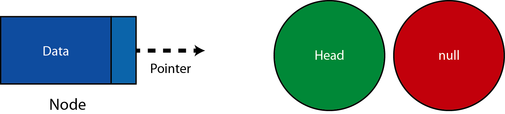

The start of a linked is termed the Head of the linked list.
If there is no Head, the linked list would be lost in memory (that is, we wouldn't know where it was in memory).
Now it is true to say that in the linked list each element points to the next. How can we finish the `linked list if that is true? In that case, we can have a null pointer.

# A Simple Linked List

We can potentially have any number (n) of nodes in a linked list.
For this example let us have 3, starting at 0 (zero).

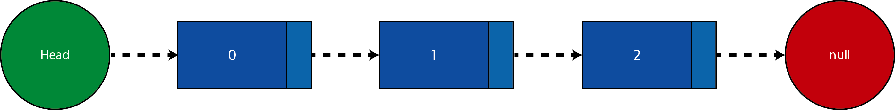

Here each node in order points to the next. This is similar to the following:
0->1->2
Note that the some find the diagram misleading. The Head is actually the first node!
Note: some people call the nodes other than the head the tail of the linked list

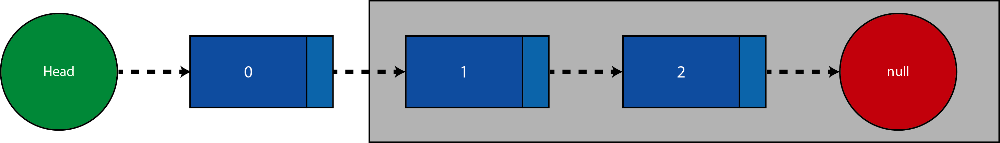


Equally the final node (that is carrying the data 2) does not actually have a pointer. The pointer itself can be thought of as null.
As a result, some find the following alternative diagram useful when thinking about Linked Lists

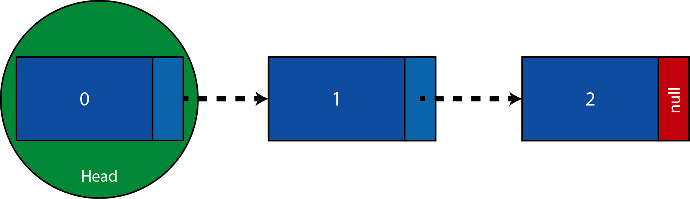

# Using a Linked list

So the first thing we need to do is to set up a linked list, is to set up a head node.
In most cases you would ensure that each node in the list has a data value. This would be because what is the point in storing a data point without any, well, data?

## The setup for a node

In most languages we would create a class that gives the basic form of the node.
Sometimes you will see each node called a linked list (because each node actually represents a linked list in itself if we consider each node to be a head node).
The pointer to the next node is may or may not be there. If the language supports this it would be optional - that is it can be null which is useful because the last node is likely to be null.

```swift
Class Node {
    var data: Int
    var next: Node?
}
```

## Creating a node
We are going to create the first node in a linked list. This is going to be called the head node. We also need to keep a record (a reference) to this node as it will be our first node as we move through the linked list
Creating three nodes is quite easy

```swift
var head = Node(data: 0)
var middle = Node(data: 1)
var last = Node(data: 2)
```

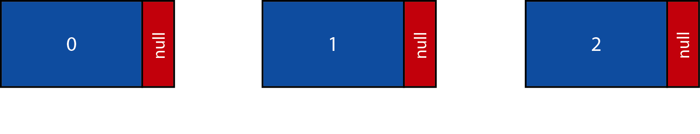

We have the three nodes, and references to them (head, middle and last). Now these could be called anything.
We can then set up the links 0->1 and 1->2

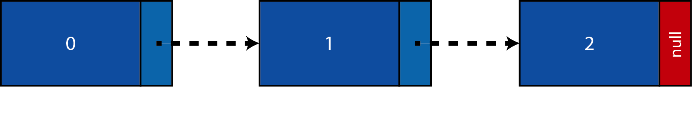

now the interesting part is that by definition head is, well, the head. This is because it has no node immediately preceding it. However, equally the node we have called middle here could be the head, and that would make the node called "head" dangling. This would be a dangling node.
So let us look at this case:

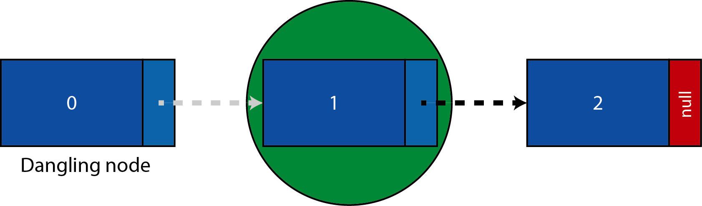

If we hadn't kept a reference to that first node, there would be no way of accessing the first node in the chain!
This would keep the node in memory, and this would obviously be a bad thing. However, we can simply remove that link and the node can be released from memory.

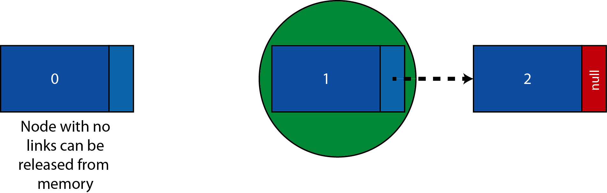

## Traversing through a linked list
If we have set up a linked list we can use a while loop to traverse through the list.
This stops us writing something like head.next.next which is quite confusing.
```swift
var currentNode = head
```
```swift
while currentNode.next != nil {
    print (head.data)
    head = head.next
}
```
```swift
print (head.data)
```
Let us look at the execution of this:

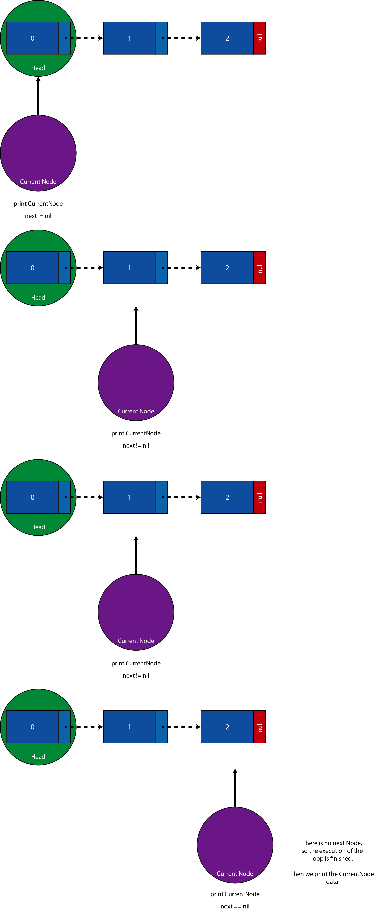

We can see the a while loop has really helped use out!

## Removing an element from a linked list

We can remove elements from the list, let us start with the head of the list:

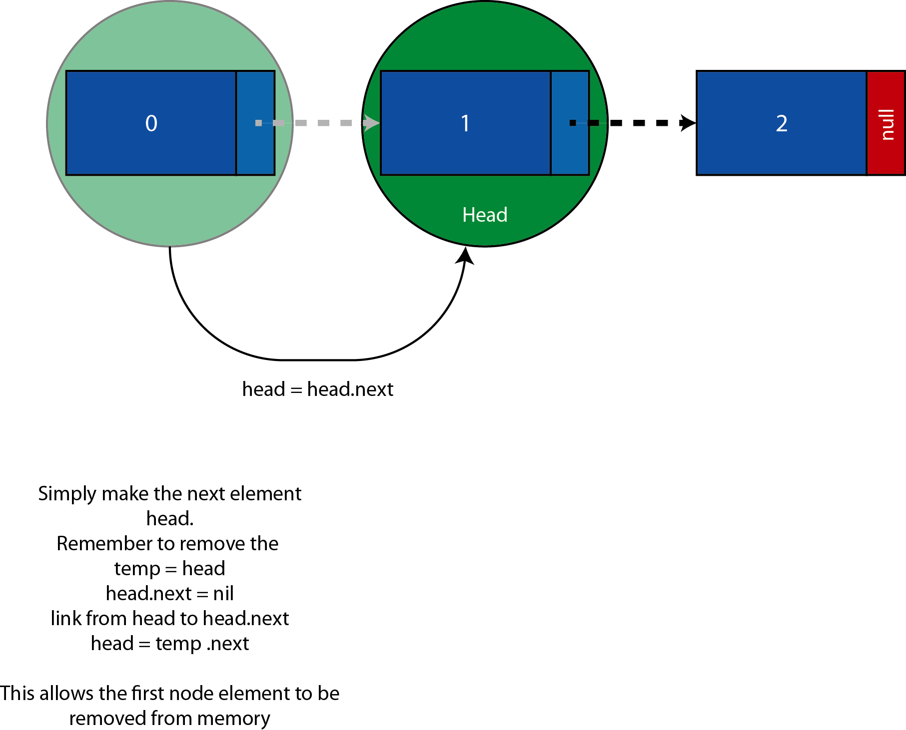

Now how can we remove an element in the middle of the linked list?


## Reverse a linked list

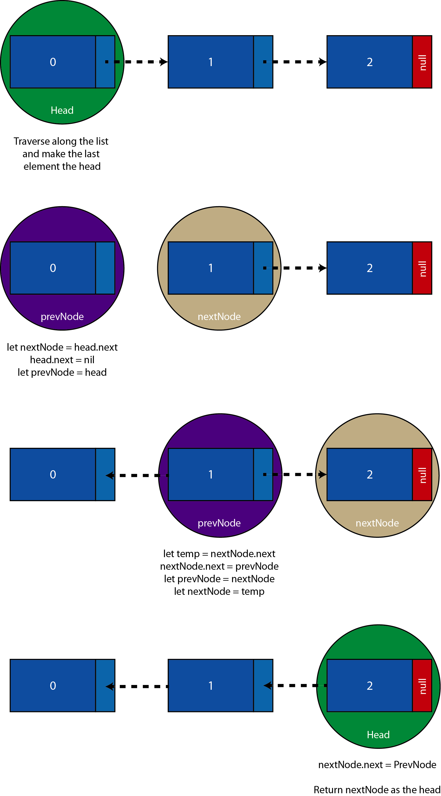

When reversing a linked list, we have to be mindful to keep references before and after the node we are handling at any particular time

---

Conclusion:
Linked lists are very important in computer science. Perhaps you wish to maintain a dictionary of names.
For this you'd use; a linked list. You might want to implement a stack (another basic data type in computer science); a linked list it at your service!
For you, the reader, you might need to implement a linked list as part of an interview process.
If this is you: good luck!
In any case, knowing about such a fundamental building block of computer science will really help you out!

---

The Twitter contact:
Any questions? You can get in touch with me HERE
