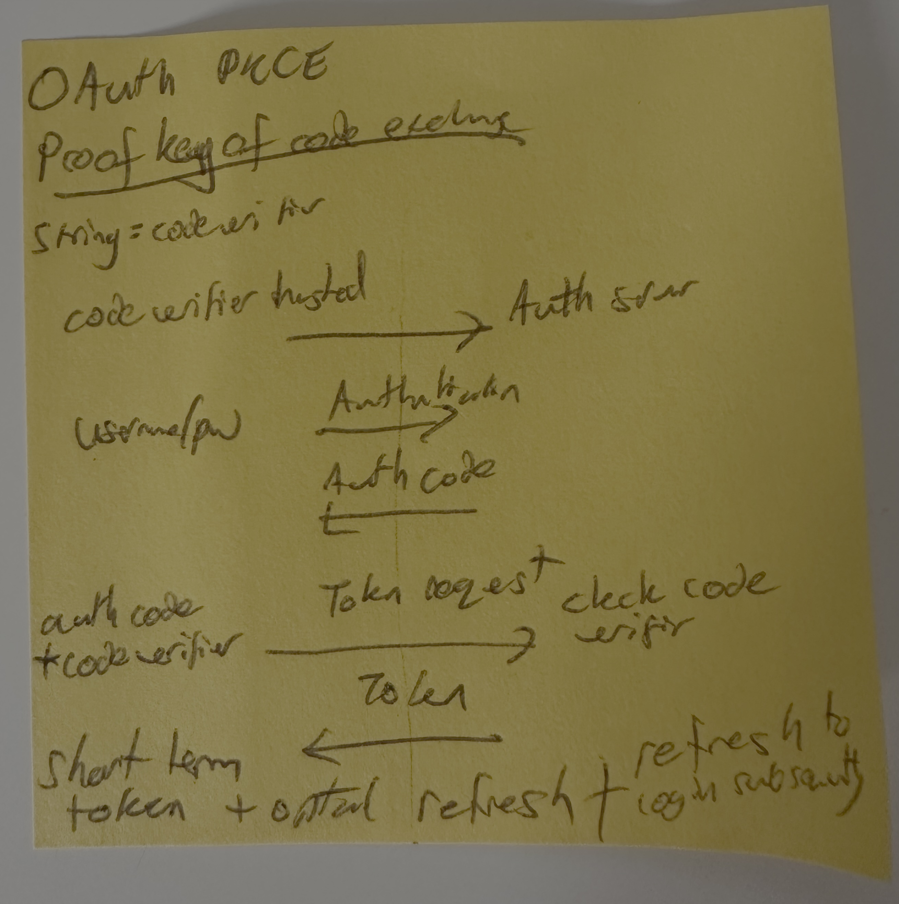

# OAuth for iOS Applications
## How to Solve for Security

It's a common question that iOS developers need to answer when producing serious applications.
**Where do you store an authentication token in an iOS application?**

You might whack it in the keychain. That's a good answer because you need to keep the data encrypted.
Yet you need to think about how the token is generated. If it's an API token for a public API you want to avoid adding the token to a public GitHub repo.
So it might be better if you add the token during your build process. Yet we can do better still for general token usage. 
A good solution is to use an authorization code flow with PKCE (Proof Key for Code Exchange) which is the commonly recommended method for mobile and native applications.
This article is going to talk us through PKCE on a theoretical level.

# Proof Key for Code Exchange (PKCE)
The PKCE flow mitigates the risks associated with tokens, and provides a good level of security for mobile applications.
The key here is to limit the lifespan of the token, mitigating the risk in having a long-lived token.

## How PKCE Works
Here are my post-it notes. If you are not able to read my handwriting, fair enough and I'll detail the steps in more detail right below the image.

## Code Verifier and Challenge
The client app generates a code verifier (a random string) and a code challenge (a hashed version of the code verifier).

## Initiate OAuth flow
The client app initiates the OAuth flow by redirecting the user to the authorization server, sending the code challenge.

## User Authentication Request
The user authenticates with their username and password. This might be in a webview embedded in the app.

## User Authentication Response
The authorization server redirects the user back to the client app with an authorization code.

## Token Request
The client app exchanges the authorization code for an access token (and optionally a refresh token) by sending the code verifier to the authorization server.

## Token Response
The authorization server validates the code verifier against the code challenge and issues the tokens.

# An iOS Flow
Here is how the flow might work in a real iOS application.

## User Authentication
**User Interface**
The user opens your application and is presented with a login interface where they enter their username and password.

**Authentication Request**
The credentials are sent from the client (e.g., a mobile app or web browser) to your authentication server or IdP. This interaction should always occur over a secure HTTPS connection to protect the credentials in transit.

**Credential Verification**
The server verifies the credentials against its user database or through another authentication service. If the verification is successful, the user is considered authenticated.

# Authorization Grant
**Redirect to Authorization Server**
Once authenticated, the user is redirected to the OAuth authorization server where they are asked to grant consent for the application to access their information or perform actions on their behalf.

**Granting Consent**
The user reviews the access permissions requested by your application and can choose to grant or deny these permissions.

# Authorization Code Exchange
**Authorization Code**
If the user grants consent, the authorization server redirects them back to your application with an authorization code. This code is short-lived and is used to obtain an access token. It does not contain sensitive information and is safer to transmit.

**Exchange for Access Token**
Your server sends a request to the OAuth server, including the authorization code and your client credentials (client ID and client secret). This exchange must happen server-to-server to keep the client secret secure and not exposed to the client.

# Access Token Issued
**Issuing Token**
Upon validating the authorization code and client credentials, the OAuth server issues an access token (and possibly a refresh token) to your application's server.

**Using Access Token**
Your application uses this access token to make API requests on behalf of the user to the resource server.

# Using Refresh Tokens (if applicable)
**Token Expiry**
Access tokens are typically short-lived for security reasons. When an access token expires, a refresh token (if issued) can be used by your application's server to request a new access token without requiring the user to re-authenticate.

**Secure Storage**
Both access and refresh tokens should be stored securely on your server and used according to the principles of least privilege.

# Conclusion
I hope that has covered your curiosity about tokens and PKCE in Swift.
