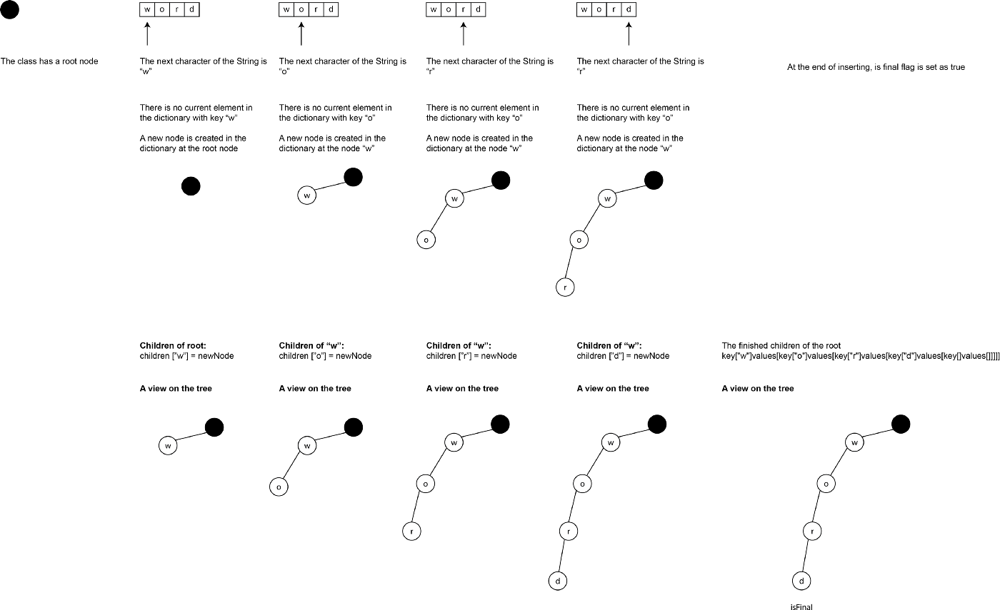

# Theory 

## Invert Binary Tree (node is a class)

```swift
func invertTree(_ root: TreeNode?) -> TreeNode? {
    if root == nil {return nil}
    let temp = root?.left
    root?.left = invertTree(root?.right)
    root?.right = invertTree(temp)
    return root
    }
```

## Sorting
Insertion sort- insert the current element into the right place on the sorted side on the left
Selection sort - select the next smallest item
Merge sort- 
Quick sort -
Binary insertion sort - I've not used before

## Heap
[https://gist.github.com/stevencurtis/cb7cd4ad164cdb36302ac08c4289210b](https://gist.github.com/stevencurtis/cb7cd4ad164cdb36302ac08c4289210b)
[https://medium.com/p/4bf1091dcdd9/edit](https://medium.com/p/4bf1091dcdd9/edit)

## Trie
[https://medium.com/swift-coding/tries-in-swift-4afb9b82785f](https://medium.com/swift-coding/tries-in-swift-4afb9b82785f)<br>
<br>

[https://gist.github.com/stevencurtis/99cb5b4e3db8f3faea7f8b7f4f1b97dc](https://gist.github.com/stevencurtis/99cb5b4e3db8f3faea7f8b7f4f1b97dc)

