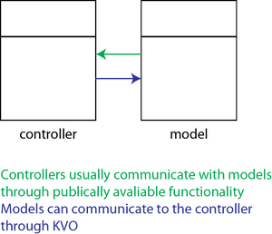

# Single Responsibility Principle in Swift
## Do yourself a SOLID

<br/>
<sub>Photo by dylan nolte on Unsplash<sub>

Difficulty: Beginner | Easy | **Normal** | Challenging


#Terminology:
Class: An object that defines properties and methods in common

Single Responsibility Principle: every module or class should have responsibility over a single part of the functionality provided by the software, and that responsibility should be entirely encapsulated by the class, module or function

SOLID: a mnemonic acronym for five design principles intended to make software designs more understandable

#Prerequisites:
- You will be expected to be aware how to make a [Single View Application](https://medium.com/swlh/your-first-ios-application-using-xcode-9983cf6efb71)

##The Single Responsibility Principle
A class should only have a single reason to change.

In other words that means the following:

1. A particular class should only do one thing
2. There should only ever be a single reason to change a certain class

So each `class` is restricted to doing similar things.

It is tempting for Swift programmers to overload responsibilities into a view controller. 
This is partly to do with the basic architecture pattern encourged for our use by Apple - the MCV pattern.

##The difficulties in SRP - MVC
The most common basic diagram for MVC (Model View Controller) is below
[MVC](Images/MVC.png)

That is, we can separate out the use of controllers and models so the controller communicates with the model in a two-way relationship



and the controller also has a relationship with the view


Now the issue is that the viewcontroller is both a view and a controller. 

The secondary issue is that many programmers also cram the model into the view controller, and this is a recipe for disaster.

It also means that many developers kind of discount the Single Responsibility Principle when coding in Swift.

`"This is a bad habit. Let us break this out into an easy example"`

##The exmple bad class
A view controller typically will have a `data source`, and this if frequently defined in the `ViewController`. Now saying that this is a **bad** class is a little strong, but equally it **does** break the Single Responsibility Principle (Even though the data source has been placed nicely into an extension).

```swift
class ViewController: UIViewController {
    @IBOutlet weak var tableView: UITableView!
    override func viewDidLoad() {
        super.viewDidLoad()
        setUpTableView()
    }

    func setUpTableView() {
        tableView.register(UITableViewCell.self, forCellReuseIdentifier: "cell")
        tableView.dataSource = self
        tableView.delegate = self
    }
    
    let data = ["1","2","3","4","5"]
}

extension ViewController: UITableViewDelegate {}

extension ViewController: UITableViewDataSource {
    func tableView(_ tableView: UITableView, numberOfRowsInSection section: Int) -> Int {
        data.count
    }
    
    func tableView(_ tableView: UITableView, cellForRowAt indexPath: IndexPath) -> UITableViewCell {
        let cell = tableView.dequeueReusableCell(withIdentifier: "cell", for: indexPath)
        cell.textLabel?.text = data[indexPath.row]
        return cell
    }
}
```

I'll say it again (ignore the subtitle) - that this isn't necessary bad…but there you go…

##Following the Single Responsibility Principle
We can create the `DataSource` as a different class. No problem.

```swift
class SingleResponsibilityViewController: UIViewController {
    @IBOutlet weak var tableView: UITableView!
    let dataSource = DataSource()
    override func viewDidLoad() {
        super.viewDidLoad()
        setUpTableView()
    }

    func setUpTableView() {
        tableView.register(UITableViewCell.self, forCellReuseIdentifier: "cell")
        tableView.dataSource = dataSource
        tableView.delegate = self
    }
    
}

extension SingleResponsibilityViewController: UITableViewDelegate {}

class DataSource: NSObject, UITableViewDataSource {
    let data = ["1","2","3","4","5"]

    func tableView(_ tableView: UITableView, numberOfRowsInSection section: Int) -> Int {
        data.count
    }
    
    func tableView(_ tableView: UITableView, cellForRowAt indexPath: IndexPath) -> UITableViewCell {
        let cell = tableView.dequeueReusableCell(withIdentifier: "cell", for: indexPath)
        cell.textLabel?.text = data[indexPath.row]
        return cell
    }
}
```

Yes, of course (if you're looking through the repo version) you would want `DataSource` in a different file. With a different name. But there's always improvements that can be made - the point is that we've got the data out of that view controller.

# Conclusion
SOILD is a collection of principles that can actually help with your coding standards, and making sure that your code is maintainable and - well of good quality.

Does that make sense? I hope so.

 If you've any questions, comments or suggestions please hit me up on [Twitter](https://twitter.com/stevenpcurtis) 
