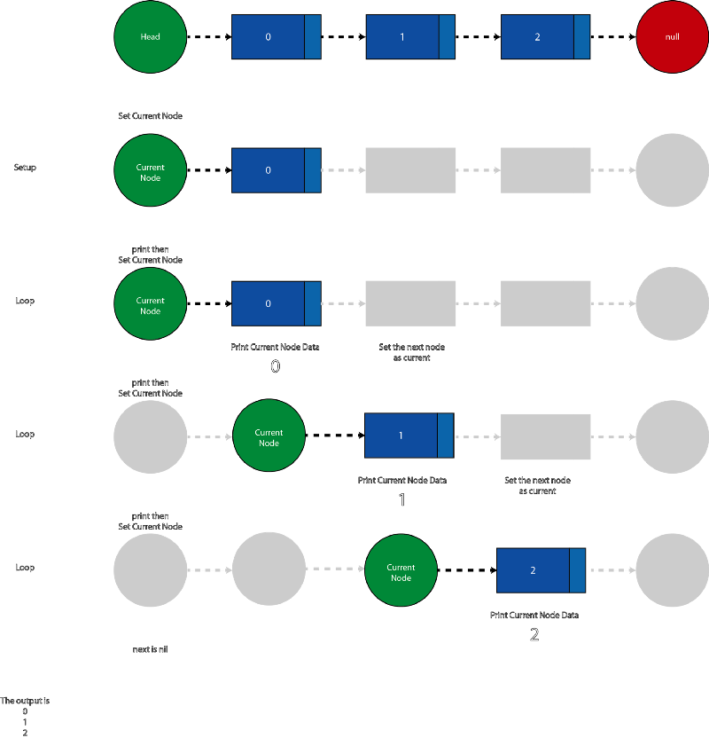
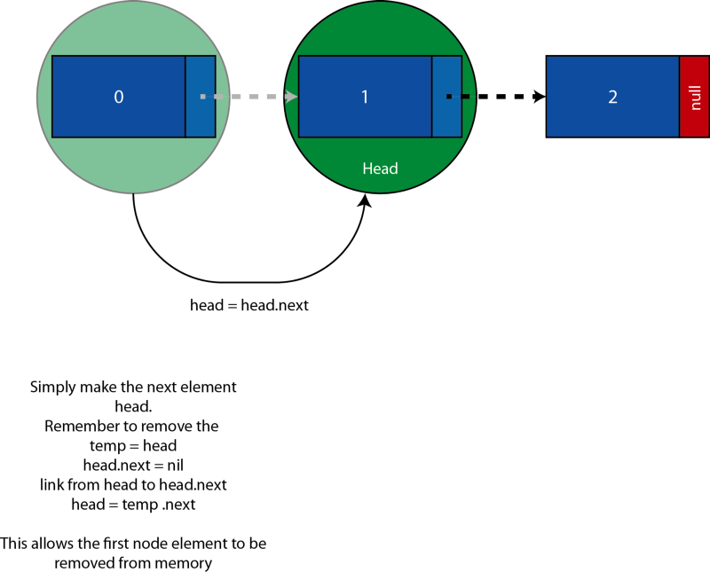
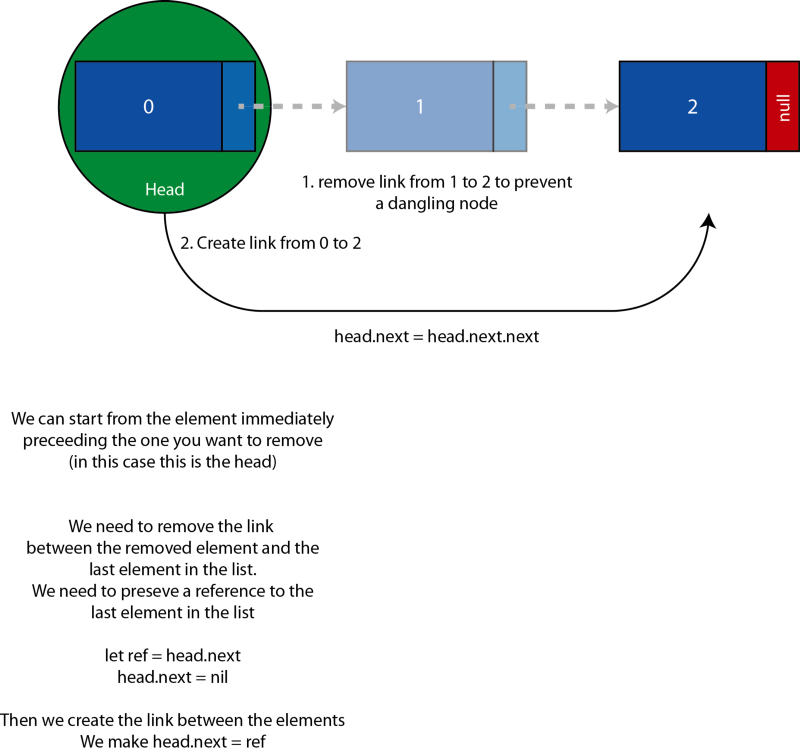
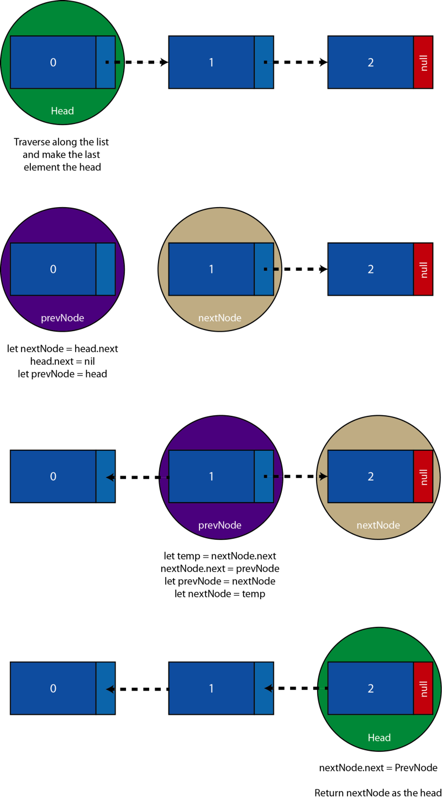

# Linked Lists and LL Algorithms in Swift
## Chain it up in Swift

Difficulty: Beginner | Easy | **Normal** | Challenging<br/>

This article is about the implementation of linked lists in Swift. The theory is covered in my own article.

# Prerequisites:
Coding in Swift Playgrounds (guide [HERE](https://medium.com/@stevenpcurtis.sc/coding-in-swift-playgrounds-1a5563efa089))
While loops in Swift (guide [HERE](https://medium.com/@stevenpcurtis.sc/while-loops-in-swift-9f73e5b17e7b)

# Terminology
## Swift terminology
Class: An object that defines properties and methods in common
## Linked List Terminology
Data structure: A way of formatting data
Head: The first (or parent, or root) node
Linked List: A linear collection of data elements, made up of a head node with zero or more connected nodes. The order of this list is given by pointers from each node to the next
Node: The basic unit of a data structure
Null Pointer: A pointer that does not point to anywhere
Pointer: An object that stores a memory address
Tail: The linked list, after the head

# Implementing a Node in Swift -Integer
A choice has been made to implement a node that contains an Integer as the data payload. If you wish to see a node that is generic (that is, can carry any data) please see the second half of this article.
## The setup for a node (the class)
Since our Node class needs to reference itself, a class has been chosen to represent the Node type (although an enum is a value type that can reference itself, I have chosen not to use that type to represent a Node in this case)

```swift
class Node {
    var data: Int
    var next: Node?
    
    init(data: Int, next: Node?) {
        self.next = next
        self.data = data
    }
}
```

This initialiser requires both a piece of data, and the next node in the linked list.

## Create instances of a node

In terms of creating an instance of a Node, Swift helps us out just as if we are creating an instance of any class.
We are going to create three nodes that are linked as a linked list, containing three elements


interestingly here I've chosen to create the nodes in reverse order.

The reason for this is that each node is connected to the next - and doing them in normal order would mean linking a node to a node that does not yet exist.

How can you link to a node that doesn't exist? You can't.
So…

```swift
let thirdNode = Node(data: 2, next: nil)
let secondNode = Node(data: 1, next: thirdNode)
let headNode = Node(data:0, next: secondNode)
```

Swift doesn't give us a good view of what we've created - so how can we be sure that we've correctly created these three nodes?
printing an element gives us the following output:

```swift
__lldb_expr_10.Node
```

yes, we get it. It's a *node*. We need some more information from the data type. We'll convince Swift to give us this information by using conformance to `CustomStringConvertable`

## Make the Node conform to CustomStringConvertable
When we conform to CustomStringConvertable we need to provide a description that Swift will provide when we print the element.

```swift
class Node: CustomStringConvertible {
    var description: String {
        return "Data: " +  String(data) + " { " + (next?.description ?? "null") + " }"
    }
    
    var data: Int
    var next: Node?
    
    init(data: Int, next: Node?) {
        self.next = next
        self.data = data
    }
}

let thirdNode = Node(data: 2, next: nil)
let secondNode = Node(data: 1, next: thirdNode)
let headNode = Node(data: 0, next: secondNode)

print (headNode)
```

Which (when we print the `head`) gives the following output:

```swift
Data: 0 { Data: 1 { Data: 2 { null } } }
```

This is much nicer, as each node is described as part of the chain now.

## Reading out the data from a Linked List
Here we are going to use a while loop to traverse the `linked list`. We know when we have gone to the end of the `linked list` since the last element always points to nil!

```swift

var currentNode = headNode
while let nextNode = currentNode.next {
    print (currentNode.data)
    currentNode = nextNode
}
print (currentNode.data)
```

This prints the following to the console:

```swift
0
1
2
```

But it might be worth exploring what happened here.



which leads us to the output to the console (as expected) as 0,1 and 2.

## Remove an element
**Remove a node from the head of the linked list**
Remove an element (a node) from the linked list from the head is a relatively easy operation.



In Swift though, we need to make sure that head has a next element - and this is implemented through optionals in Swift.

```swift
if let nextNode = headNode.next {
    headNode = nextNode
}
```

Since the old headNode has no reference it can now be deallocated, so there is no dangling **head node**.

**Remove a node from the middle of the linked list**

This is slightly more tricky than removing a **node** from the **head** of a **linked list**.



```swift
if let _ = headNode.next, let ref = headNode.next {
    headNode.next = headNode.next?.next
    ref.next = nil
}
```

We remove this second **node** and deal with the hanging **node**.

**Reverse a linked list**

The theory goes something like the following:



A **linked list** can be reversed through the following code in Swift.

To be noted here, is the creation of a empty **node** initially that will be the new tail of data:

```swift
var prevNode: Node?
var nextNode: Node? = headNode

while nextNode != nil {
    let tailRef = nextNode?.next
    nextNode?.next = prevNode
    prevNode = nextNode
    nextNode = tailRef
}
```

#Conclusion
**Linked lists** are really important in programming, and this guide has shown you how linked lists can be implemented in the best programming language (Swift).
Reversing a singularly linked list is a little tricky, and with that we can easily introduce the concept of a doubly linked list to cope with that. But more on that topic on another day (i.e. follow me).


If you've any questions, comments or suggestions please hit me up on [Twitter](https://twitter.com/stevenpcurtis) 
