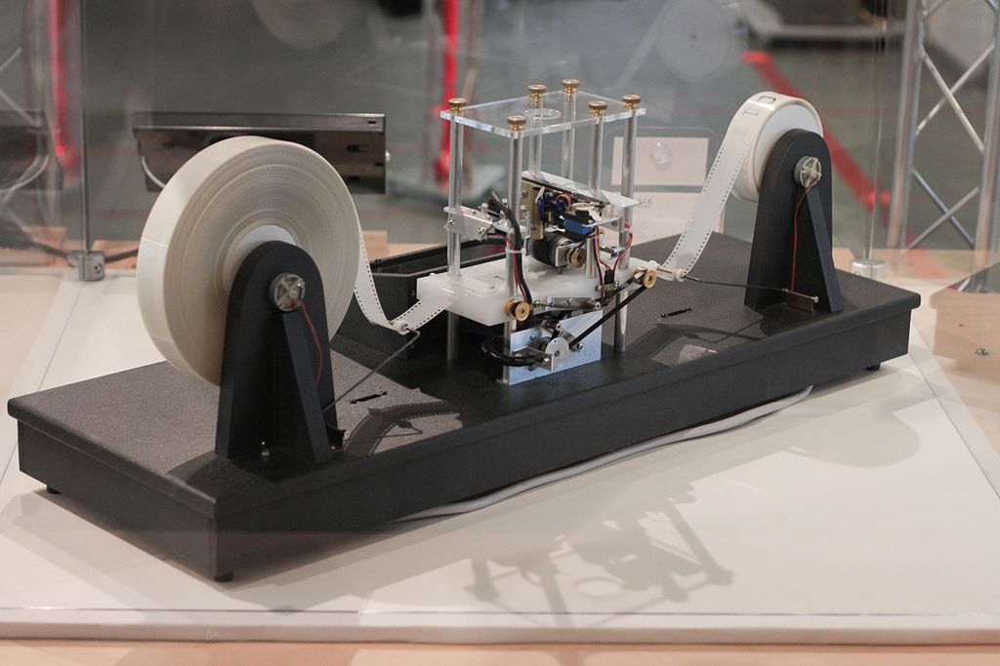
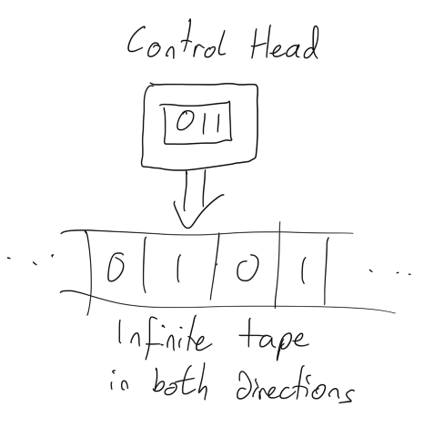

# Turing Machines
## It really matters for coders in 2023

A Turing Machine is a an abstract computational device intended to investigate the limits of computing.

It is important to note that there aren't any real Turing machines. They are mathematical models an as such exist as a concept that exists in the abstract rather than a physical machine. 

That isn't to say that physical implementations of Turing machines, however they do rather struggle with having unlimited tape (more on that later).


 
 # History
 Turing machines were invented in 1936 by British Mathematician Alan Turing as an automatic machine (only later would the theoretical machine be termed a Turing machine).
 
 Turing machines can help us conceptualize about computing as abstract machines to investigate the extent and limitations of computing.
 
 This article is a quick look at Turing machines, towards the bottom we can see that the Church-Turing thesis means that Turing machines sit at the *top* of the hierarchy of computer science rather than the bottom.

# Inputs
the input of a Turing machine is actually the initial state of the machine.
The input therefore consists of:
- A number of non-empty cells
- The head is in an initial cell to start reading or writing
- The control head (CPU) is also in an initial state
- There is a defined set of instructions for each preceding state of the machine

*

* The image above shows a setup where we read binary numbers (0 - 1) rather than characters

*Read - write*
The head reads the tape and can either write a new characters in a cell or erase a characters

*The control head*
The head can move left or right along the tape. Although the tape is infinite the head can only be in a finite number of states.

The head can also be in a halting state, that is doing nothing.

*Tape*
The tape is infinite, meaning that we assume machines have infinite memory. Cells can either be blank of contain data (in the case of the head in the image this is a 1 or 0).

Formally, a Turing machine algorithm is described by the function:

```
δ : Q × Γ → Q × Γ × {L, R}
```

where:
Q is a finite set of states. 
Γ is a finite set of symbols (e.g., Γ = {#, 0, 1, a, b, . . .} and perhaps Σ = {0, 1})

A Turing machine P can be described as computing a function f : Σ∗ → Σ∗ where Σ ⊆ Γ where y = f(x) is the remaining string if the machine halts.

For decision problems, we have YES and NO halting states. 

# Entscheidungsproblem
Hilbert's Entscheidungsproblem (also known as the decision problem) asks:
Does there exist an algorithm when provided with a formal language and logical statement will output True or False depending on the truth of thae statement.

More formally we can define the problem as follows:

```
Given a formula such as ∀x∃y : y < x
can we determine if such a formula is always true no matter what what
ordered domain x, y and < refer to?
For example, ∀x, y, z(x < y and y < z implies x 6= z) is always true.
But x < y implies ∀x, y∃z : x < z < y is not true of all ordered domains
(e.g., consider the integers)
```

# The Church-Turing thesis
This is a thesis about the nature of computable functions.

It is stated that any real-world computation can be translated into an equivalent computation involving a Turing machine.

That is, if a problem can be solved on a machine it can be solved on a Turing machine.

*This is the importance of a Turing machine*

# Importance
Turing machines and computability theory may not be directly applicable to a standard coder's day-to-day work. However, having a basic understanding of the theoretical underpinnings of computer science can really help with with:

**Algorithm Design**
Understanding something about Turing machines can help developers write more efficient algorithms.

**Complexity analysis**
Turing machines can help developers understand the performance characteristics of their algorithms and make informed decisions about trade-offs between performance and other design considerations.

**Advanced programming**
Functional programming and type theory has its roots in computability theory and the study of Turing machines.

# Conclusion

Thank you for reading. I know this is a little CS101 for some of you, and yet too theoretical for others. That really feels like it's the fun of coding with others in 2023!

We all come from different backgrounds, and I hope that this article has in some sense helped you out.

Thanks!

If you've any questions, comments or suggestions please hit me up on [Twitter](https://twitter.com/stevenpcurtis) 
