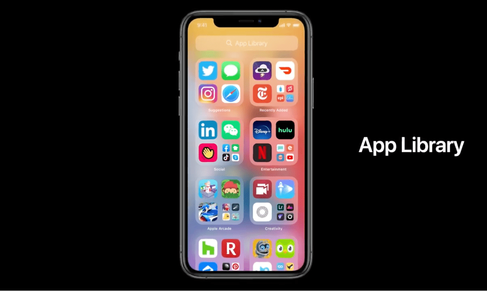
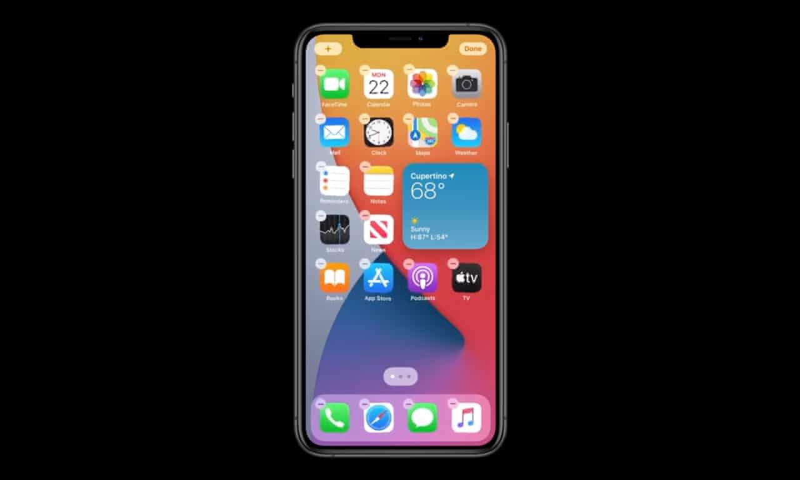
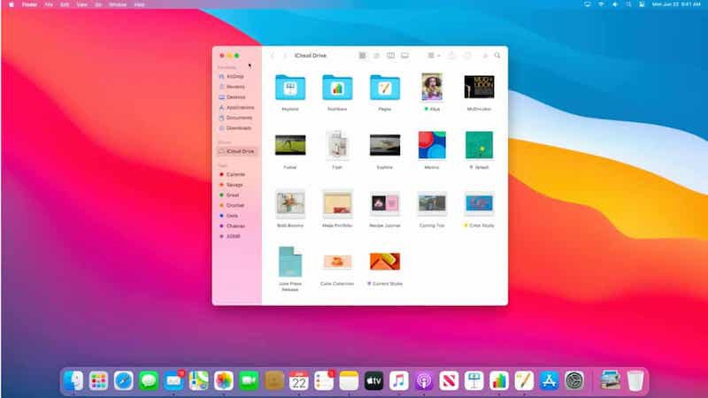

# NEW!! WWDC 2020 Special Keynote
## It’s not all for developers!!

 
Photo by Onlineprinters on Unsplash

Wow! What a start to this year’s WWDC. From Tim’s trainers (smart) to Craig’s hair (as usual) we had plenty to look at.
On that note, let us think about each platform in turn and look through the highlights for each of the platforms:

 

# iOS
The new App library automatically organises your Apps. Wonderful — Apple can you do the same with my filing system at home?

 

Widgets are a huge (well larger than icons) thing. Drag ’em around, move them — it looks like fun. Sure to make your iPhone much more personal and useful than ever before.

 

Siri will finally support on device dictation, so hopefully Siri can stop podcasts without a data connection (don’t say you’re “trying” — idiot). It all looks nicer than before to boot — and refrains from taking up the whole screen when you “Hey, Siri” it. Cool

Apple have had a look at WhatsApp and although they think Messages is better they thought it could use some of the features that have existed on that platform for some time. So you’ll get message pinning, improved Emojis and inline replies. You’ll just need someone who uses Messages to write to.
Maps has been overhauled to help cyclists avoid (scary) public transport, and looks much better as well. If the idea of cycling in lycra makes you sick, your iPhone can now unlock your car, and you can even copy your key to Craig Federighi if you work at Apple — something that sounds an appalling idea.
Apple are helping you download Apps by not downloading Apps. There are 10Mb “App Clip” micro Apps to help you do stuff without downloading a whole App. Now to think about how to get them to transition to the full App, developers…

Voice Memos are to get noise cancellation, favourites and folders which is nice.
Live photos are getting video stabilisation features to stop that bluuuuur we’ve all seen. And:
Finally! You’ll be able to change your default email and browser Apps — so won’t be tied to Safari an Mail any longer. BEGONE.

# AirPods
Finally they’ll switch devices without making me open and close the case like a buffoon. Thanks Apple!
They’ll be some awesome surround-sound stuff (Spatial audio) to make future trips to the cinema even less attractive. Stay at home with your AirPods, Apple (probably) think.

# iPadOS
The iPad will get lots of the new features that are being brought to iOS (not surprisingly, as iOS and iPadOS are extremely close).

# Watch OS.
Apple are bringing a sleep tracking mode to Watch OS. Hopefully the next hardware revision will bring sufficient battery life…(!)
You watch will be able to track your dance moves, and this is something that is sure to be exploited with Apps (that hopefully licence some music or something) to create great experiences.
Your watch will also detect your covid-19 avoiding moves through hand-wash tracking. It’s so 2020 it might be frightening.

# Mac
Big Sur (along with a comedy reason for naming it…watch the keynote) will (drum roll) work on ARM Macs. Yes, the Mac is to transition from Intel to “Apple silicone” which is ARM architecture. That is, the whole Mac lineup is transferring to ARM (although there will be new Intel models this year).
You’ll be able to run iOS and iPad OS Apps straight on the Mac (but not vice-versa) although how developers will deal with the change from touch to keyboard-mouse will remain to be seen.
Developers can order a new ARM Mac NOW for $500, although they have to return it after the Transition so are paying the money for…yeah.
Big Sur also looks much more like iOS and if the Thrills (music pun) offered in iOS do it for you, features like control center making their way over certainly will.

 

# Privacy
Apple have staked much on privacy in the past, and it certainly does not seem like this is going to change in the near future. Translations can be provided on device meaning less data sent to…who knows where. On that theme, Apps will announce what they are doing with private data right on the App Store (developers self-reporting, let us see how that works).
Speaking of developers, they will be able to use the upgrade to Sign-in with Apple to help users avoid too many passwords!

# Conclusion: Marks out of 10?
It’s an ARM out of an Intel. Sorry, an Apple silicon out of a Emoji. Isn’t it? Yes
