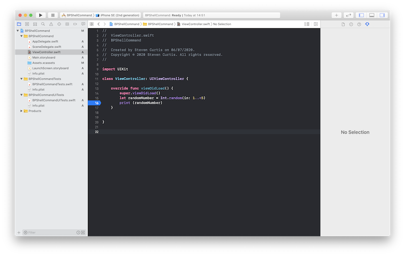
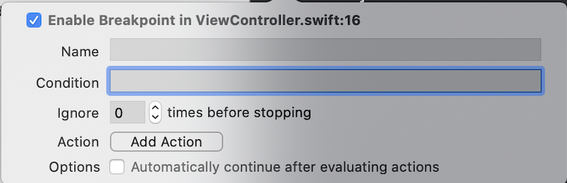
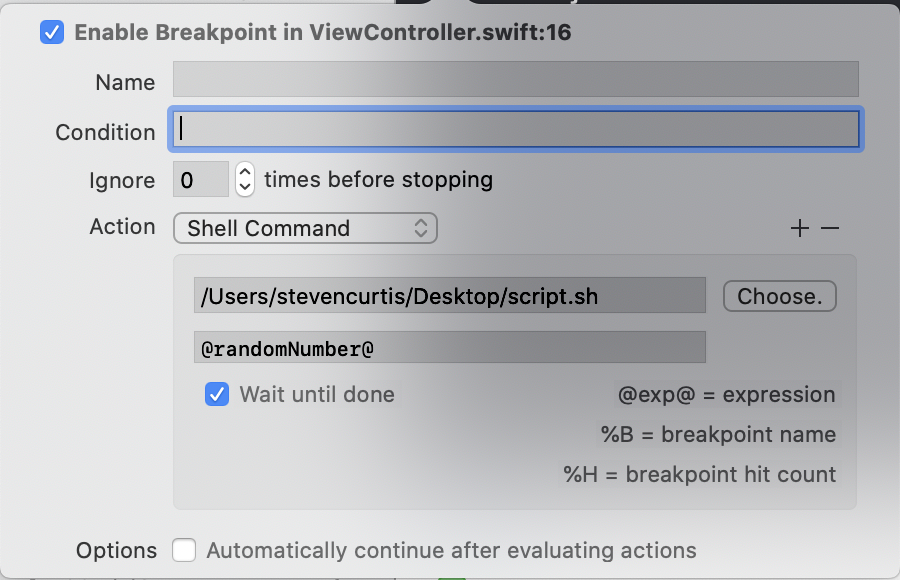
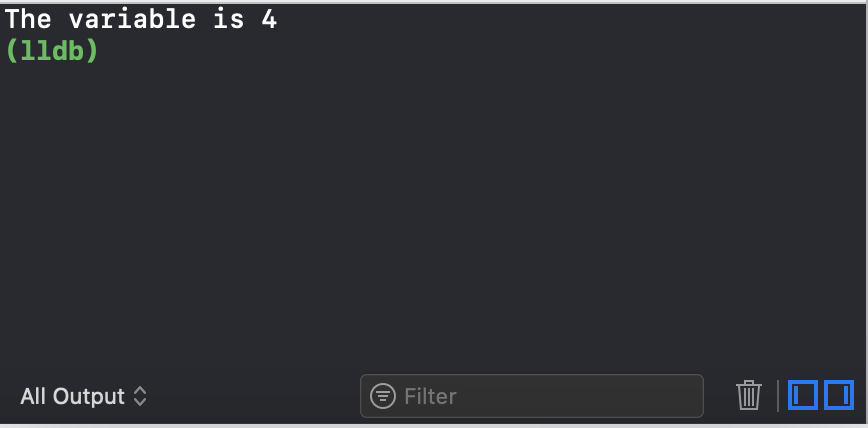

# Running Shell Commands from Breakpoints
## Shell commands

<br/>
<sub>Photo by Andrew Tanglao on Unsplash<sub>

Difficulty: Beginner | Easy | **Normal** | Challenging<br/>
This article has been developed using Xcode 11.4.1, and Swift 5.2.2

# Prerequisites:
* You will be expected to be aware how to make a [Single View Application](https://medium.com/swlh/your-first-ios-application-using-xcode-9983cf6efb71) in Swift
* I'll create the script using [VIM](https://medium.com/@stevenpcurtis.sc/using-vim-as-a-text-editing-tool-on-the-mac-9595c1122e91), but you could use any text editor you choose

# Terminology
Breakpoints: a debugging tool that allows you to pause the execution of your program at a specific point in time
Script: a program which is carried out by another program

# Creating the script
For this we shall use [VIM](https://medium.com/@stevenpcurtis.sc/using-vim-as-a-text-editing-tool-on-the-mac-9595c1122e91), and to do so we choose a new [Terminal](https://medium.com/@stevenpcurtis.sc/the-mac-terminal-998eb9f42b5) window.

```swift
cd ~/Desktop
VIM script.sh
```
using VIM I added the following:

```swift
#!/bin/bash
echo "The variable is $1"
```

and obviously I saved with a little :wq commands (awesome)
You will need to make sure that the permissions are correctly set

`chmod u+x script.sh`

which will mean that the script is visible in and to Xcode (this will need to be run from the desktop, if you have put the script in the same place as I did.

# Creating the worst App ever
It doesn't do anything, boss.
In fact the code isn't rubbish - it just creates a random number and prints it to the console:

```swift
override func viewDidLoad() {
    super.viewDidLoad()
    let randomNumber = Int.random(in: 1..<5)
    print(randomNumber)
}
```

We are going to add the breakpoint (on what in my code) is line 16, which is the print statement. Now this means that the script will run while the random number is logged to the console - this should not be a concern as the script will not change the running of the code.

<br/>

So after adding the breakpoint a quick right-click will bring up the breakpoint menu, and **Edit Breakpoint…** should be chosen. 

We can then select the `Add Action` button

<br/>

Shell command can then be chosen, and Xcode even helpfully suggests that we can even take the suggestion that `@exp@ = expression`, that is we can pass the variable to the script by using `@randomNumber@` (which happens in this example to be the only variable that we have available).

<br/>

The output then becomes:

<br/>

Since the console writes the output of the script. 
Cool eh?

# Conclusion
Using scripts can save us time, and gives us repeatability even when they are run from breakpoints. There are a couple of more tricky things here, like setting the permissions of the files but once that is covered, this is quite a simple process.

If you've any questions, comments or suggestions please hit me up on [Twitter](https://twitter.com/stevenpcurtis) 

Why not sign up to my [newsletter](https://subscribe.to/swiftcodingblog/)
