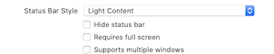
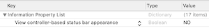

# Swift Code Snippets
## A collection of tips that I've found to be useful in Swift
Perhaps not worthy of a full article, but useful nonetheless

## Contents

[Decode a file from the bundle](#Decode-a-file-from-the-bundle)<br>
[Decode JSON with a generic function](#Decode-JSON-with-a-generic-function)<br>
[Set status bar to light](#status-bar-light)<br>


# The Code
## Decode a file from the bundle

```swift
extension Bundle {
    func decode<T: Decodable>(_ type: T.Type, from file: String) throws -> T {
        guard let url = self.url(forResource: file, withExtension: nil) else {
            throw ErrorModel(errorDescription: "\(file) missing in \(self).")
        }

        guard let data = try? Data(contentsOf: url) else {
            throw ErrorModel(errorDescription: "\(file) missing in \(self).")
        }

        let decoder = JSONDecoder()

        do {
            let decoded = try decoder.decode(T.self, from: data)
            return decoded
        } catch {
            throw ErrorModel(errorDescription: "\(file) could not be decoded from \(self) with error: \(error).")

        }
    }
}
```

which can then be tested

```swift
func testingBundle() {
    let file = try! Bundle(for: type(of: self)).decode(MODEL.self, from: "FILE.json")
    XCTAssertEqual(model.property, "String")
}
```

## Decode JSON with a generic function
```swift
func decode<T: Decodable>(decoder: JSONDecoder, data: Data) -> T? {
    do {
        return try decoder.decode(T.self, from: data)
    } catch {
        // will silently fail and return nil
        return nil
    }
}
```

## Status bar light
To set the status bar light throughout the App you will need to set it in the `Deployment info` section of the Project details
<br/>

Then we need to set the plist  
<br/>


