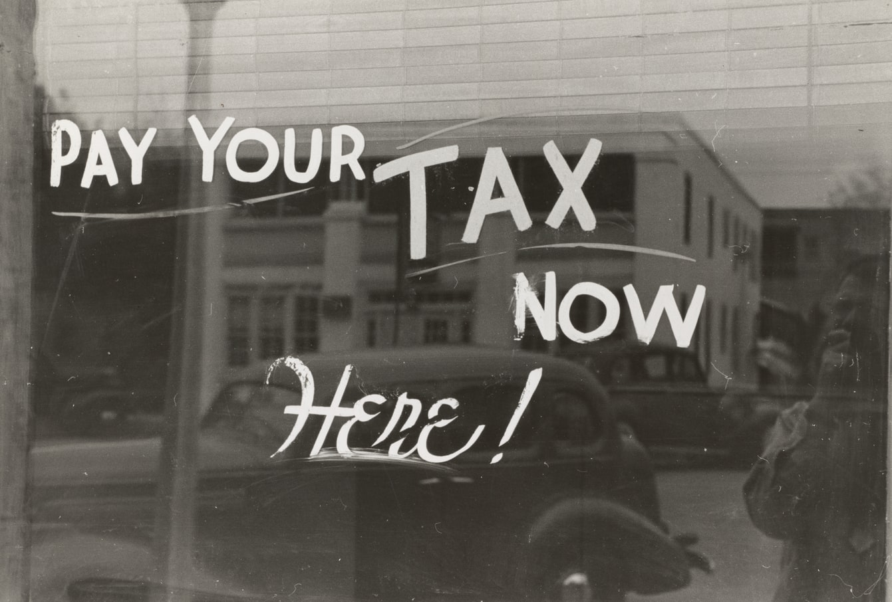

# Get a Comma Separated List From An Array
## Stop writing rubbish!

<br/>
<sub>Photo by The New York Public Library on Unsplash<sub>

Difficulty: Beginner | **Easy** | Normal | Challenging

Here is a friendly YouTube version: https://youtu.be/cW7jpnRQefg

## Not great
Here I can loop through the input Strings, adding the comma to each element in turn.

But there is a wrinkle in this! The last element would have a comma appended to the end! This is then removed with a quick `outputString.removeLast()`. 

The potential function is shown here:

```Swift
func commaSeparatedList(list: [String]) -> String {
    var outputString: String = ""
    for element in list {
    	outputString.append(element + ",")
    }
    outputString.removeLast()
    return outputString
}
```

## Better
We can use a [map](https://medium.com/@stevenpcurtis.sc/mapping-in-swift-a6d6132a38af) combined with [String interpolation](https://medium.com/swlh/string-interpolation-in-swift-c66b7bac9fd1) to join the elements with a comma. 

Here is the end result:

```Swift
func commaSeparatedList(list: [String]) -> String {
    var outputString: String = ""
    outputString.append(list.map{ "\($0)" }.joined(separator: ","))
    return outputString
}
```

## Testing
This wouldn't be a great article without some testing! The following works only in a playground (which is why we hit `defaultTestSuite`) and more testing information is avaliable in my [TDD article](https://medium.com/@stevenpcurtis.sc/test-driven-development-tdd-in-swift-b903b31598b6), but in any case here is the code:

```Swift
class MyTests: XCTestCase {
    func testCSLSingle() {
        XCTAssertEqual(commaSeparatedList(list: ["a"]), "a")
    }
    func testCSLDouble() {
        XCTAssertEqual(commaSeparatedList(list: ["a", "b"]), "a,b")
    }
    
    func testCSLTriple() {
        XCTAssertEqual(commaSeparatedList(list: ["a", "b", "c"]), "a,b,c")
    }
}

MyTests.defaultTestSuite.run()
```


# Conclusion
Writing readable code is always a worthwhile endeavor.

Writing good, reliable code is really worthwhile, and spending time making sure that your code is up to scratch will help your PR's go through. Isn't that worth thinking about?

 If you've any questions, comments or suggestions please hit me up on [Twitter](https://twitter.com/stevenpcurtis) 