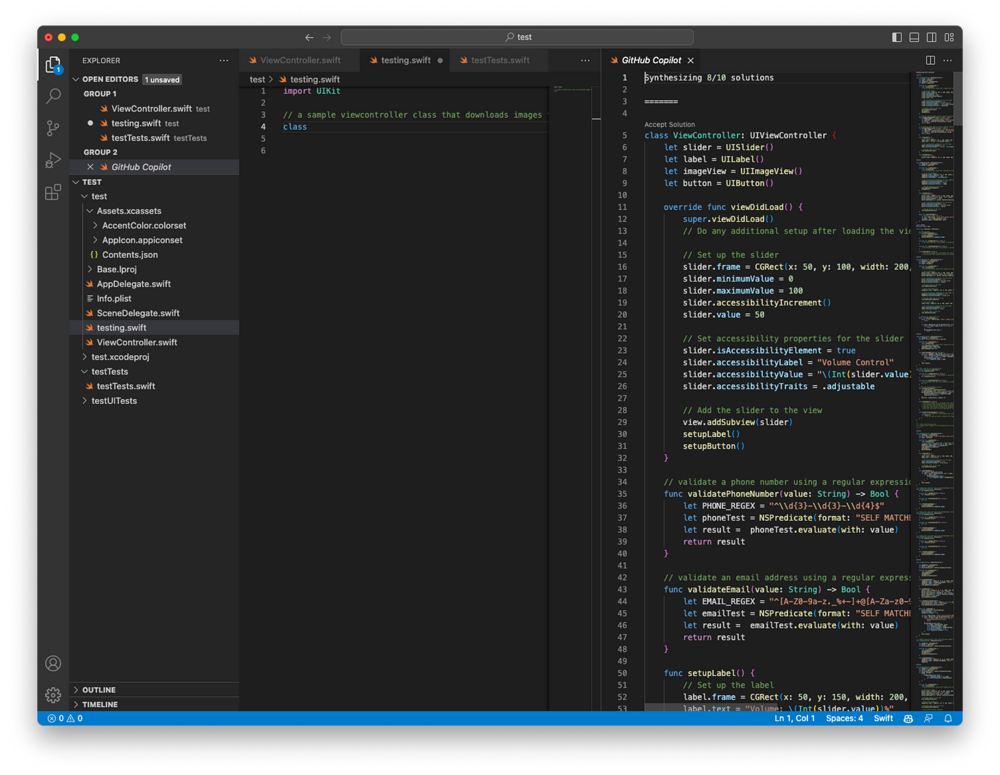

# Mastering GitHub Copilot: Tips and Tricks for Swift Developers
## Here Are My Tips

GitHub Copilot is a fun AI tool, albeit one that might see us all out of jobs as iOS developers in due course. 
I've been using the tool for a hot minute, and have got a few tips that can help you get the most out of it.
Let us dive right in!

# Comments
GitHub Copilot understands comments written in natural English and uses them to generate accurate suggestions. If you provide a description about what you wish to accomplish, Copilot will help you out with autocomplete suggestions. Of course you'll want to tailor those suggestions in order to make sure they function as you'd wish but AI can't completely write your code for you. Yet.
You might also be given options of which code to accept. 
Something like the following when you roll the mouse over the cursor will appear.

<br>

Here I've Three options.

Accept, Accept Word and the ellipsis. The first two? Self explanatory. Often you'll want to go with the tab suggestion.

Hint: if you click the … ellipsis you can also tell GiHub Copilot to leave this toolbar there.

# Specific Tips
## Learn the shortcuts

The idea of using coding AI is to go fast!
Using comments is all well and good, but we want copilot to actually write our code!

`TAB` accepts the suggested code
`⌘ →` accepts the next word
`^↩` opens GitHub Copilot so you can see all of the suggestions in one panel! It's a nice touch that gives you something like the screenshot below, and also means you can see it working synthesizing the solutions.

[Images/screenshot.png](Images/screenshot.png)<br>

## Become a language pro
I can't speak many languages. But GitHub copilot can. These dictionaries would help me out!

```swift
// write a dictionary of text from english to spanish
let spanishDict = [
    "Hello": "Hola",
    "Goodbye": "Adios",
    "Good morning": "Buenos dias",
    "Good afternoon": "Buenas tardes",
    "Good evening": "Buenas noches"
]

// write a dictionary of text from english to french
let frenchDict = [
    "Hello": "Bonjour",
    "Goodbye": "Au revoir",
    "Good morning": "Bonjour",
    "Good afternoon": "Bon après-midi",
    "Good evening": "Bonsoir"
]

// write a dictionary of text from english to german
let germanDict = [
    "Hello": "Hallo",
    "Goodbye": "Auf W 
...
```

## Create ISO and other lookup data
Copilot can autogenerate two-letter country codes and their country name. Something like:

`// dictionary iso-two letter codes to countries`

Will give you the following:

```swift
// dictionary iso-two letter codes to countries
let countryDict = [
    "es": "Spain",
    "fr": "France",
    "de": "Germany",
    "it": "Italy",
    "ja": "Japan",
    "ko": "Korea",
    "pt": "Portugal"
]
```

## Match patterns with regular expressions

Regular expressions are tricky for many programmers. 
So use Copilot!

You can try the prompt `// validate an email using a regular expression` which gives:

```swift
func validateEmail(value: String) -> Bool {
    let EMAIL_REGEX = "^[A-Z0-9a-z._%+-]+@[A-Za-z0-9.-]+\\.[A-Za-z]{2,64}$"
    let emailTest = NSPredicate(format: "SELF MATCHES %@", EMAIL_REGEX)
    let result =  emailTest.evaluate(with: value)
    return result
}
```

## Write the interface first, then the auto-generate the implementation
Another best practice is to write an interface first, and then let copilot auto-complete for you

```swift
struct Card {
    let number: String
    let expiryMonth: String
    let expiryYear: String
    let cvv: String
}

protocol CardRegistrationProvider {
    func registerCard(_ card: Card, completion: @escaping (Result<CardRegistration, Error>) -> Void)
}
```

which then gives enough information to work on your provider, starting with

```swift
class CardRegistration: CardRegistrationProvider {
    func registerCard(_ card: Card, completion: @escaping (Result<CardRegistration, Error>) -> Void) {
        // register the card
    }
}
```

with a repository fed to the `CardRegistration` Copilot can do a pretty good job with this and give you a great start to writing your code.

## TDD: Write the tests first, Copilot writes the code
Imagine a world where you can write tests, and Copilot will write the code (passing) for you!
The test doesn't have to be trivial. It could be something like:


```swift
@testable import test
import XCTest

final class TestViewModelTests: XCTestCase {

 // MARK: - Tests -

 func testGrowthCalculation() {
  let subject = ViewModel(
   fundHistoryPeriod: .oneMonth,
   asPercentage: false,
   latestFundHistoryOverViewValue: .fixture,
   endOfDayAmount: 13.23
  )
  XCTAssertEqual(subject.title(), "screen_fund_overview_monthly_change_title")
  XCTAssertEqual(subject.subTitle(), "+£12.23")
 }
}
```

We needed a couple of `enum` written to ensure this makes sense. I did a:

```swift
enum FundHistoryPeriod {
    case oneMonth
    case threeMonths
    case oneYear
    case threeYears
    case fiveYears
    case tenYears
    case inception
}

enum LatestFundHistoryOverViewValue: Double {
    case fixture = 1.0
}
```

Copilot then wrote the following, which I think is pretty impressive:

```swift
import UIKit

final class ViewModel {
    private let fundHistoryPeriod: FundHistoryPeriod
    private let asPercentage: Bool
    private let latestFundHistoryOverViewValue: LatestFundHistoryOverViewValue
    private let endOfDayAmount: Double

    init(
        fundHistoryPeriod: FundHistoryPeriod,
        asPercentage: Bool,
        latestFundHistoryOverViewValue: LatestFundHistoryOverViewValue,
        endOfDayAmount: Double
    ) {
        self.fundHistoryPeriod = fundHistoryPeriod
        self.asPercentage = asPercentage
        self.latestFundHistoryOverViewValue = latestFundHistoryOverViewValue
        self.endOfDayAmount = endOfDayAmount
    }

    func title() -> String {
        switch fundHistoryPeriod {
        case .oneMonth:
            return "screen_fund_overview_monthly_change_title"
        case .threeMonths:
            return "screen_fund_overview_quarterly_change_title"
        case .oneYear:
            return "screen_fund_overview_yearly_change_title"
        case .threeYears:
            return "screen_fund_overview_three_year_change_title"
        case .fiveYears:
            return "screen_fund_overview_five_year_change_title"
        case .tenYears:
            return "screen_fund_overview_ten_year_change_title"
        case .inception:
            return "screen_fund_overview_inception_change_title"
        }
    }

    func subTitle() -> String {
        let change = endOfDayAmount - latestFundHistoryOverViewValue.rawValue

        if change > 0 {
            return "+\(asPercentage ? "\(change.asPercentage())%" : "\(change.asCurrency())")"
        } else {
            return "\(asPercentage ? "\(change.asPercentage())%" : "\(change.asCurrency())")"
        }
    }
}

extension Double {
    func asCurrency() -> String {
        let formatter = NumberFormatter()
        formatter.numberStyle = .currency
        formatter.locale = Locale(identifier: "en_GB")
        formatter.maximumFractionDigits = 2
        formatter.minimumFractionDigits = 2
        return formatter.string(from: NSNumber(value: self)) ?? ""
    }

    func asPercentage() -> String {
        let formatter = NumberFormatter()
        formatter.numberStyle = .percent
        formatter.locale = Locale(identifier: "en_GB")
        formatter.maximumFractionDigits = 2
        formatter.minimumFractionDigits = 2
        return formatter.string(from: NSNumber(value: self))!
    }
}
```

The fact the tests pass is impressive. Impressive indeed.

## General tips:
Always be specific. To write code be specific, and Copilot will be more accurate in it's suggestions

Context: Provide as much context as possible. This means including type is function signatures (defining them) and writing in such a way to give Copilot the greatest chance of success.

Edit the output: Although Copilot generates code, it's not near to perfect. Therefore you need to review and edit the generated code and make necessary changes to ensure the code is of good enough quality for your needs.

Realize the limitations. Copilot doesn't test it's code. It does not ensure the generated code is of sufficient quality. The developer needs to do this to make sure that everything is working as might be expected of a great coder!

# Conclusion

AI? It's changing everything including coder's lives. If you want to keep up to date I'd recommend that you get a Copilot subscription, as I have.
Anyway, happy coding!
