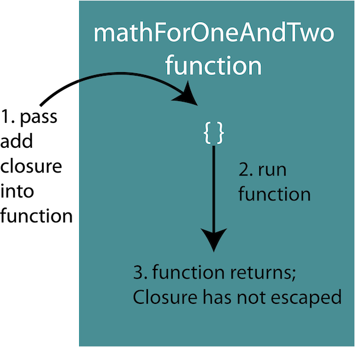
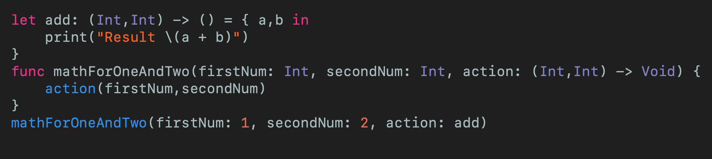
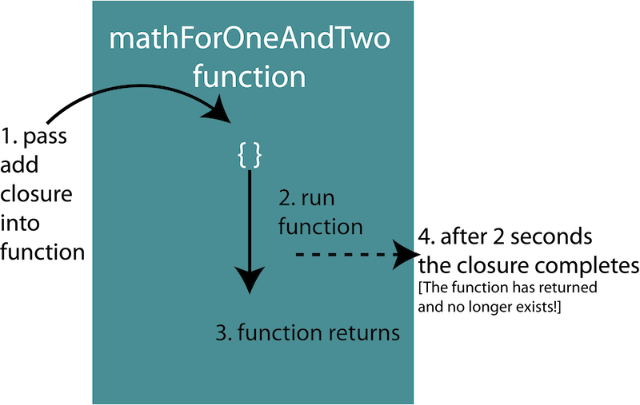
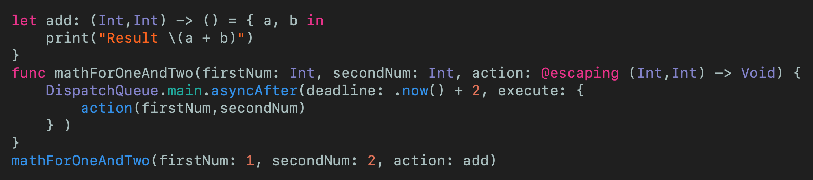

# What Is The Difference Between @escaping and @nonescaping Closures in Swift
## Escaping sounds fun!

 
Photo by Billy Chester on Unsplash

An in-depth look into the two types of [closures](https://medium.com/swift-coding/swift-closures-c14cb7aa2170), focussing on @escaping and @nonescaping closures.

Difficulty: **Beginner** | Easy | Normal | Challenging 
This article has been developed using Xcode 11.4.1, and Swift 5.2.2

# What are escaping and non-escaping closures
* A non-escaping closure is a closure that is called within the function it is passed into. The execution of the closure will be before the function returns
* An escaping closure is a closure that executes after the function it is passed into returns. The closure outlives the function that it is passed into, and this is known as `escaping`. escaping closures are frequently used for asynchronous execution or storage.

# The Problem
Closures risk creating a [retain cycle](https://medium.com/@stevenpcurtis.sc/see-retain-cycles-in-xcode-70eb150ce7d1). By writing @escaping before a closure's parameter type indicates that the closure is allowed to escape (to be called later)

Let us look at some real-life examples

## The real-life example
Now a closure can be thought of a set of instructions that are passed to a function that are executed by that function. The function has no information about what these instructions (the closure) might do, other than the parameters it is given and the return type. The closure will have a reference to an object - and it is this reference that can cause problems with a possible [retain cycle](https://medium.com/@stevenpcurtis.sc/see-retain-cycles-in-xcode-70eb150ce7d1) and memory leak.

The *flow* of the two situations in hand look like the following
*non-escaping closures*
* Pass the closure as a function argument
* The function processes some work
* The function runs the closure
* The function returns

*Escaping closure*
* Pass the closure as a function argument
* The function processes some work
* The function returns
* At some later stage, the closure is executed

So a *non-escaping* closure can be analogous to the following:
You are following a recipe (the function) that looks something like - Turn on Oven - Place Ready Meal inside Oven. Now you have to work out the *Place Ready Meal inside Oven*, so we pass in a closure that instructs us how to open the oven. Now that closure will reference an oven property (that is, your oven) - the closure *closes over* the property and captures a strong reference to the oven. 
When the function returns, the closure has already run so we can clean up all of these references and clear up the memory. Awesome!

An *Escaping* closure can be analogous to the following:
You are following a recipe (the function) that looks something like - Open bag of salad- empty out the salad onto the plate - boil an egg - put egg onto the plate. Now *boil an egg* is quite a tricky step as it should take at least 5 minutes and involves several steps, so we pass in a closure that instructs us how to boil the egg. Now that closure will reference the plate property - the closure *closes over* the property and captures a strong reference to the plate.
However, when the function returns the closure still has a reference to the plate and holds onto it. The plate cannot be removed until the closure has completed - and will it ever complete?

## The default
Closures themselves are reference types, and by default they are non-escaping closures. Since non-escaping closures can't create retain cycles this means that code is likely to avoid these memory leaks. All references from the creating context are removed after the closure has finished execution. 

# The Examples
A simple example consists of a function which has two parameters (two Integers) and adds them, where the output is the sum of the two numbers.

### non-escaping closures
The closure is called from the `mathForOneAndTwo` function, and this is a rather ordinary function that is run.

The following example makes things rather clear:

The idea is that the closure does not exist once the outer function has completed (because it runs sequentially).

This is the default state, the `non-escaping closure` and will not create a [retain cycle](https://medium.com/@stevenpcurtis.sc/see-retain-cycles-in-xcode-70eb150ce7d1).

So this can be practically implemented with the following code:

 
[Click for Gist](https://gist.github.com/stevencurtis/06b367d19c49a4e17b6c240db461338b)

### escaping closures
There is an alternative, situation that reduces the risk of creating retain cycles

a closure that is called after the function it was passed to returns and outlives the function it was passed to. Useful for async calls, callbacks or scheduling tasks on the dispatch queue.
So in our example (to make using an escaping closure make sense — without using a network call) I wrap the closure inside asyncAfter() so it is executed after a two second delay.
The compiler asks for @escaping to be added to mathForOneAndTwo (thanks Swift!)

Memory is only released when the closure has finished execution.

So this can be practically implemented with the following code:

 
[Click for Gist](https://gist.github.com/stevencurtis/60020d823085de81b9e2ddde0986f180)

# Conclusion
The idea of @escaping and non-escaping closures can be a little tricky. We didn't even get into [capture lists](https://medium.com/@stevenpcurtis.sc/using-capture-lists-in-swift-19f408f986d) that might be the next article you'd like to read.

Some of these concepts in Swift can be a little tricky, but it is important to try to get there in the end and put all of these tools into your programming toolbag.

If you've any questions, comments or suggestions please hit me up on [Twitter](https://twitter.com/stevenpcurtis) 

Why not sign up to my [newsletter](https://subscribe.to/swiftcodingblog/)
