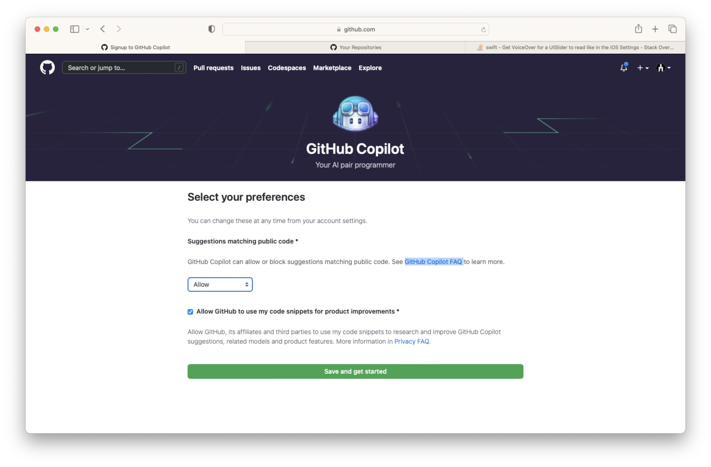
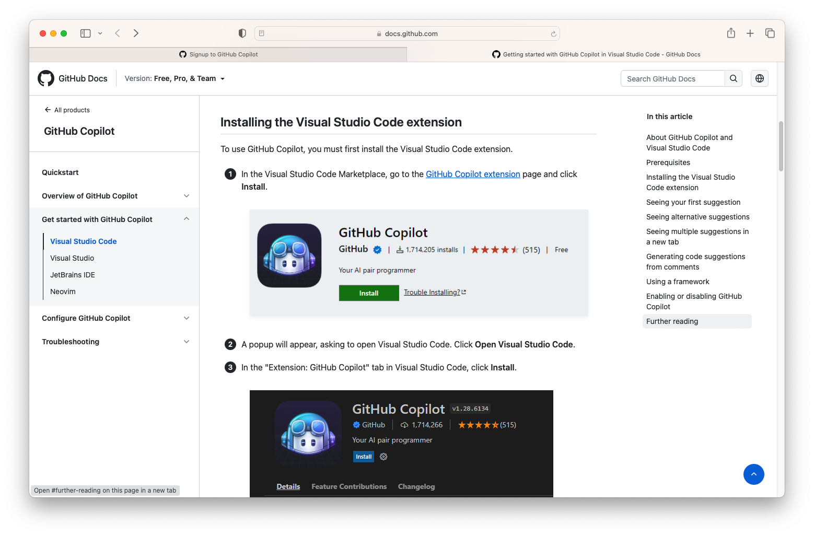
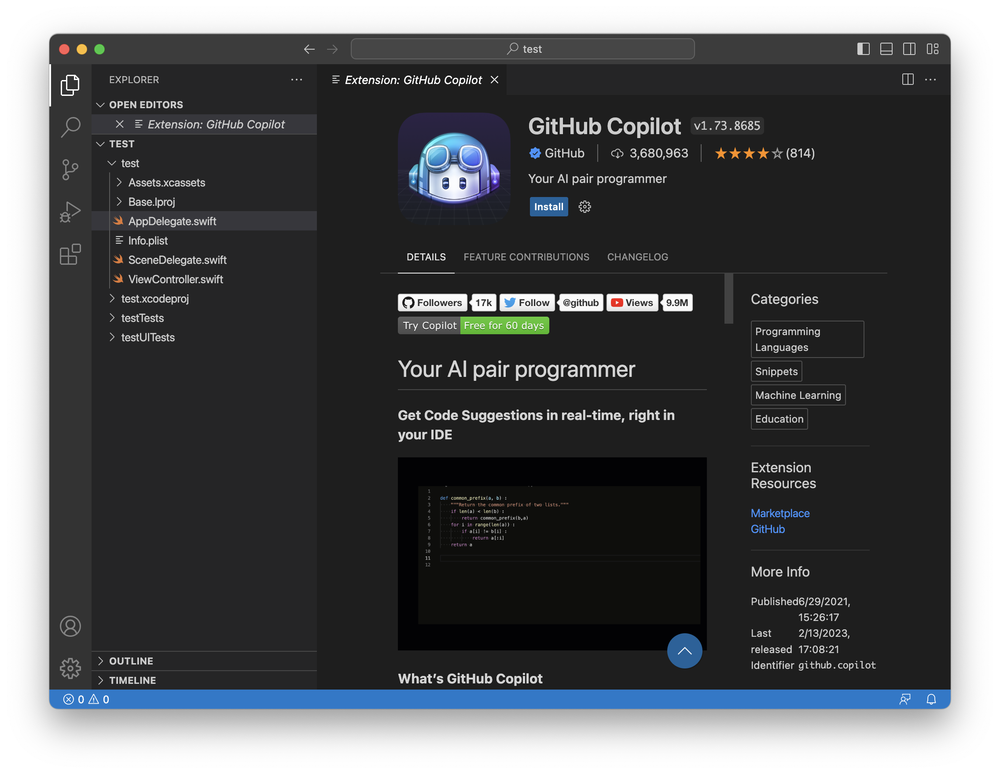
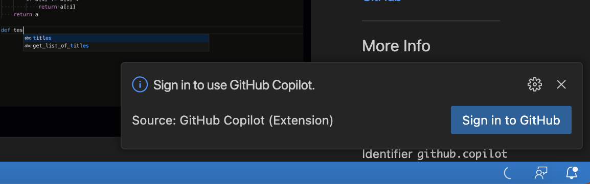
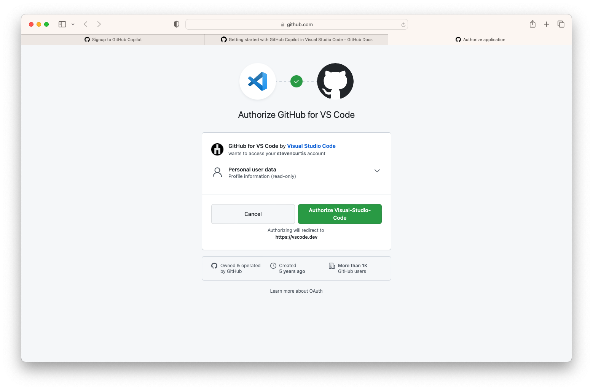
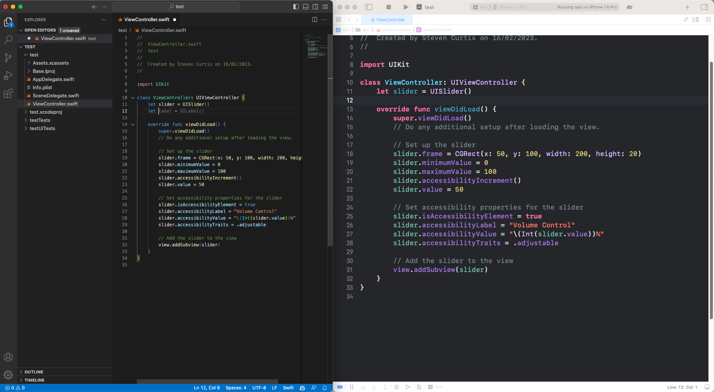
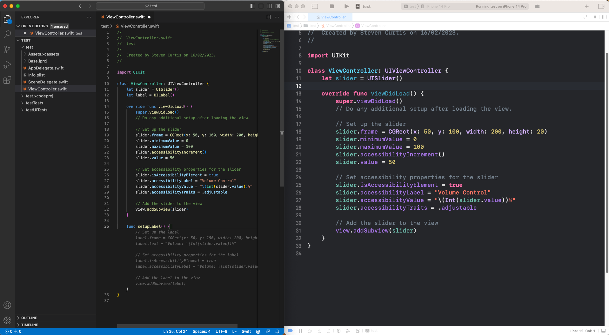

# GitHub Copilot: The AI-Powered iOS Programming Assistant You Need to Try
## See What I've Found Out

AI is everywhere. I want to join the revolution™ and get with the AI programme, and surely (please) it's not too late for me. 
I'm using ChatGPT for all sorts of things, [although not at work](https://medium.com/@stevenpcurtis/you-shouldnt-use-chatgpt-at-your-coding-jo-d5e0aeb52e7b) but I haven't been using it for the big one. [The thing that I love doing, and would do even if I'm not paid. Coding.](https://medium.com/@stevenpcurtis/my-love-is-ios-coding-this-valentines-day-3c8f89ac598a) 
Announced way back in 2021 and brought out of technical preview in June 2022. I'm really late.
Here's a tutorial about how to Install GitHub Copilot and how to use it to code in Swift.
Buckle up and let's go!

# Signing up
Over at https://github.com/features/copilot you can sign up to GitHub Copilot. This is going to be fun!
There's even a 60-day free trial, but I think that I'll leave this installed to make my coding adventures ([at least on personal projects](https://medium.com/@stevenpcurtis/you-shouldnt-use-chatgpt-at-your-coding-jo-d5e0aeb52e7b)) fun.

<br>

Of course! They're not going to allow me to get a 60-day free trial without payment details.


<br>

I found it slightly annoying that PayPal wouldn't work in the day I tried this, so had to whip out the card that doesn't charge me for international transactions. Still, a small price to play for that AI-goodness, right?

<br>

This setting can be changed at any time, so I'm not going to think too deeply about them.

<br>

Ah. I'm going to need Visual Studio Code installed. This wasn't a step I needed to follow (I already had it) but unfortunately I didn't have a new enough version. A quick update had me away!
I then needed the following extension, and pressed the friendly-looking green install button on page will get that extension working.

<br>

Feels that there's many approvals and checks to get this working. Over on Visual Studio Code there's another install button.

<br>

I pressed the reassuring Install button.
Then (and only then) did I realize that I wasn't signed into GitHub. Junior mistake.

<br>

An authorization? Why not!

<br>

So many redirects. Anyway I have some code that allows me to place a simple label on the screen. I opened it with a simple File>Open in Visual Studio Code.
I've positioned my screens so I can see Visual Studio Code and Xcode on the same screen. This is going to be fun!

<br>

I already had this slider code hanging around (actually I'd got ChatGPT to write this code, by NM).
It just displays a slider on the screen.

<br>

I go to Visual Studio Code. I type let and It suggests a label. Tab means I accept the suggestion.
So we can setup a function to setup that label, right?
I write func setupLabel() and autocomplete gives me the rest.
Tab allows me to agree to that label. I'll call this function from the viewDidLoad() function os type that in. A quick save then I can run the simulator.

<br>

Thats…reasonable. It's lined up Ok. It displays the initial value. It's…something.
What else can I do with this?

## Writing some comments
If I type in some comments into Visual Studio code, it writes the code for me.

`// validate a phone number using a regular expression`

A quick tab gives confirmation that I'll use the following code:
```swift
// validate a phone number using a regular expression
func validatePhoneNumber(value: String) -> Bool {
    let PHONE_REGEX = "^\\d{3}-\\d{3}-\\d{4}$"
    let phoneTest = NSPredicate(format: "SELF MATCHES %@", PHONE_REGEX)
    let result =  phoneTest.evaluate(with: value)
    return result
}
```

That's reasonable.
What about 

`// validate an email address using a regular expression`

```swift
// validate an email address using a regular expression
func validateEmail(value: String) -> Bool {
    let EMAIL_REGEX = "^[A-Z0-9a-z._%+-]+@[A-Za-z0-9.-]+\\.[A-Za-z]{2,64}$"
    let emailTest = NSPredicate(format: "SELF MATCHES %@", EMAIL_REGEX)
    let result =  emailTest.evaluate(with: value)
    return result
}
```

What if I go to my test class and

`// test function`

That gives me 

```swift
func testValidatePhoneNumber() {
    let vc = ViewController()
    let result = vc.validatePhoneNumber(value: "123-456-7890")
    XCTAssertTrue(result)
}
```

That's… reasonable.
`// test validatePhoneNumber function for false values`

```swift
func testValidatePhoneNumberFalse() {
    let vc = ViewController()
    let result = vc.validatePhoneNumber(value: "123-456-789")
    XCTAssertFalse(result)
}
```

It's all a little "North Atlantic". I'll try and make this a bit more suitable for this side of the pond.

`// test validatePhoneNumber for UK phone numbers`

```swift
func testValidatePhoneNumberUK() {
    let vc = ViewController()
    let result = vc.validatePhoneNumber(value: "123-456-7890")
    XCTAssertTrue(result)
}
```

You can't have everything, can you? 
It's a bit weird because over on ChatGPT we have
Sooooooo. I don't know.
At least all of these tests pass, so that's something.

# What do I think?
After giving GitHub Copilot a try for myself, I can confidently say that it's an incredible tool that every iOS developer should try.
Since it's machine learning brain has been trained on a massive dataset of code it comes up with interesting context-specific suggestions - and those are actually based on the code you're writing. 
At this time I feel really impressed, but how far can I take this? Actually, one of my first thoughts is how I can use this to improve my coding technique and perhaps use TDD in the future.
The jury is really out as to whether I can use this in production code, and I'll write an article on just that!

# Conclusion
I guess I'm going to be using this big time in the future. You with me? I mean I've selected a year's subscription so I think I've got to use this to get value for money!
Happy coding, and perhaps I'll see you next time?
