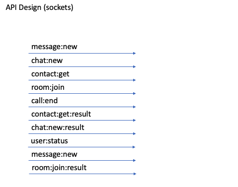
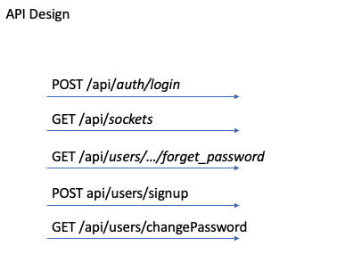
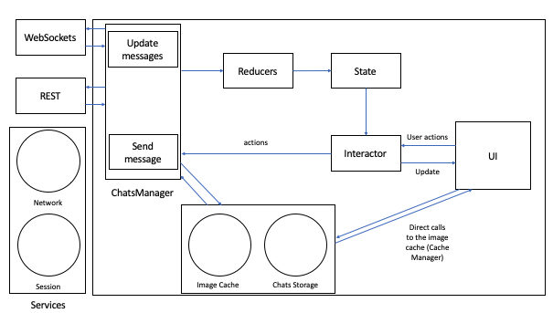
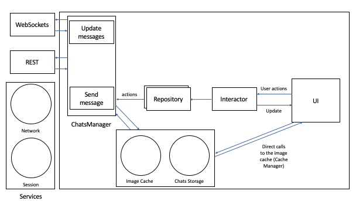

# System Design

# Constraints and Assumptions (criteria)
Defining components in order to provide the required functionality, solving the problem of repeated code.

* Who?
* How do they use it?
* Number of users?
* What are the inputs and outputs of the system
* Requests per second
* Testing
* Security
* Offline storage
* Intermittent connection issues

Do not allow massive view controllers, rigidity, fragility

# High-level Design
## Functional and non-functional requirements
* Preformance
* Responsiveness
* Offline functionality
* Watch
* Security
* Avaliability

## Break out services i..e
* Network
* Login
* Analytics

## System Design 1: Redux managing App State
Redux is commonly matched with MVI (Model-View-Intent) where the intent represents the state of the App. Here I have considered Redux to be MVI, and interact with Redux through an interactor.

Advantages:
* Pure reducer functions make business logic easy to test
* Centralized state makes debugging relatively easy
* State can be persistent

Disadvantages:
Redux should only be used if you actually require a state management tool.
That is, does this App:
* Require it's application state to be updated frequently, is complex to update and is required in many parts of the App
* Does the App have a medium-to-large codebase worked on by many people

Only the Specific application context can answer these questions.

[Images/SystemDesignRedux.png](Images/SystemDesignRedux.png) 

## System Design 2: MVVM-C

[Images/SystemDesign.png](Images/SystemDesign.png) 

Want to separate UI and business logic

MVVM-C or viper? MVVM provides less clearly defined responsibilities compared to VIPER. However, in VIPER we have layers with their own responsibilities which are perhaps less flexible.
If your project is long-term with well-defined requirements then VIPER may be a good option due to the clear separation of concerns. However, confusing communication 
However MVVM-C helps with the separation of concerns by separating out the flow coordinator while also allowing flexibility. 
For smaller projects VIPER can be seen as overkill, defining where responsibilities are defined. 

# API Design
**Pagination**
If we download messages over an API. This can be implemented either within a REST or a GraphQL API.

We can use a system like `messages(first: 2, offset:2)` which would as for the next two items in a list.

However what about the case where messages keep being sent? 
**ID-based**
We can improve and use and ID to as for the next two messages after a particular message
`messages(first:2 after:$messageID)`
**Time-based**
We can perform a similar trick with a timestamp
`messages(first:2 after: now()`

**Cursor**
Using a cursor is the most powerful of these options.
`messages(first:2 after:$messageCursor)`
This gives a further abstraction, if the pagination model changes in the future we will still be compatible. We should remember that cursors are opaque and the format should not be relied upon (suggesting a base64 encoding).

 

 

## Non-Domain Specific functionality
Services sit of top of the UI and MVC (or other App architecture), and frequently consist of services such as storage and networking. Using these services we can avoid duplicated code.

Frameworks can be used across applications.

Other examples of frameworks that can be created are:
* Login services
* Analytics
* Location services
* Localization
* Add in reachability

However care should be take on more-domain independent functionality such as handling notifications and storage. It should also be noted that this isn't the only solution to making your App modular (by any means), and usually only makes sense when Applications become larger

## System Design 1: Redux managing App State
Redux is commonly matched with MVI (Model-View-Intent) where the intent represents the state of the App. Here I have considered Redux to be MVI, and interact with Redux through an interactor.

Advantages:
* Pure reducer functions make business logic easy to test
* Centralized state makes debugging relatively easy
* State can be persistent
* Services separated out from the main Application

Disadvantages:
Redux should only be used if you actually require a state management tool.
That is, does this App:
* Require it's application state to be updated frequently, is complex to update and is required in many parts of the App
* Does the App have a medium-to-large codebase worked on by many people

Only the Specific application context can answer these questions. Do you really need to update the state over time?

 

## System Design 2: MVVM-C
Want to separate UI and business logic

 

MVVM-C or viper? MVVM provides less clearly defined responsibilities compared to VIPER. However, in VIPER we have layers with their own responsibilities which are perhaps less flexible.
If your project is long-term with well-defined requirements then VIPER may be a good option due to the clear separation of concerns. However, confusing communication 
However MVVM-C helps with the separation of concerns by separating out the flow coordinator while also allowing flexibility. 
For smaller projects VIPER can be seen as overkill, defining where responsibilities are defined. 
