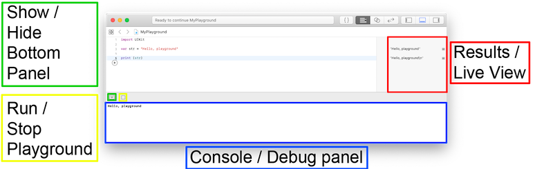
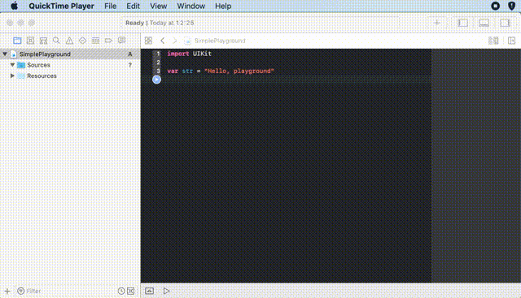

# Playgrounds tips

This article is in addition to the rather basic [basics](https://medium.com/@stevenpcurtis.sc/coding-in-swift-playgrounds-1a5563efa089) file I've created before, and using SwiftUI in [playgrounds](https://medium.com/@stevenpcurtis.sc/display-the-ui-in-swifts-playgrounds-d35a8371946c).


For clarity here are the sections of the Mac Playground that will be referred to here:
<br/>

## Derived data
Always, always clear the derived data from Xcode if you want reasonable performance from your Mac. 

## Separating out your files
Now you wouldn't usually put your files into one big super class, would you? But Playgrounds looks like it is missing any options to have mutliple files. 

Don't fear - we can **add** files! 

However, if we have a class or a function this needs to be declared as `public` [access control](https://medium.com/swift-coding/access-control-in-swift-71228704654a) so it is visible in the main `playgrounds` class.

So a right-click on the left-hand side panel (which must be revealed in Xcode) and adding a new file should be relatively easy for readers, and then the following function can be declared 

```swift
public func loghello() {
    print ("hello")
}
```
<br/>

Of course, if you choose to create a `class` (or `struct`, or `enum`) this would need to be pubic too!

## Accessing an extension

Now I love to use an `extension` to be able to decode json from a file (rather than hitting an endpoint repeatedly, which is featured in my [Code snippets](https://github.com/stevencurtis/SwiftCoding/tree/master/Tips/CodeSnippets)). Now for this to work I'm going to need four things:
* A file in the `Sources` folder that contains the Extension
* Make the function `public` 
* A `.json` file to access
* A model to decode to

It just so happens that I have all of these: The process for adding the files is the same as above, and you'll be able to see the result of this attached to the repo.

But, **but** **but** you need to have `Resources` placed into the `Resources` folder. I'd say Apple are a stickler for tradition, but actually I kind of agree that this makes some sense.

In my project (attached) this has allowed me to create the people object and access it: see?

```swift
var people: [PeopleModel] = try! Bundle.main.decode([PeopleModel].self, from: "Peeps.json")
print (people)
```

without a load of other text making it a little confusing. Which is nice.

## Adding a folder
This is still Xcode, right? A nice little right-click gives the option of `New Folder` and the files can be dragged into there. It's nice and organised, doctor.

