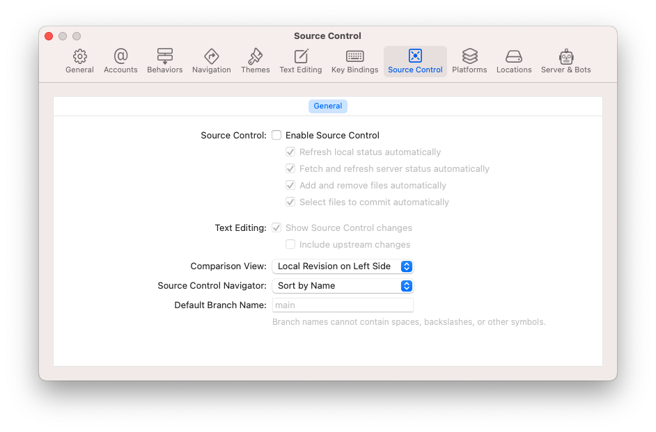

# Xcode: Not Using Source Control? Save Resources NOW
## A Simple Tip 

This looks like a clickbait headline. It really does.
However, if you're not using source control in Xcode you should really disable it. 
The menu Xcode>Settings gets you to the screen above (in Xcode). You can then click the Enable Source Control toggle and you'll get the screen above. You'll have disabled Source Control.

## Why, but why?
Source control in Xcode can impact the CPU cycles of your computer, as it requires processing power to manage the version control operations, such as committing changes, merging branches, or checking out a previous version of the code.

## Does it matter?

The impact on CPU cycles can vary depending on several factors, such as the size of your codebase, the complexity of your version control operations, and the performance of your computer. In general, the impact on CPU cycles should be minimal, and the benefits of using source control far outweigh any potential performance issues.
However, in a case where you aren't using source control you're really just wasting resources. 
Don't spend resources on something you're not using. Like those subscription accounts!

## My take
I generally use the terminal for version control, so don't lose performance in Xcode. YMMV however.

## Conclusion
Thanks for reading!
I hope this little tip has helped you out!
