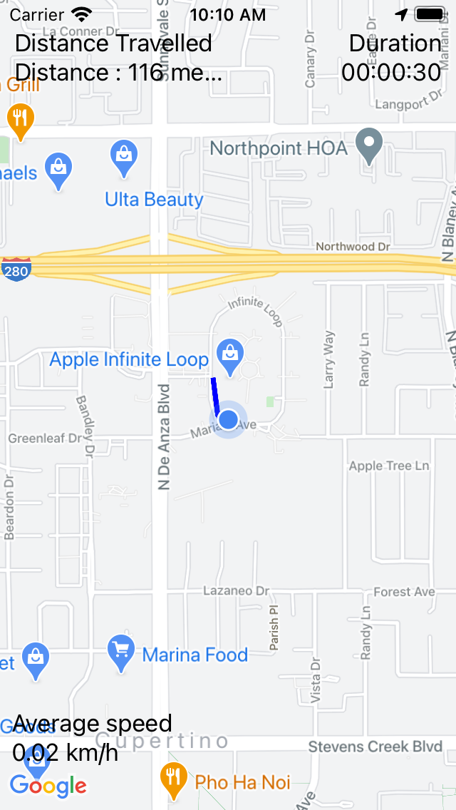
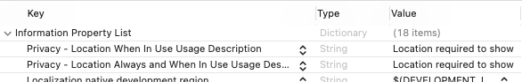
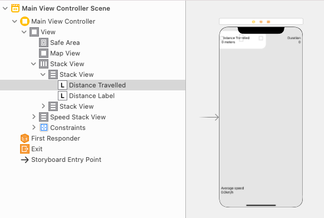

# Track My Movement: A RxSwift Project
## Bind to the view controller


# Before we start
Difficulty: Beginner | Easy | Normal | **Challenging**<br>
This article has been developed using Xcode 12.2, and Swift 5.3

## Prerequisites
This article is based on the [UITableView Programmatic Example](), and builds on that (although the code is given in this article)
I usually remove the storyboard using [this technique](https://medium.com/@stevenpcurtis.sc/avoid-storyboards-in-your-apps-8e726df43d2e)

## Keywords and Terminology
Row: The content in a UITableview is ordered into rows

# This project
## Background
Before we look at how to put spaces in between `UITableViewCells`, let us look at some of the background of `UITableView`.

# Installation from the Repo
**Download**
You can (in fact I encourage it!) download the files from the [repo](https://github.com/stevencurtis/SwiftCoding/tree/master/PropertyObservers/TrackMyMovement).

**Pods**
I've excluded the `pod` file so open a terminal window and move to the folder with the project, and `pod install`. If you don't have `CocoaPods` you can install them from [cocoapods.org](https://cocoapods.org).

**API Key**
The API key is not included in this repo. To use a Google Maps API Key one may be obtained from [The Google Developer site](https://developers.google.com/maps/documentation/embed/get-api-key), or has been sent to you by the author.

This should be placed into a file called `APIKey.Swift` with the following format
```swift
let key = "YourKey"
```

**Usage**
Traverse to the folder the files have been saved in. Open `TrackMyMovement.scworkspace`, using Xcode.

`⌘-U` runs the Unit tests from within Xcode

`⌘-R` runs the project

# The guide
## Create a new project
This is an ordinary iOS project using *Swift* and *UIKit*

## The PodFile
Pod init

```swift
# Uncomment the next line to define a global platform for your project
# platform :ios, '9.0'

target 'TrackerDemo' do
  # Comment the next line if you don't want to use dynamic frameworks
  use_frameworks!

    pod 'GoogleMaps'

  # Pods for TrackerDemo
      pod 'RxSwift'
      pod 'RxCocoa'

  target 'TrackerDemoTests' do
    inherit! :search_paths
    # Pods for testing
      pod 'RxTest'
      pod 'RxBlocking'
  end

  target 'TrackerDemoUITests' do
    # Pods for testing
  end

end

```

Note that `RxSwift` and `RxBlocking` are used in the test target only. 

## Install the Pods
Pod Install
Which is typed in from the terminal, in the target folder

## Permissions
Permissions need to be set in the *info.plist* file. To set these move to the *Info.plist* file and add  the following:

Key: Privacy - Location Always and When In Use Usage Description
Value: Location required to show you where you are

Key: Privacy - Location When In Use Usage Description
Value: Location required to show you where you are

which results in the following at the top of the *info.plist*:



## The AppDelegate

You must both import GoogleMaps at the beginning of the file, and replace `func application(_ application: UIApplication, didFinishLaunchingWithOptions launchOptions: [UIApplication.LaunchOptionsKey: Any]?) -> Bool`

with 

```swift
    func application(_ application: UIApplication, didFinishLaunchingWithOptions launchOptions: [UIApplication.LaunchOptionsKey: Any]?) -> Bool {
        // Override point for customization after application launch.
        GMSServices.provideAPIKey(APIKeys.GMSServicesAPIKey)
        return true
    }
```

## The SceneDelegate
The `func scene(_ scene: UIScene, willConnectTo session: UISceneSession, options connectionOptions: UIScene.ConnectionOptions)` function has been replaced with the following:

```swift
func scene(_ scene: UIScene, willConnectTo session: UISceneSession, options connectionOptions: UIScene.ConnectionOptions) {
    guard let windowScene = (scene as? UIWindowScene) else { return }
    
    self.window = UIWindow(windowScene: windowScene)
    let storyboard = UIStoryboard(name: "Main", bundle: nil)
    let vc = storyboard.instantiateViewController(identifier: "MainViewController", creator: { coder in
        return MainViewController(coder: coder, locationManager: LocationManager.shared)
    })
    
    let rootNC = UINavigationController(rootViewController: vc)
    self.window?.rootViewController = rootNC
    self.window?.makeKeyAndVisible()        
}
```

## The LocationManager
I decided to wrap the `CLLocationManager` and it's delegate into a class do I can use [Dependency injection](https://medium.com/@stevenpcurtis.sc/learning-dependency-injection-using-swift-c94183742187).

The class uses `BehaviorRelay` since this relay emits all of the (to be observed) items, after emitting the most recently observed item. This is what is needed for relays that will communicate the current position, location, distance and speed.

The full class looks like the following:

```swift
import RxSwift
import RxCocoa
import GoogleMaps

protocol LocationManagerProtocol {
    var locationPermissionRelay: BehaviorRelay<CLAuthorizationStatus> { get }
    var locationRelay: BehaviorRelay<CLLocation?> { get }
    var distanceRelay: BehaviorRelay<CLLocationDistance> { get }
    var speedRelay: BehaviorRelay<CLLocationSpeed?> { get }
    var initialTripLocationRelay: BehaviorRelay<CLLocation?> { get }
}

class LocationManager: NSObject, LocationManagerProtocol, CLLocationManagerDelegate {
    private lazy var locationManager = CLLocationManager()
    private let disposeBag = DisposeBag()
    lazy var locationPermissionRelay = BehaviorRelay<CLAuthorizationStatus>(
        value: locationManager.authorizationStatus)
    let locationRelay = BehaviorRelay<CLLocation?>(value: nil)
    let speedRelay = BehaviorRelay<CLLocationSpeed?>(value: CLLocationSpeed.init(exactly: 0.0))
    let distanceRelay = BehaviorRelay<CLLocationDistance>(value: 0)
    let initialTripLocationRelay = BehaviorRelay<CLLocation?>(value: nil)

    static let shared = LocationManager()
    
    private override init() {
        super.init()
        locationManager.delegate = self
        locationManager.distanceFilter = kCLDistanceFilterNone
        locationManager.desiredAccuracy = kCLLocationAccuracyBestForNavigation

        DispatchQueue.main.async{
            self.locationManager.startUpdatingLocation()
        }
    }
    
        // MARK: - CLLocationManagerDelegate
    func locationManager(_ manager: CLLocationManager, didChangeAuthorization status: CLAuthorizationStatus) {
        locationPermissionRelay.accept(status)
    }

    func locationManager(_ manager: CLLocationManager, didUpdateLocations locations: [CLLocation]) {
        guard let currentLocation = locations.last else { return }
        locationRelay.accept(currentLocation)
        speedRelay.accept(currentLocation.speed)
        
        if let initialTripLocation = initialTripLocationRelay.value {
            let distance = currentLocation.distance(from: initialTripLocation)
            guard distance > 0 else {return}
            distanceRelay.accept( distanceRelay.value + abs(distanceRelay.value - distance) )
        } else {
            initialTripLocationRelay.accept(currentLocation)
        }
    }
}
```

## The MainViewModel
The output for the viewmodel is where we are linking the `UIControl` elements. These are mainly `Driver` observable sequences. 

This means that they conform with the following:

```swift
*it never fails
*it delivers events on MainScheduler.instance
*share(replay: 1, scope: .whileConnected) sharing strategy
```
The idea that the driver delivers events on `MainScheduler.instance` are a big advantage, making this ideal to drive the `UIControl` components.

This has resulted in the following struct:

```swift
struct Output {
    var authorizedDriver: Driver<Bool>
    var locationsDriver: Driver<CLLocation?>
    var initialTripLocation: Single<CLLocation??>

    var distanceDriver: Driver<String>
    var averageSpeedDriver: Driver<String>
    var durationDriver: Driver<(String)>
}
```

Now the LocationManager is injected into the `ViewModel` class using the [initializer](https://medium.com/@stevenpcurtis.sc/swift-initializers-fc12908a9106) in order to be able to do so.

Now some calculation needs to happen in order to format the output from the Location Manager and provide it to the View Controller in an appropriate format. 

Authorization:
This formats `locationManager.locationPermissionRelay` into a Boolean, and if an error is provided we return a false to the View Controller.

Locations:
Essentially this provides the `CLLocation` to the View Controller

Distance:
The distance is formatted into meters or km as a `String` for the View Controller - 

```swift
locationManager.distanceRelay
                .map({ meters in
                    if meters < 1000 {
                        return String(format: "Distance : %.f meters", meters)
                    }
                    return String(format: "Distance : %.2f km", meters / 1000)
                })
```

Average Speed:
The average speed is calculated by taking the distance and dividing it by the speed, using  `combineLatest` for the distance and the speed given by the `locationManager`.

```swift
locationManager.distanceRelay,
locationManager.speedRelay,
resultSelector: { (speed, distance) -> (String) in
    guard let distance = distance else {return ""}
    let kmh = abs(distance / speed)
  return String(format: "%.2f km/h", kmh)
}
```

Duration:
This is calculated using a `combineLatest` `Observable` where we take the time from the initial location and the current and calculate the difference, of course the result of this is formatted for display by the View Controller.

```swift
locationManager.initialTripLocationRelay,
locationManager.locationRelay,
resultSelector: { (initial, current) -> (String) in
    guard let initial = initial, let current = current else {return ""}
    let userCalendar = Calendar.current
    let components = userCalendar.dateComponents([.hour,.minute,.second], from: initial.timestamp, to: current.timestamp)
    return components.formattedTime
}
```

## The MainViewController
Sorry about the interface! In effect it is a couple of labels dragged onto the storyboard 
.

The main meat of this view controller is in the function `setupBindings`. Of course we need to have a `DisposeBag` to prevent memory leaks with `RxSwift`, and since these are drivers that are being linked to UI components rx has extensions for that, for example `distanceLabel.rx.text` - which is wonderful!

```swift
var disposeBag = DisposeBag()

func setupBindings() {
    mainViewModel.output.authorizedDriver
        .skip(1)
        .drive(onNext: {result in
            if result == false
            {
                let normalalert = UIAlertController(
                    title: "Location Access Required",
                    message: "Please open settings and set location access to ‘While Using the App’",
                    preferredStyle: .alert)
                let okay = UIAlertAction(title: "Retry", style: .default, handler: { _ in  })
                normalalert.addAction(okay)
                self.present(normalalert, animated: true)
            }
        })
        .disposed(by: disposeBag)
    mainViewModel.output.locationsDriver
        .drive(onNext: {[weak self] result in
            guard let latitude = result?.coordinate.latitude, let longitude = result?.coordinate.longitude else {return}
            let camera = GMSCameraPosition.camera(withLatitude: latitude, longitude: longitude, zoom: 17.0)
            self?.mapView.animate(to: camera)
            self?.mapView.camera = GMSCameraPosition(target: result!.coordinate, zoom: 15, bearing: 0, viewingAngle: 0)
            self?.path.add(CLLocationCoordinate2D(latitude: (result?.coordinate.latitude)!,
                                                  longitude: (result?.coordinate.longitude)!))
            let polyline = GMSPolyline(path: self?.path)
            polyline.strokeColor = UIColor.blue
            polyline.strokeWidth = 3
            polyline.map = self!.mapView
        })
        .disposed(by: disposeBag)

    mainViewModel.output.distanceDriver
        .drive(distanceLabel.rx.text)
        .disposed(by: disposeBag)
    
    mainViewModel.output.averageSpeedDriver
        .drive(averageSpeedLabel.rx.text)
        .disposed(by: disposeBag)
    
    mainViewModel.output.durationDriver
        .drive(durationLabel.rx.text)
        .disposed(by: disposeBag)
}
```

# Conclusion
Of course, if you want the full code you need to download from the [Repo](https://github.com/stevencurtis/SwiftCoding/tree/master/TrackMyMovement) makes things rather easier to follow in this project, and I do recommend you download this project.

If you've any questions, comments or suggestions please hit me up on [Twitter](https://twitter.com/stevenpcurtis) 
