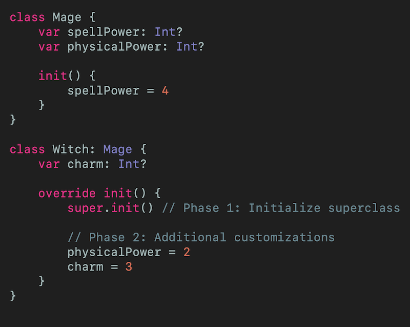
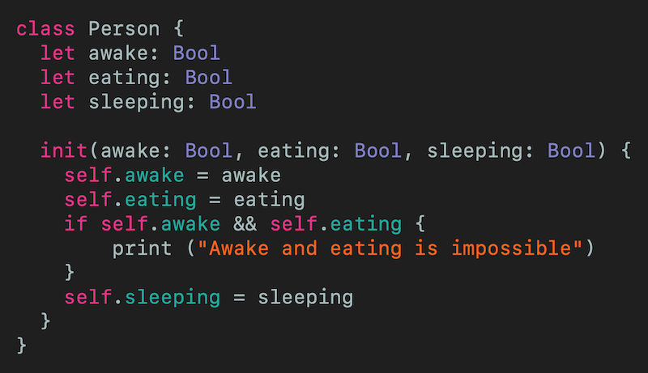
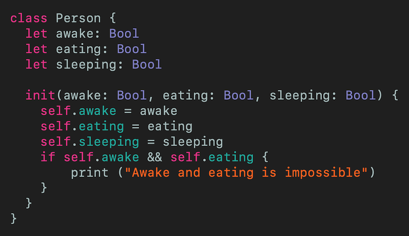
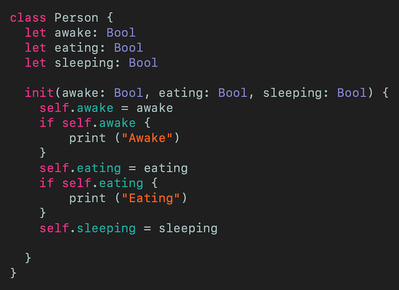
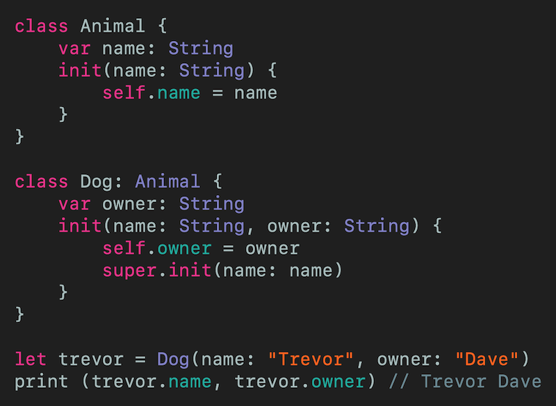

# Two-Phase Initialization in Swift
## One then another

 
Photo by Vincent van Zalinge on Unsplash

I've previously written about [Swift initializers](https://medium.com/@stevenpcurtis.sc/swift-initializers-fc12908a9106), however I didn't EVEN MENTION Two-Phase Initilization. 

Time to put that right!

Difficulty: Beginner | Easy | **Normal** | Challenging 
This article has been developed using Xcode 11.5, and Swift 5.2.4

## Prerequisites: 
* You need to either be able to make a [Single View Application](https://medium.com/swlh/your-first-ios-application-using-xcode-9983cf6efb71) in Swift, or use a [Playground](https://medium.com/@stevenpcurtis.sc/coding-in-swift-playgrounds-1a5563efa089).

# What is Swift's Two-Phase Initialization
Swift has many safety features that allow us to have a great experience programming. 

So what has Swift done to ensure that properties are set before a `class` (or indeed a `struct`) is ready for use?

The answer is the aforementioned Two-Phase Initialization: Two-phase initialization prevents property values from being accessed before they are are initialized, and prevent the property values from being set to a different value by another initializer unexpectedly. 

## The safety checks
### Safety check 1
All properties introduced by it's class are initalized before it delegates up to a superclass initializer.

The memory for an object is only fully initialized once the initial state of each of it's store properties are known. To satisfy this rule, a designated initializer makes sure that it's own perperties are intialized *before* it hands back up the chain.

### Safety check 2
A designated initilizer must delegate up to the superclass initializer before assigning a value to an inherited property. The alternative is to assign the new value to overwite the superclass as part of it's own initialization.

### Safety check 3
Convenience initializers delegate up to a superclass initializer before assigning a value to an inherited property. The alternative is to assign the new value from a convenience initializer  by the class's own designated initializer.

### Safety check 4
An initializer can't call any instant methods, read the value of any instance properties or return to self until the first phase of initialization is complete.

## A derived class
Each initilizer must initialize all of it's properties, then call it's superclass in order to do the same. 

## The phases
### Phase 1
* When a designated or convenience initializer is called on a class memory for the instance is allocated, but not initialized
* Designated initializers confirm that stored properties introduced by that class have a value, meaning that the memory for the stored values is initialized
* The designated initializer hands off to the superclass initializer to recursively initialize the properties for it's own stored properties - and this is continued until the top of the chain is reached
* At the top of the chain, the stored properties have a value. Your instance has initialized memory, and phase 1 is complete

### Phase 2
* Working from the top of the chain, each designated initializer in the chain can customize the instance further. That is, initializers can access `self` and can modify properties using `self` to do so an call instance methods.
* Convenience initializers in the chain can customize the instance and work with `self`

# Examples

## The difference between Phase 1 and Phase 2
Let us look at the following example. 
 

When you call `Witch()` the first section of the initializer calls `super.init()`, which initializes the superclass (`Mage`). Since the `Witch()`  properties are initialized  at the super call (as represented by `spellPower = 4`). 

Once that is complete, phase 2 can kick off. After the `super.init()` call additional customizations can be performced, represented by `physicalPower = 2` and `charm = 3`

NOTE: The properties are [optionals]( https://medium.com/@stevenpcurtis.sc/simply-optionals-in-swift-or-not-ee63c3999e16) and *The derived object* example covers the example where they are not, later in this article

## To perform calculations you need to initialize all properties first

The following will *not* compile with the following error message:

`'self' captured by a closure before all members were initialized`

 

and of course if we initiaize all of the members first we have no such problem:

 

If you don't use the `&&` operation, and take care not to try to use a property before it is initialized then you also have no such issues

 

## The derived object
The subclass here (`Dog`) is known to inherit from it's superclass (`Animal`) before the object is created. If any methods were overriden, the superclass will use the overriden methods which can use the subclass's member variables. 

Since all subclass variables must be initialized before superclass method the correct order is 

`self.owner = owner
super.init(name: name)`

In Swift, when you create a Derived object, it is a Derived object from the start. If methods are overridden, then the Base init method will already use the overridden methods, which might access Derived member variables. Therefore all Derived member variables must be initialised before the Base init method is called.
 

# Conclusion
Two Phase initialization is one of those concepts in Swift that is ideal to learn as it will help the speed of writing great software, while at the same time will help stop you relying on the compiler for these things.

Wouldn't that be great?

If you've any questions, comments or suggestions please hit me up on [Twitter](https://twitter.com/stevenpcurtis) 
