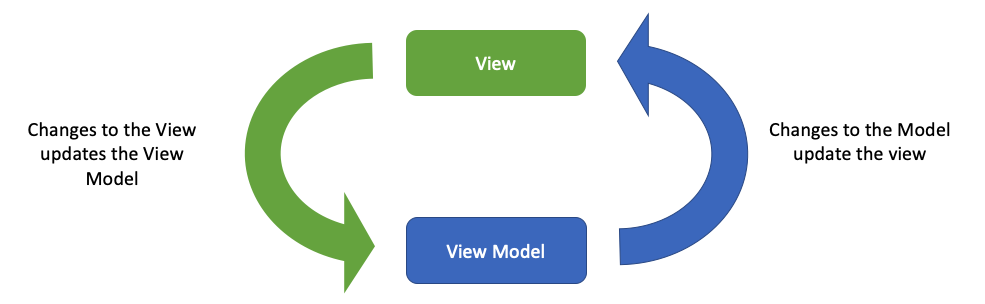

# Two-Way Binding in Vanilla Swift
## Don't use third parties


<sub>Photo by Matthew Henry</sub>

Difficulty: Beginner | Easy | **Normal** | Challenging<br/>
This article has been developed using Xcode 12.1, and Swift 5.3, and certain features (\String.self keypath) require Swift 5+

## Prerequisites:
* You will be expected to be aware how to make a [Single View Application](https://medium.com/swlh/your-first-ios-application-using-xcode-9983cf6efb71) in Swift.
* I have taken a programmatic approach to the interface, although this is unlikely to trip you up ([the guide is here](https://medium.com/@stevenpcurtis.sc/avoid-storyboards-in-your-apps-8e726df43d2e))
* [Keypaths](https://medium.com/@stevenpcurtis.sc/what-are-swifts-keypaths-e8c829bc97d3) are a major factor in the ultimate solution in this article
* If you'd like to take a look at the theory of the [Mediator Pattern](https://stevenpcurtis.medium.com/the-mediator-design-pattern-in-swift-66bc06137ade) that might give you a hand
* There is some mention of [optionals](https://medium.com/@stevenpcurtis.sc/simply-optionals-in-swift-or-not-ee63c3999e16)
* We have some [Generics in Swift](https://medium.com/better-programming/generics-in-swift-aa111f1c549)
* You would also need some knowledge about [extensions](https://medium.com/@stevenpcurtis.sc/extensions-in-swift-68cfb635688e) and [protocols](https://medium.com/@stevenpcurtis.sc/protocols-in-swift-f46c31283b18)

MVVM is a fantastic Architecture pattern for iOS. However, if you do not implement the two-way binding you are likely to end up with the subtly different MVP architecture.

The answer? Use two-way bindings. One way to do this is to add RxSwift or other dependencies into  your code. Don't want to add those third-party libraries? Read on to find out how to avoid bloating your code for these bindings. 

## Terminology
Binding: A technique that binds data sources from the provider and consumer together and synchronizes them
MVVM: An architecture pattern consisiting of Model, View and View-Model
Observable: An emitter of notifications of a change
Observer: An object that wishes to be notified when the state of another object changes.
Subscribe: An observer lets a subject know that it wants to be informed of changes through a process called subscribing
Subscriber: A term meaning Observer
Type: A representation of the tyoe of data that can be processed, for example Integer or String

## Loose couping
The open-closed principle says that implementation should hide behind an interface - that is; loose coupling.


## Two-way binding
Two-way binding means that we can connect the View to the View Model. The idea is that the View and the View Model are held in sync.



Since the View Model mediates in between the view and the model it no only updates the view, but updates it. That is, two-way (bi-directional) binding, in the style of [The Mediator Pattern](https://stevenpcurtis.medium.com/the-mediator-design-pattern-in-swift-66bc06137ade). 

Observables are at the heart of reactive programming (although they do not cover the entire range of reactive programming as the principes at work go beyond just this. Effectively this functionality is inbuilt in [RxSwift](https://medium.com/swlh/using-mvvm-with-rxswift-baa38325b750) however our own implementation can avoid needing to import that rather large third-party library!

## The project
I'm going to create a rather dull project that has three `UITextField` components on it, each of which will implement two-way binding in slightly different ways. This finished project looks just like the following image:

 - 2020-11-11 at 09.37.29.png)

Now of course since these are `UITextField` components you can [download the repo](https://github.com/stevencurtis/SwiftCoding/tree/master/TwoWayBinding), take a look and change what they say!

Now this particular project does not use [storyboards](https://medium.com/@stevenpcurtis.sc/avoid-storyboards-in-your-apps-8e726df43d2e) as I have opted for a programmatic approach

## The first UITextField Observing a String, AKA one-way binding fixed to be two-way
The `UITextField` called `firstTF` is connected to a `String` in the `ViewModel`, but in this case we aren't going to use a simple `String` - this is going to be an Observable - that is, a **type** that can be observed, and I've constructed this as a class.

```swift
var firstName: Observable<String> = Observable("First")
```

We can then observe any changes that are made from the `ViewModel`

```swift
viewModel.firstName.observe(on: firstTF, completion: {val in
    self.firstTF.text = val
})
```

Now we need to keep the original value in the `ViewModel` synchronised. To do so we can set the delegate of the text field, and update the value in the view model. 

```swift
extension ViewController: UITextFieldDelegate {
    func textField(_ textField: UITextField, shouldChangeCharactersIn range: NSRange, replacementString string: String) -> Bool {
        if textField == firstTF {
             viewModel.firstName.value = textField.text! + string
        }
        return true
    }
}
```

So that `Observable` class looks like the following:

```swift
public class Observable<ObservedType> {
    struct Observer<ObservedType> {
        weak var observer: AnyObject?
        let completion: (ObservedType) -> Void
    }
    
    private var observers: [Observer<ObservedType>]
    
    public var value: ObservedType? {
        didSet {
            if let _ = value {
                notifyObservers()
            }
        }
    }
    
    public init(_ value: ObservedType? = nil) {
        self.value = value
        observers = []
    }
    
    public func observe(on observer: AnyObject, observerBlock: @escaping (ObservedType) -> Void) {
        observers.append(Observer(observer: observer, completion: observerBlock))
        if let value = value {
            observerBlock(value)
        }
    }
    
    public func remove(observer: AnyObject) {
        observers = observers.filter { $0.observer !== observer }
    }
    
    private func notifyObservers() {
        for observer in observers {
            if let value = value {
                DispatchQueue.main.async { observer.completion(value) }
            }
        }
    }
}
``` 

essentially we take an optional `value` (so this works with [optional type](https://medium.com/@stevenpcurtis.sc/simply-optionals-in-swift-or-not-ee63c3999e16)). Essentially we assign the value during initialization, and when we observe the value the observer is added to an array of observers, and initially (and when the value is changed) the completion handler is called.

In the code in the [repo](https://github.com/stevencurtis/SwiftCoding/tree/master/TwoWayBinding) you'll see that I've used a delay with `DispatchQueue.main.asyncAfter` - something I would not do in production code. No, a better way of testing code is to use testing:

```swift
func testObservableStringChanges() {
    let expectation = XCTestExpectation(description: #function)
    let text = Observable("tests")
    let test = TestClass()
    var results: [String] = []
    text.observe(on: test, completion: {result in
        let res = result
        results.append(res)
        if results.count == 2 {
            XCTAssertEqual(results, ["tests", "changed"])
            expectation.fulfill()
        }
    })
    text.value = "changed"
    wait(for: [expectation], timeout: 3.0)
}
```

I did use [DispatchGroups](https://medium.com/@stevenpcurtis.sc/dispatchgroups-to-group-api-calls-in-swift-7906b2203854) in the full tests in the [Repo](https://github.com/stevencurtis/SwiftCoding/tree/master/TwoWayBinding) so please do try to take a look there if you want the full details!

One difficulty with this approach is that when we type a change in the `firstTF` text field the `UITextField` will be updated twice (so there would be a performance penalty for using this approach, which (to be honest) is not two-way binding at all as we have to perform extra work in the delegate function of `UITextField`.

We therefore need to find a better approach!

## The second UITextField
The `secondTF` uses a bind function (which is actually a two-way binding) as:

```swift
secondTF.bind(with: viewModel.secondName)
```

which once again connects to an `Observable`:
```swift
var secondName: Observable<String> = Observable("Second")
```

Now `Bindable` itself is a protocol

```swift
public protocol Bindable {
    associatedtype BindingType: Equatable
    func bind(with observable: Observable<BindingType>)
}
```

which any specific `UIControl` conforms to - in this case we are using `UITextField` as an example. This uses the `Observable` class as defined in the previous section of this article, and leverages a `UITextFieldDelegate` within an extension.

Here is the protocol, and the extension:

```swift
public protocol Bindable {
    associatedtype BindingType: Equatable
    func bind(with observable: Observable<BindingType>)
}

extension UITextField: Bindable, UITextFieldDelegate {
    public typealias BindingType = String
    private struct BinderHolder {
        static var _binder: Observable<BindingType>?
    }

    var binder: Observable<BindingType>? {
        get {
            return BinderHolder._binder
        }
        set(newValue) {
            BinderHolder._binder = newValue
        }
    }
    
    public func bind(with observable: Observable<BindingType>) {
        self.delegate = self
        binder = observable
        observable.observe(on: self, completion: { newText in
            // update text
            if self.text != newText {
                self.text = newText
            }
        })
    }

    public func textFieldDidChangeSelection(_ textField: UITextField) {
        binder?.value = (textField.text ?? "")
    }
}    
```

Now this can be improved by using the improved version of [Stored Properties in this article](https://github.com/stevencurtis/SwiftCoding/tree/master/StoredProperties), but this implementation does indeed work:

**so...**
So we have avoided having the delegate of the `UITextField` in the `UIViewController`, but that comes at a real cost - what if we want to use any of these delegate functions in our own code? Well, certainly we could use ['NSNotificationCenter']("https://medium.com/@stevenpcurtis.sc/using-nsnotificationcenter-in-swift-8e3d4a8a3f8a") but even if we went down that road, there would be another problem.

We'd have to write this extension for each and every control that would be used. This would be, quite clearly, awful. There has to be a better way.

In steps the third example.

## The third example
We can use [keypaths](https://medium.com/@stevenpcurtis.sc/what-are-swifts-keypaths-e8c829bc97d3) to make a `MakeBindable` type that we will use in place of the `Observable` type we used before 

```swift
var thirdName: MakeBindable<String> = MakeBindable("Third")
```

which is then bound using the following:

```swift
viewModel.thirdName.bind(\String.self, to: thirdTF, \.text)
```

So `MakeBindable` is a class, where we can optionally add an initial value

```swift
class MakeBindable<BindingType> {
    private var observers = [(BindingType) -> ()]()
    private var lastValue: BindingType?
    init(_ value: BindingType? = nil) {
        lastValue = value
    }
}
```

with functions that use [generics](https://medium.com/better-programming/generics-in-swift-aa111f1c549) to bind `AnyObject` to specific [keypaths](https://medium.com/@stevenpcurtis.sc/what-are-swifts-keypaths-e8c829bc97d3).

The initializer optionally creates the inititial value (which, as it can change is called `previousValue` which would represent the previous value in a stream of values.

```swift 
private var previousValue: BindingType?
init(_ value: BindingType? = nil) {
    previousValue = value
}
```

the bind function ais the entry point to add the observer, using the [keypath](https://medium.com/@stevenpcurtis.sc/what-are-swifts-keypaths-e8c829bc97d3) as chosen

```swift
    func bind<O: AnyObject, T>(
        _ sourceKeyPath: KeyPath<BindingType, T>,
        to anyObject: O,
        _ objectKeyPath: ReferenceWritableKeyPath<O, T?>
    ) {
        addObserver(for: anyObject) { object, observed in
            let value = observed[keyPath: sourceKeyPath]
            anyObject[keyPath: objectKeyPath] = value
        }
    }
```

which itself calls the following private function:

```swift
private func addObserver<T: AnyObject>(
    for object: T,
    completion: @escaping (T, BindingType) -> Void
) {
    // if there is a lastValue (which is commonly the initial value)
    // run the completion handler on that value
    lastValue.map { completion(object, $0) }
    observers.append { [weak object] value in
        guard let object = object else {
            return
        }
        completion(object, value)
    }
}
```

which of course, when updated will call each of these observers

```swift
func update(with value: BindingType) {
    lastValue = value
    // call each of the functions
    observers.forEach{ $0(value)}
}
```

**Further testing**
This all sounds great until we look into the detail. More testing is required!

```swift
func testTFChange() {
    let text = MakeBindable("tests")
    let testTF = TestTF()
    text.bind(\String.self, to: testTF, \.text)
    testTF.text = "test"
    testTF.sendActions(for: .editingChanged)
    XCTAssertEqual(text.currentValue(), "test")
}
```

We have implemented *better* one-way binding, but haven't yet implemented two-way binding! Curses! 

## Improving the `MakeBindable` class
We will need a function to show us the current value

```swift
func currentValue() -> BindingType? {
    return previousValue
}
```

now when the binding type is a `UIControl` I would like to update the value, using a function something like:

```swift
@objc func valueChanged( sender: UIControl) {
    if let newValue = sender[keyPath: keyPath!] as? BindingType {
        previousValue = newValue
        observers.forEach{$0(newValue)}
    }
}
```

Where we run the new value to each of the observers, and update our `previousValue`.

In itself this function is created when we bind the values, here is the updated bind function:

```swift
    func bind<O: AnyObject, T>(
        _ sourceKeyPath: KeyPath<BindingType, T>,
        to anyObject: O,
        _ objectKeyPath: ReferenceWritableKeyPath<O, T?>
    ) {
        if let control = anyObject as? UIControl {
            control.addTarget(self, action: #selector(valueChanged), for: [.editingChanged, .valueChanged])
            keyPath = objectKeyPath
        }
        
        addObserver(for: anyObject) { object, observed in
            let value = observed[keyPath: sourceKeyPath]
            anyObject[keyPath: objectKeyPath] = value
        }
    }
```

which of  course relies upon the Keypath property
```swift
var keyPath: AnyKeyPath?
```

Which we can then use, for example we can bind a `UILabel` to a property called `value`:

```swift
var value: MakeBindable<String> = MakeBindable("Test Value")
lazy var label: UILabel = {
    let lab = UILabel()
    return lab
}()

value.bind(\String.self, to: lab, \.text)
```

This all seems nice and fine. However, we might want to bind different values. To do so we would need to have some sort of mapping functions:

```swift
enum Mappers {
    static var transformBoolToStringFunction: (Bool) -> String = String.init(_:)
    static var transformFloatToStringFunction: (Float) -> String = String.init(_:)
    static var transformIntToStringFunction: (Int) -> String = String.init(_:)
}
```

which can then be implemented with the following binding function that functions in a similar way as has been explained above 

```swift
    func bind<O: AnyObject, T, R>(
        _ sourceKeyPath: KeyPath<BindingType, T>,
        to anyObject: O,
        _ objectKeyPath: ReferenceWritableKeyPath<O, R?>,
        mapper: @escaping (T) -> R?
    ) {
        
        if let control = anyObject as? UIControl {
            control.addTarget(self, action: #selector(valueChanged), for: [.editingChanged, .valueChanged])
            keyPath = objectKeyPath
        }
        
        addObserver(for: anyObject) { object, observed in
            let value = observed[keyPath: sourceKeyPath]
            let mapped = mapper(value)
            object[keyPath: objectKeyPath] = mapped
        }
    }
```

Which can then be used (for example to bind a boolean to a label:


```swift
var switchValue: MakeBindable<Bool> = MakeBindable(true)
viewModel.switchValue.bind(
    \Bool.self,
    to: switchLabel,
    \.text,
    mapper: Mappers.transformBoolToStringFunction)
```

**Finish up**
The code in the view controller can be simpilfied with the implementation of two-way binding. Therefore the testing code I have added in the [repo](https://github.com/stevencurtis/SwiftCoding/tree/master/TwoWayBinding) may be of interest, especially since I've added the subclassed `UITextField` here:

```swift
class TestTF: UITextField {
    var closure: ((String) -> ())?
    override var text: String? {
         didSet {
            if let closure = closure {
                closure(text!)
            }
         }
     }
}

func testMakeBinding() {
    let expectation = XCTestExpectation(description: #function)
    let text = MakeBindable("tests")
    let testTF = TestTF()
    var results: [String] = []

    testTF.closure = {str in
        results.append(str)
        if results.count == 2 {
            XCTAssertEqual(results, ["tests", "test"])
            expectation.fulfill()
        }
    }
    text.bind(\String.self, to: testTF, \.text)

    text.update(with: "test")
    wait(for: [expectation], timeout: 3.0)
}
```

Now remember: This `MakeBindable` class can be used for any controls. Wonderful!

# Conclusion
Two-way binding without using `RxSwift` or similar? That's interesting as we can see how the functions should work, and we can even have a great new use for `KeyPaths`.

Keeping our Apps small and efficient? That is certainly something that we should be doing as we create better and better Apps. Take a look at the [repo](https://github.com/stevencurtis/SwiftCoding/tree/master/TwoWayBinding), and in particular the second `UIViewController` that has examples of a series of controls. I hope this helps you out!

This article even contains testing so you can be sure that this deal with your `⌘U` to your hearts content. I hope you have enjoyed this article.

Isn't that nice? It sure is!

If you've any questions, comments or suggestions please hit me up on [Twitter](https://twitter.com/stevenpcurtis) 