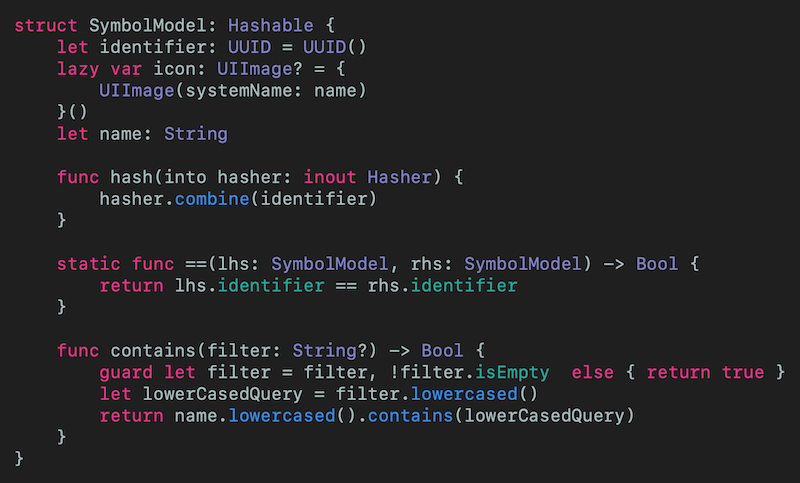
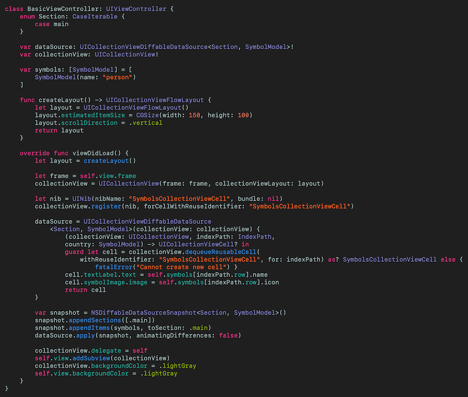
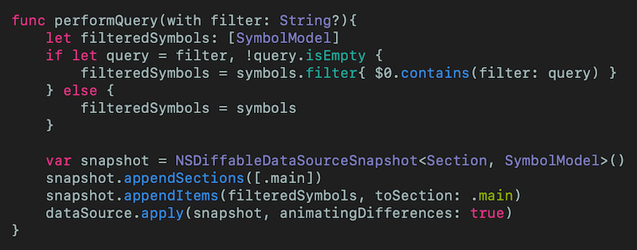
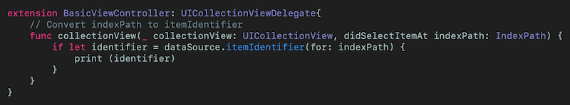

# Using UICollectionView and UICollectionViewDiffableDataSource
## Has that changed?

<br/>
<sub>Photo by Jesse Roberts on Unsplash<sub>

Difficulty: Beginner | Easy | **Normal** | Challenging<br/>
This article has been developed using Xcode 11.5, and Swift 5.2.4

## Prerequisites: 
* You will be expected to be aware how to make a [Single View Application](https://medium.com/swlh/your-first-ios-application-using-xcode-9983cf6efb71) in Swift.
* UICollectionViewDiffableDataSource is reliant on [Hashable](https://medium.com/@stevenpcurtis.sc/swifts-hashable-fd57e6cd6426) so some knowledge of that would be useful
* [Enums](https://medium.com/swlh/listing-enum-cases-using-caseiterable-in-swift-c68f29d6cf40) are used, and it is assumed that you recognize that they are hashable

## Terminology:
UICollectionViewCell: The on-screen cell for the UICollectionView type
UICollectionView: An object that manages an ordered collection of data items and presents them using customizable layouts

# Diffable Data Source
The diffable data source will compare two snapshots and see if there have been any changes. This is possible by performing a `==` operation between the old and new values (`Hashable` which ). 

In order to do so, the diffable data source uses an item hash to identify an item uniquely. 

# Why?
* Data source and UI state should agree - but there is no single source of truth.

* `NSInternalInconsistencyException` are annoying things - you need to make sure you understand the sections that are removed and added (and avoid hitting `reloaddata()` because that works without animations ). 

In steps UICollectionViewDiffableDataSource that provides a declarative approach to UI States

## With...?
`apply()` - Automatic diffing. This means it knows about the current state and a potential new state
`snapshots` - The source of truth for the UI state, replacing index paths with identifiers
`UICollectionViewDiffableDataSource` - The data source class
`NSDiffableDataSourceSnapshot` - The snapshot class

# The implementation
## A SymbolsCollectionViewCell
The `xib` file has a `UIView` pinned to the safe area, and an inner `UILabel` which is pinned to that `UIView`. An outlet is set from from the `xib` to the `swift` file.

Phew!

### Snapshot
This is a generic class  that is parameterized by the section identifier and 

For a single section we can create an `enum`, and since enums are `hashable`. Such an `enum` is shown in the following code:

`enum Section: CaseIterable {
    case main
}`

A snapshot can either be created as an empty snapshot:
`let snapshot = NSDiffableDataSourceSnapshot<Section, UUID>()`
or a copy of the current snapshot in the dataSource
`let snapshot = dataSource.snapshot()`

### The model
The model here is `Hashable` to prevent needing to pass an identifier - meaning that the `struct` is uniquely identified by the hash value - the `UUID()` gives a uniquely identified instance of `SymbolModel`

<br>
<sub>[Click for Gist](https://gist.github.com/stevencurtis/2fd874cc5f2be30ca079bc0b8b8ae570)<sub>

You can also see how equality has been defined (the func `==`), and how contains will return true if there is a match of the Strings in the name and the search (for where the implementation moves onto a search).

### The CollectionView - displaying content
There are a few parts to this. 

The data source is set up
`var dataSource: UICollectionViewDiffableDataSource<Section, SymbolModel>!`
and we have a nice `createLayout()` function that creates a `UICollectionViewFlowLayout()`.

Now when we set up the `dataSource`  we use `collectionView.dequeueReusableCell` and can populate the cell. 

We set up the snapshot initially. We don't have to animate the difference as this is an initial
```swift
var snapshot = NSDiffableDataSourceSnapshot<Section, SymbolModel>()
snapshot.appendSections([.main])
snapshot.appendItems(symbols, toSection: .main)
dataSource.apply(snapshot, animatingDifferences: false)
```

Nice! All the details are here:

<br>
<sub>[Click for Gist](https://gist.github.com/stevencurtis/c88ffb09053725c2f2ccfaae647f8961)<sub>

### The CollectionView - searching content
Within the code in the [repo](https://github.com/stevencurtis/SwiftCoding/tree/master/UICollectionViewDiffableDataSourceExample) the vital part is *performQuery* that creates a new snapshot based on the previous one (and we can see `performQuery` which is reproduced here).

<br>
<sub>[Click for Gist](https://gist.github.com/stevencurtis/a0f4dd1c048ae9271bd4c9d83e2cfff1)<sub>


### Implementing selecting a cell (for any implementation)
The viewcontroller relevant will need to conform to `UICollectionViewDelegate`, and I've placed this is an `Extension` to try and keep the code nice and organised. 

<br>
<sub>[Click for Gist](https://gist.github.com/stevencurtis/754d2900be8b5f24ceb4b02c7c752c70)<sub>

# There's more?
## Configure snapshots

You can further configure snapshots by using the following:

`func insertItems(_ identifiers: [ItemIdentifierType],
beforeItem beforeIdentifier: ItemIdentifierType)`

`func moveItem(_ identifier: ItemIdentifierType,
afterItem toIdentifier: ItemIdentifierType)`

`func appendItems(_ identifiers: [ItemIdentifierType],
toSection sectionIdentifier: SectionIdentifierType? = nil)`

`func appendSections(_ identifiers: [SectionIdentifierType])`

Oh, if you call `appendItems` you need to make sure that you always call this on the same queue. Just putting it out there!

# Conclusion
The approach taken is from `WWDC 2019` and there is a video for this on the Apple Developer website. Happy coding!

The code from this is included in the attached [Repo](https://github.com/stevencurtis/SwiftCoding/tree/master/AlamofireNetworking). 

If you've any questions, comments or suggestions please hit me up on [Twitter](https://twitter.com/stevenpcurtis) 
