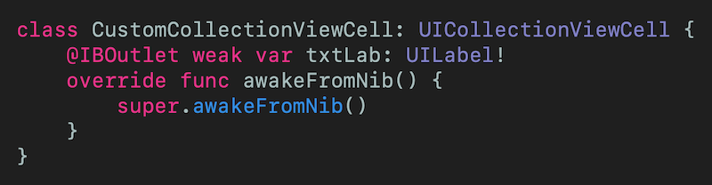
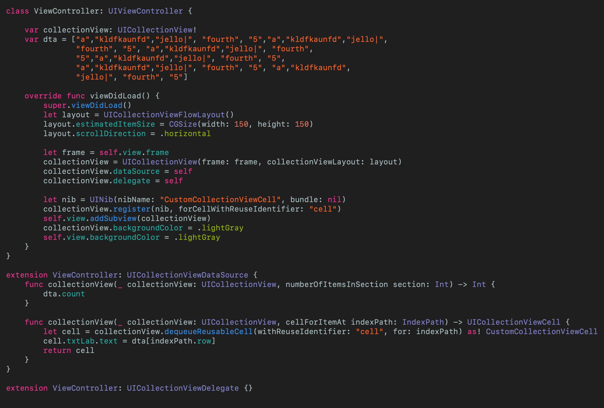
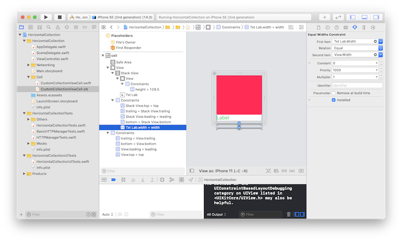
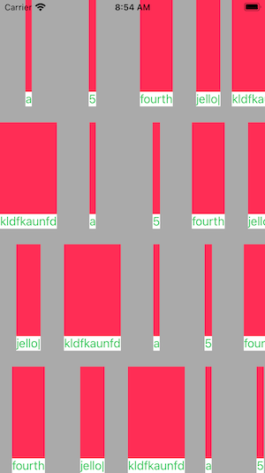

# Create a Horizontally Scrolling UICollectionView
## Left-to-right

 
Photo by Mylon Ollila on Unsplash

Difficulty: Beginner | **Easy** | Normal | Challenging 
This article has been developed using Xcode 11.4.1, and Swift 5.2.2

## Prerequisites: 
* You will be expected to be aware how to make a [Single View Application](https://medium.com/swlh/your-first-ios-application-using-xcode-9983cf6efb71) in Swift
* The solution to this article is [Auto Layout](https://medium.com/@stevenpcurtis.sc/the-auto-layout-cheat-sheet-ee05dfd34d49) based, so some knowledge of that would be useful

## Terminology:
UICollectionViewCell: The on-screen cell for the UICollectionView type
UICollectionView: An object that manages an ordered collection of data items and presents them using customizable layouts

# The project
There are a set of `UICollectionViewCell` objects that can be used horizontally 
[sim.png](Images/sim.png)

But here in this article we want to do more than this - we want the cells to be sized to their content (which will be the text label).

## The cell
The `UICollectionViewCell`  here is a particularly simple cell instance.
[cell.png](Images/cell.png)
This is actually a `xib` file so we need to ensure that this is instantiated correctly in the `UICollectionView` class. 

The Swift file `CustomCollectionViewCell.swift` is the most basic possible - simply the `UILabel` is connected to the `xib` file through the outlet.

 
[Click for Gist](https://gist.github.com/stevencurtis/5370e55ae22bcbbb6d53bd91a9da1840)

Now we will talk about how we have set this up before thinking about the *solution* for making this fit to the size of the content.

## The view controller
This view controller sets up the `UICollectionView` with a `UICollectionViewFlowLayout()`, and it is here that the `scrollDirection` is set to be `horizontal`.

Perhaps the only other interesting part of this is the way I have registered the nib (`let nib ...`) and then later `dequeueReusableCell` with the same cell for the identifier `"cell"`.

Please do forgive the `dta` being a load of junk Strings. Just accept it.

Here is the code:

 
[Click for Gist](https://gist.github.com/stevencurtis/56b3bc858e66024a0e247cd9576f9eb7)

## The magic sauce
**Estimated size**
The `UICollectionViewFlowLayout` will be declared as layout and then we feed it an estimated size with `estimatedItemSize`.

`layout.estimatedItemSize = CGSize(width: 150, height: 150)`

**Auto Layout**
The following *could* be done in code rather than in Interface Builder, but here is shown as Auto Layout constraints. 

The *secret* for this? This isn't too tricky - this is making a constraint from the `UILabel` to the `UIView` - and it is this that makes the `UICollectionViewCell` the same width as the `UILabel`. 
 

This gives us the solution as follows - remember that this scrolls horizontally on a real device / a simulator
 

# Conclusion
Creating a horizontally-scrolling `UICollectionView` isn't that difficult - but `UICollectionViewDataSource` feels a little fragile. 

That makes it feel like there is a new article coming....

The code from this is included in the attached [Repo](https://github.com/stevencurtis/SwiftCoding/tree/master/AlamofireNetworking). 

If you've any questions, comments or suggestions please hit me up on [Twitter](https://twitter.com/stevenpcurtis) 
