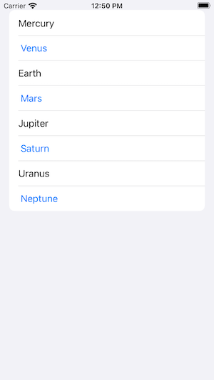
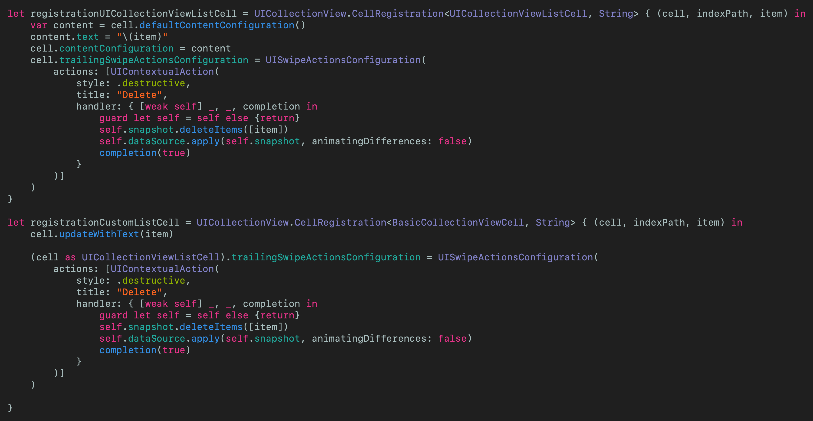
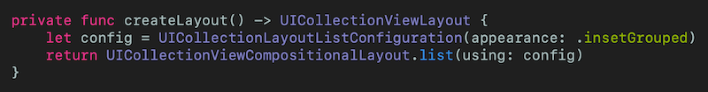
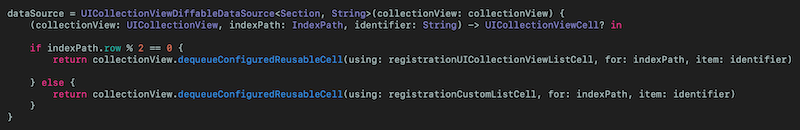

# Did Apple Kill UITableView?
## Build a solar system lists in UICollectionView

 
Photo by Marcus Löfvenberg on Unsplash

Difficulty: Beginner | Easy | **Normal** | Challenging 
This article has been developed using Xcode 12 (beta), and Swift 5.2.4

`UICollectionView` could never compete with a `UITableView` for ease of use, reordering and deletion. That's never going to change. Wait. What? `UICollectionViewCompositionalLayout`.list(using: config). Can you speak English?

## Prerequisites: 
* You will be expected to be aware how to make a [Single View Application](https://medium.com/swlh/your-first-ios-application-using-xcode-9983cf6efb71) in Swift.
* You will need to have installed the Xcode 12 (beta) if you are going to create or download the repo and run it - this uses features of iOS14!

## Terminology:
UICollectionView: An object that manages an ordered collection of data items and presents them using customizable layouts

# The goal of this article
This article will show a `UICollectionView` where we can treat this list as a `UITableView` - including removing items. We are going to use `UICollectionViewDiffableDataSource`, updating a `NSDiffableDataSourceSnapshot`, and remove data items when the user slides cells like in any nice App with a half-decent user interfaces.

If we can do all of that with a `UICollectionView` the question to be answered will be - Do we need to EVER use `UITableView` again?

## The Application
This application is going to display the plantes of the solar system. The data to be displayed is the following:

`var data = ["Mercury", "Venus", "Earth", "Mars", "Jupiter", "Saturn", "Uranus", "Neptune"]`

Which is going to be displayed on a rather traditional Table (that can be in either orientation)

 

This is going to be awe-some (sic)

### Configuring the collection view
At the class level, we have a dataSource and collectionView
`var dataSource: UICollectionViewDiffableDataSource<Section, String>!
var collectionView: UICollectionView!`

which is then setup in `viewDidLoad()`

 
[Click for Gist](https://gist.github.com/stevencurtis/c36e00b482c157711084899e97b44bf0)

### The layout
This function can be called from `viewDidLoad()` and allows us to create our list with an `.insetGrouped` appearance - and trust me this is the one we want!

 
[Click for Gist](https://gist.github.com/stevencurtis/629baba056d40edb476032aa81b42a48)

### The data source
The idea is to use every other cell as a standard `UICollectionViewListCell` and the other cells as a `BasicCollectionViewCell` . To make the datasource release the right cell at the right time, here is a rather simple peice of logic that does just that:

 
[Click for Gist](https://gist.github.com/stevencurtis/abbd614726e2200a03cd666032634f15)

which is then setup in `viewDidLoad() `with
`snapshot.appendSections([.main])
snapshot.appendItems(Array(data))
dataSource.apply(snapshot, animatingDifferences: false)`

### The cells
This example uses both a standard `UICollectionViewListCell` and a custom cell called `BasicCollectionViewCell` - to make it clear how we can use both a standard cell and a custom cell. There is nothing particularly special about my custom cell - but it is blue text in the cell to make it clear which one is which.

Now the idea is that every other cell is a `BasicCollectionViewCell`, and to do so we will need to register the cells.

To do so, we are going to use the new `cellRegistration` API:

 
[Click for Gist](https://gist.github.com/stevencurtis/c36e00b482c157711084899e97b44bf0)

The main part of the code here is using `defaultContentConfiguration` for the `UICollectionViewListCell` and my own `updateWithText(_ titleString: String)` function for the `BasicCollectionViewCell` that sets the `UILabel` to the `String` fed into the cell.

The `trailingSwipeActionsConfiguration` gives us a destructive "deletion" that is the swipe to delete functionality that we are looking for in this article. The custom part of this allows us to delete the item from the `snapshot`, and then apply the difference.

# Conclusion
For this article, the question is do we ever need to use `UITableView` again? You want the bad news? The APIs used here require iOS14 which means that you can't yet publish any App on the App store (since Xcode 12 is in beta). 

**You're going to have to wait, James** (If your name isn't James, you're going to have to wait anyway).

If you want more information about UICollectionView I'd recommend you watch [this](https://developer.apple.com/wwdc20/10097) WWDC video

The code from this is included in the attached [Repo](). 

If you've any questions, comments or suggestions please hit me up on [Twitter](https://twitter.com/stevenpcurtis) 
