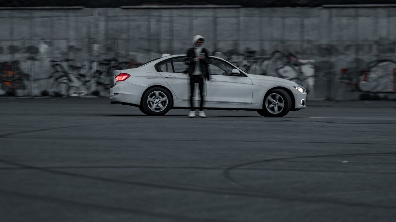

# A UIGestureRecognizer Tutorial
## Drag and drop


<sub>Photo by Eugene Chystiakov on Unsplash</sub>

The interaction between user and App is extremely important. This extends from the look and feel of the application right to the touch gestures that make the user's interactions delightful.

In order to make the application respond to these gestures you will need UIGestureRecognizer, and this tutorial should help you out in doing so.

# Before we start
Difficulty: Beginner | Easy | **Normal** | Challenging<br>
This article has been developed using Xcode 12.2, and Swift 5.3

## Prerequisites
* You will be expected to be aware how to make a [Single View Application in Swift](https://medium.com/swlh/your-first-ios-application-using-xcode-9983cf6efb71)

## Terminology
UIGestureRecogniser: The base class for gesture recognisers, which include tap and pinch recognisers

## The end result
This isn't going to be pretty. You're going to see some squares moving around an App according to whether the user drags, drops, pinches or rotates. Thomas Was Alone doesn't have anything on this stuff!

## The setup
The setup for this has been done directly in Playgrounds. In practice I've already written a [tutorial](https://medium.com/@stevenpcurtis.sc/use-gestures-even-in-swift-playgrounds-d7432adb0ae3) for this, but to get this working I used `import PlaygroundSupport` at the top of the playground and set the live view with `PlaygroundPage.current.liveView = MyViewController()`. I've written the gestures in `viewDidLoad()` and kept things tidy by using `loadView()` (there is a guide on this [HERE](https://medium.com/@stevenpcurtis.sc/write-clean-code-by-overriding-loadview-ac4f172163d0)). Don't worry though, this is really about the gestures and not the setup, and the full Playground is at the bottom of this article.

## The theory
The `UIGestureRecognizer` class help us detect common gestures like taps, pinches, swipes, pans, long presses and rotations. This avoids having to register touch notifications for each `UIView` and then use [`touchesBegan(_:with:)`](https://medium.com/r/?url=https%3A%2F%2Fdeveloper.apple.com%2Fdocumentation%2Fuikit%2Fuiresponder%2F1621142-touchesbegan) for that view. Let us avoid that kerfuffle and get started!

## A pan gesture
We set up the pan recogniser in `viewDidLoad()` with the following couple of lines to create the gesture recogniser .

The `UIPanGestureRecognizer `looks for the panning gesture

```swift
let pan = UIPanGestureRecognizer(target: self, action: #selector(handlePan(_:)))
clickableView.addGestureRecognizer(pan)
```

which calls the following method to handle the pan:

```swift
@objc func handlePan(_ sender: UIPanGestureRecognizer) {
    guard let targetView = sender.view else {return}
    let translation = sender.translation(in: view)
    targetView.center = CGPoint(x: targetView.center.x + translation.x
        ,y: targetView.center.y + translation.y)
    sender.setTranslation(CGPoint.zero, in: view)
}
```

The sender is passed to the method, and this has a view associated with the sender - which we can then make a translation (which is then set through `setTranslation:inView:`). Set translation makes sure that we are working in the correct coordinate system - if not the translation will not work correctly!

## Pinch
Option + Shift to pinch is the way to get those two circles on a view to enable to pinch gesture is the way to go there. It can be a little tricky in the Playground, but it does work in the end (if you cannot get it working then perhaps using the full simulator is the way to go).

The `UIPinchGestureRecognizer` looks for the pinch gesture
```swift
let pinch = UIPinchGestureRecognizer(target: self, action: #selector(handlePinch(_:)))
clickableView.addGestureRecognizer(pinch)
```

which calls for the following method to handle the pinch:

```swift
@objc func handlePinch(_ sender: UIPinchGestureRecognizer) {
    guard let gestureView = sender.view else {
      return
    }
	// implement the transformation, scaled by the space between fingers
    gestureView.transform = gestureView.transform.scaledBy(
      x: sender.scale,
      y: sender.scale
    )
    // set the scale to be 1
    sender.scale = 1
}
```

Wait, *what is scale*?
The distance between fingures on the screen is the scale factor. At the beginning of the gesture, the scale facto is 1.0, and as the distance between the fingers increases the scale factor also increases (or decreases if the distance decreases). When the gesture has finished, the scale factor is set back to 1 as the image is reset to be a standard image with a scale factor as 1 (after each change).

## A tap gesture
We might wish to register when the user taps an object on the screen. 

The `UITapGestureRecognizer` looks for the tap gesture
```swift
let tap = UITapGestureRecognizer(target: self, action: #selector(handleTap(_:)))
tap.numberOfTapsRequired = 1
clickableView.addGestureRecognizer(tap)
```

Which in this case will print a description of the gesture to the console

```swift
@objc func handleTap(_ sender: UITapGestureRecognizer) {
    guard let tappedView = sender.view else {
        return
    }
    print ("The \(tappedView.description) view has been tapped!")
}
```

To change this gesture to a double tap, simply change the number of taps required using the property `tap.numberOfTapsRequired` to 2 (or of course whatever integer representing the number of taps is required).

## A long-press gesture
We might wish to register when the user taps an object on the screen for a longer period than the simple tap gesture.

The `UILongPressGestureRecognizer` looks for the long press gesture
```swift
let longPress = UILongPressGestureRecognizer(target: self, action: #selector(handleLP(_:)))
longPress.minimumPressDuration = 0.5
clickableView.addGestureRecognizer(longPress)
``` 

Which in this case will print a description of the gesture to the console

```swift
@objc func handleLP(_ sender: UILongPressGestureRecognizer) {
    guard let pressedView = sender.view else {
        return
    }
    print ("The \(pressedView.description) view has been long pressed")
}
```

## A rotation gesture
We might wish to rotate our square when a user selects it with two fingers.
The `UIRotationGestureRecognizer` looks for this rotation:

```swift
let rotate = UIRotationGestureRecognizer(target: self, action: #selector(handleRotateGesture))
clickableView.addGestureRecognizer(rotate)
```

Which in this case will rotate the `UIView` subclass:
```swift
@objc func handleRotateGesture(_ sender: UIRotationGestureRecognizer) {
    guard sender.view != nil else { return }
         
    if sender.state == .began || sender.state == .changed {
        sender.view?.transform = sender.view!.transform.rotated(by: sender.rotation)
        sender.rotation = 0
    }
}
```

## A swipe
I'd say that it makes more sense to apply a swipe gesture to the whole `UIViewController` rather than an object.

The `UILongPressGestureRecognizer` looks for the long press gesture
```swift
let swipeLeft = UISwipeGestureRecognizer(target: self, action: #selector(handleSwipeGesture))
swipeLeft.direction = .left
self.view.addGestureRecognizer(swipeLeft)
```
Which in this case will print a description of the gesture to the console

```swift
@objc func handleSwipeGesture(_ sender: UISwipeGestureRecognizer) {
    guard let pressedView = sender.view else {
        return
    }
    print ("The \(pressedView.description) view has been long pressed")
}
```

If you decide to use a different direction choose a direction to feed to the property `swipeLeft.direction` (of course you might want to change the name of the gesture from swipeLeft too!

## Multiple views per gesture
Unfortunately this is not possible. Because every gesture can only be attached to one view this is unfortunately rather a fixed rule.

## Did you make sure the user can interact?
When you add a gesture to a `UIImageView` it is a common issue that `isUserInteractionEnabled` is set by default as false. So do this: Make sure `isUserInteractionEnabled` is set as true either in the Storyboard or though code.

## Conclusion
Pinches, taps and rotations are great ways for users to interact with iOS applications. Making your code a must for the disconcerting user.

The [Repo](https://github.com/stevencurtis/SwiftCoding/tree/master/UIGestureRecogniserTutorial) makes things rather easier to follow in this project, and I do recommend you download this project to walk through the gestures.

This article has walked through pan gestures, tap gestures, long-press gestures and swipe gestures. They are all similar, so I hope this article really has helped you out in developing your own applications.

If you've any questions, comments or suggestions please hit me up on [Twitter](https://twitter.com/stevenpcurtis) 