# The UINavigationController and UINavigationBar in Swift
## Improve your user experience

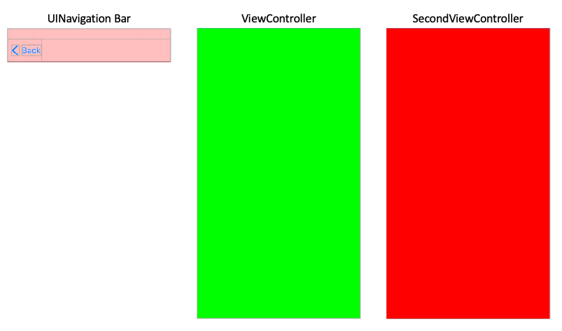
<sub>Diagram by Steven Curtis</sub>

Unusually for one of these articles I've presented two separate Projects within the [repo](https://github.com/stevencurtis/SwiftCoding/tree/master/UINavigationController)

Difficulty: **Beginner** | Easy | Normal | Challenging<br/>
This article has been developed using Xcode 12.1, and Swift 5.3

## Prerequisites:
* You will be expected to be aware how to make a [Single View Application](https://medium.com/swlh/your-first-ios-application-using-xcode-9983cf6efb71) in Swift
* One of the implementations assumes you can create a [UIViewController programmatically](https://medium.com/@stevenpcurtis.sc/write-clean-code-by-overriding-loadview-ac4f172163d0)
* The concepts described here are the same as those covered in [stacks](https://medium.com/swlh/stacks-in-computer-programming-a7defa317cea?source=friends_link&sk=adea0dc58c743b0ae1a1cc0182c100a2)

## Terminology
Stack: A data structure used to store objects
Storyboard: A way to graphically layout the UI in Xcode
UINavigationBar: A bar containing buttons for navigating within the hierarchy of screens
UINavigationController: A container that stores view controllers in a stack.

The image at the top of the article (repeated here for ease of reading)


Shows the app to which this article refers. However, that `UINavigationController` that would embed the `UIViewController` instances isn't shown. 

Perhaps the best way to express this is to show the storyboard solution from the practical below:
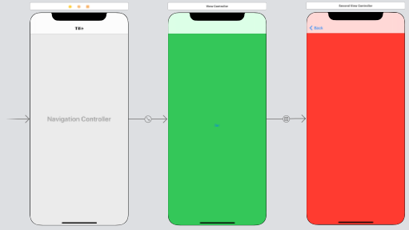

We can see that the `UINavigationController` comes first, that is the `UIViewController` instances are managed by it.

# The Theory
What is happening is that a `UINavigationController` instance manages the navigation stack that can have any number of `UIViewController` instances. So at the bottom of the stack there is a root view controller, and pushed on top of this are any number of child view controllers.

We can think of the topmost `UIViewController` instance as being the one that can be is viewable to the end use.

Each time we put a new topmost `UIViewController` onto the stack, we call that **push**, each time we remove one we do so by using a **pop**.

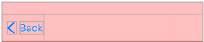

The `UINavigationBar` is featured at the top of the navigation stack, and can be adjusted (and even hidden from view), but is commonly in use to give the user a method of moving *back* through the stack of `UIViewController` instances.

# Create the Programmatic Version
There are going to be two files here - the ViewController.swift (which is what we get for free when creating a project), so perhaps copy and paste the following:

```swift
import UIKit
class ViewController: UIViewController {
    override func loadView() {
        let view = UIView()
        view.backgroundColor = .green
        self.view = view
    }

    override func viewDidLoad() {
        super.viewDidLoad()
        self.navigationController?.pushViewController(SecondViewController(), animated: true)
    }
}
```

We then need to create a new file - `SecondViewController.swift`, which can be produced by using the menu system in Xcode: `File>New>File..`
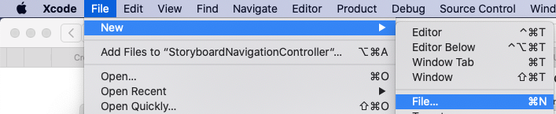
and then select Swift File as the template
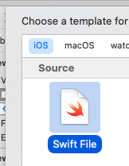

Of course call the file SecondViewController
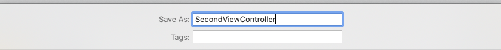

which will then be filled with the following contents:
```swift
import UIKit
class SecondViewController: UIViewController {
    override func loadView() {
        let view = UIView()
        view.backgroundColor = .red
        self.view = view
    }

    override func viewDidLoad() {
        super.viewDidLoad()
    }
}
```

Although this isn't really part of this tutorial (there is a full guide on this [here](https://medium.com/@stevenpcurtis.sc/write-clean-code-by-overriding-loadview-ac4f172163d0) but essentially you can select `Main.storyboard` in the project inspector:
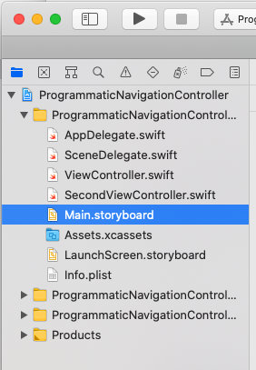

then pressing the delete key (on your keyboard!)

Then the reference must be removed, the easiest way is to select the top level project file in the project inspector (mine is called ProgrammaticConstraints).

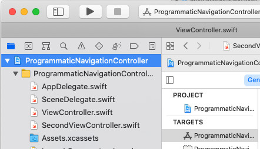

and then delete the **Main Interface** (which is usually set to *Main*) which can be deleted once again with the use of the delete key on the keyboard.

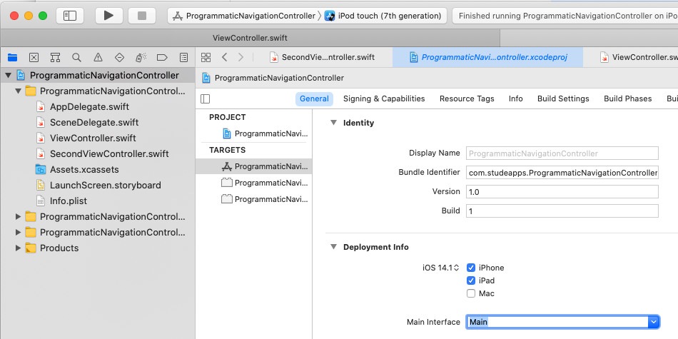

The third stage of this is deleting the reference in the .plist file.

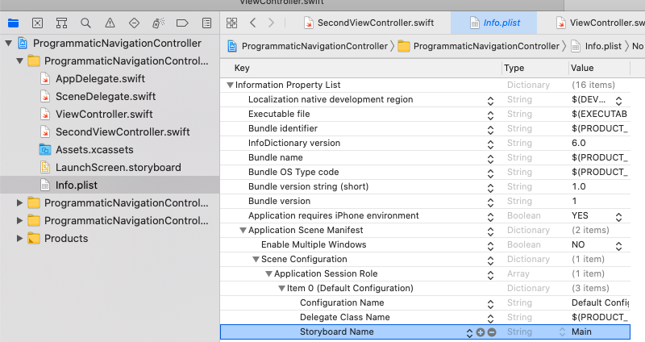

then we need to update the `SceneDelegate.swift` file to programmatically load the first `UIViewController` instance, so replace the `optional func scene(_ scene: UIScene, willConnectTo session: UISceneSession, options connectionOptions: UIScene.ConnectionOptions)` function with the following:

```swift
func scene(_ scene: UIScene, willConnectTo session: UISceneSession, options connectionOptions: UIScene.ConnectionOptions) {
    guard let windowScene = (scene as? UIWindowScene) else { return }

    window = UIWindow(frame: windowScene.coordinateSpace.bounds)
    window?.windowScene = windowScene
    
    self.window = UIWindow(windowScene: windowScene)

    let vc = ViewController()
    let rootNC = UINavigationController(rootViewController: vc)

    self.window?.rootViewController = rootNC
    self.window?.makeKeyAndVisible()
}
```

# Create the Storyboard Version
To embed the main ViewController `UIViewController` instance move to `Main.storyboard` on the left-hand side
project navigator and select the main view controller.

Through the menu system we can then select `Editor>Embed in>Navigation Controller` as in the following image"

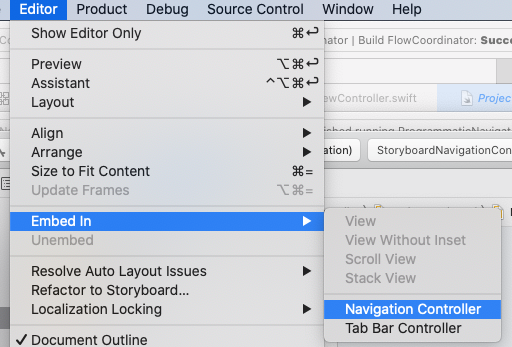

this then gives an updated Storyboard where the `UIViewController` instance `ViewController` is embedded in the `UINavigationController`

This results in the following:


We can then add a new `UIViewController` in the `UIStoryboard` by selecting the + icon in the top-right hand corner of the screen.

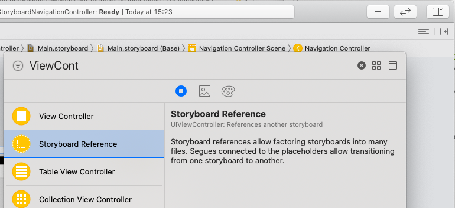

Then drag-drop the instance:
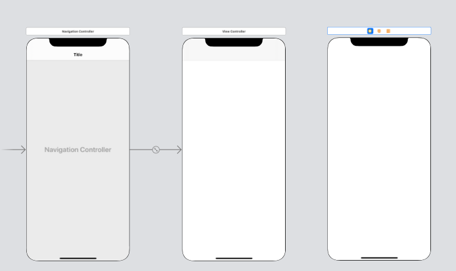

We then need to create a new file - `SecondViewController.swift`, which can be produced by performing `File>New>File..`

and then select Swift File as the template:


Of course call the file SecondViewController:


then fill in the contents with the following code:

```swift
import UIKit

class SecondViewController: UIViewController {
    override func viewDidLoad() {
        super.viewDidLoad()
    }
}
```

which then needs to be linked to the view controller on the storyboard. Go back to `Main.storyboard` and select the `UIViewController` to change the class to `SecondViewController` as in the following image:

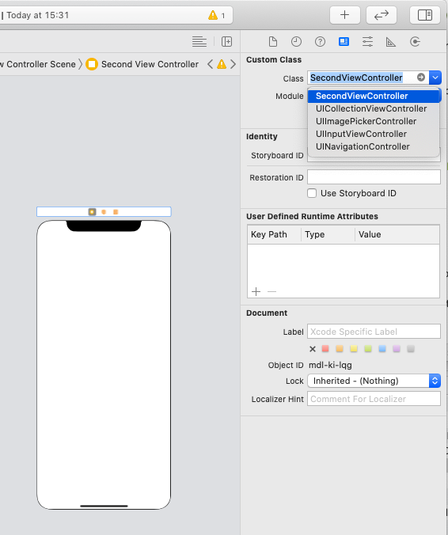

Then create a button in order to traverse to that second `UIViewController` instance.

In order to do so, we need to add a `UIButton` and drag it onto the view. So, with `Main.storyboard` selected, press + in the top-right hand corner. 
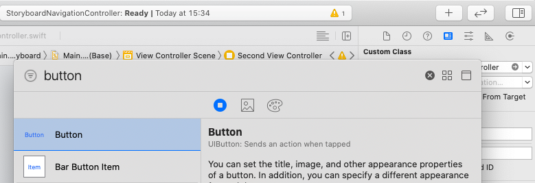

If you are careful, you can drag it to the middle of a `UIViewController` and get the blue guide lines to show it is in the middle of the page. A quick double-click on the `UIButton` instance can mean that we can change the name to Go!

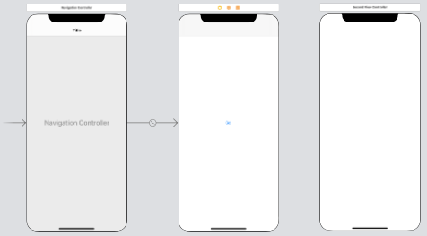

We can then control-click on the button towards the background and choose *Center Horizontally in Safe Area* then repeat the process for *Center Vertically in Safe Area*:
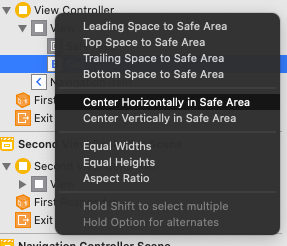

In order to traverse to the next `UIViewController` instance click on the button and press control and drag to the SecondViewController. Then we choose **show**:

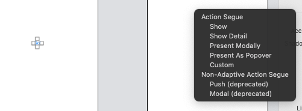

Which then gives the following solution:
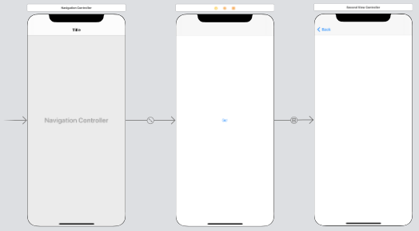

Then we need to change the background of ViewController to be green, and SecondViewController as red. The process for doing this is to select the relevant `UIViewController` instance and then the view within that, and for the ViewController choose green, and SecondViewController choose red.

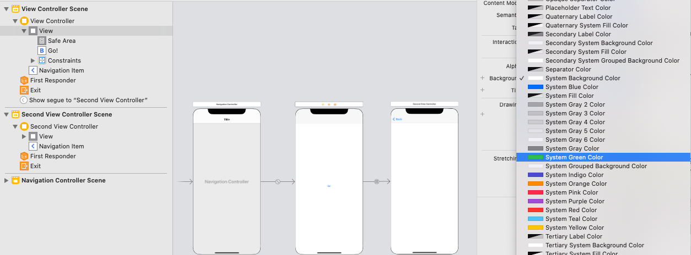

# Traverse Programmatically
##Push View Controller
We can move through the stack, and one small wrinkle is that the navigationController instance is an optional! This means that (in the same way as above we are putting to the stack"

```swift
let vc = SecondViewController()
self.navigationController?.pushViewController(vc, animated: true)
```

Animated is the nice sliding animation that moves across the screen: usually you would want that to be true.

##Pop View Controller
We can also pop the topmost view controller from the top of the stack, whih is usually the `UIViewController` instance that is visible to the user:

```swift
self.navigationController?.popViewController(animated: true)
```

##Dealing with the array
The navigation stack is actully an array! We can access that using the following:
```swift
var array = self.navigationContoller?.viewControllers
```

and we can treat this like an array, that is use any [array](https://medium.com/swlh/zero-indexed-arrays-f752a47abf65) functions

# Customize the UINavigationBar programatically
It is more than possible to change the tint color:
```swift
self.navigationController?.navigationBar.barTintColor = .orange
```

We can also set a background image (the PlaceholderImage is avaliable for you in the repo):

```swift
 navigationController?.navigationBar.setBackgroundImage(UIImage(named: "PlaceholderImage"), for: .default)
```

which shows the following effect:

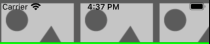

Of course you can set the title on the `UINavigationBar`, and even change the text:

```swift
self.navigationItem.title = "ViewController"
let textAttributes = [NSAttributedString.Key.foregroundColor: UIColor.red]
navigationController?.navigationBar.titleTextAttributes = textAttributes
```

There is also a titleView that can be useful for a company logo (or similar):
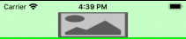

The back button can also be adjusted: take a look at this!

We can add button items:
```swift
let add = UIBarButtonItem(barButtonSystemItem: .action, target: self, action: #selector(addTapped))
let playButton = UIButton(type: .custom)
playButton.setImage(UIImage(named: "plus"), for: .normal)
playButton.addTarget(self, action: #selector(addTapped), for: .touchUpInside)
playButton.frame = CGRect(x: 0, y: 0, width: 10, height: 10)
navigationItem.rightBarButtonItems = [add]
```

of course this would require the addition of an `addTapped` function:

```swift
@objc func addTapped() { }
```
# Customize the UINavigationBar through the Storyboard
If we select the `UIStoryboard` it is possible to select the `UINavigationController`. Now there are several options you can select, as in the screenshot below:

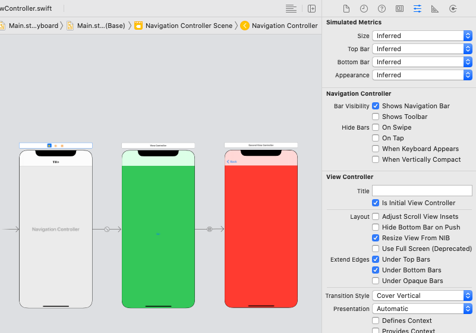

However if you are working in a larger group of developers you would be well advised to use a programmatic method to change more of the options, as within the `UIStoryboard` this can be difficult to track and use.


# Conclusion
I hope you have enjoyed following along in this tutorial. There are reams of Apple documents, both for the [UINavigationController](https://developer.apple.com/documentation/uikit/uinavigationcontroller) as well as the [UINavigationBar](https://developer.apple.com/documentation/uikit/uinavigationbar).

As with anything in iOS it can be tricky to get the exact effect you want, but it is certainly possible and I hope this article is really helping you to move into the exciting development future.

If you've any questions, comments or suggestions please hit me up on [Twitter](https://twitter.com/stevenpcurtis) 
