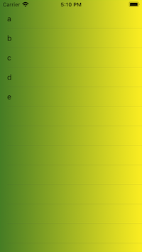
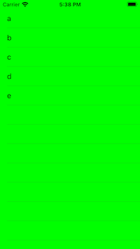

# A Gradient Layer Below a UITableView
## It is possible!

This one really annoyed me. Placing a `CAGradientLayer()` in the background of a `UITableView` should be super super easy, right? Well, not quite. Let us take a look.

Difficulty: Beginner | **Easy** | Normal | Challenging<br/>
This article has been developed using Xcode 12.5, and Swift 5.4

## Prerequisites:
* I'd like you to know something about [the UITableView created programatically](https://stevenpcurtis.medium.com/the-programmatic-uitableview-example-e6936d5557af)
* This article goes over some aspects of the [UIViewController lifecycle](https://stevenpcurtis.medium.com/the-uiviewcontroller-lifecycle-b964cf18256b)

# The output
The idea of this project is to create a `UITableView` with a gradient right behind it. The resultant project will run in the simulator with something like the following: 


It should be simple but...

# The challenge
Essentially here is a simple `UITableViewController` which, in this case, displays the `String`s "a", "b", "c", "d" and "e".

The issue is putting the `CAGradientLayer` into place. 

If you'd like to get that natty green to yellow transition like in the image above, you might have a gradient layer expressed like the following:

```swift
let gradientLayer = CAGradientLayer()
gradientLayer.frame = view.bounds
gradientLayer.colors = [#colorLiteral(red: 0.2745098174, green: 0.4862745106, blue: 0.1411764771, alpha: 1).cgColor, UIColor(red: 252/255, green: 238/255, blue: 33/255, alpha: 1).cgColor]
gradientLayer.startPoint = CGPoint(x: 0.0, y: 0.5)
gradientLayer.endPoint = CGPoint(x: 1.0, y: 0.5)
gradientLayer.shouldRasterize = true
bgView.layer.addSublayer(gradientLayer)
```

Which is great. But where to put that code?

## The options
**Put it in viewDidLoad**
You might wish to put this code in `viewDidLoad` as the frame is set at that point. You could do this right before setting the background colour of the table itself (which I've done to make sure that the gradient is displayed).

Something like:
```swift
override func viewDidLoad() {
    super.viewDidLoad()

    let gradientLayer = CAGradientLayer()
    gradientLayer.frame = view.bounds
    gradientLayer.colors = [#colorLiteral(red: 0.2745098174, green: 0.4862745106, blue: 0.1411764771, alpha: 1).cgColor, UIColor(red: 252/255, green: 238/255, blue: 33/255, alpha: 1).cgColor]
    gradientLayer.startPoint = CGPoint(x: 0.0, y: 0.5)
    gradientLayer.endPoint = CGPoint(x: 1.0, y: 0.5)
    gradientLayer.shouldRasterize = true
    bgView.layer.addSublayer(gradientLayer)
    
    bgView.autoresizingMask = [.flexibleWidth, .flexibleHeight]
    bgView.backgroundColor = .green

    self.view.addSubview(bgView)
```

you know what happens? Nothing. 



You know why? The frame is not set in `viewDidLoad`, so our gradient layer has a zero size. That sucks, and in the demonstration code from the repo we get a `UITableView` with a bright green background rather than a gradient. That sucks.

**Put it in viewDidLayoutSubviews()**
This seems a much better solution. When we hit `viewDidLayoutSubviews()` the frame is set! Excellent! The code might go something like the following:

```swift
override func viewDidLayoutSubviews() {
    super.viewDidLayoutSubviews()
    let gradientLayer = CAGradientLayer()
    gradientLayer.frame = view.bounds
    gradientLayer.colors = [#colorLiteral(red: 0.2745098174, green: 0.4862745106, blue: 0.1411764771, alpha: 1).cgColor, UIColor(red: 252/255, green: 238/255, blue: 33/255, alpha: 1).cgColor]
    gradientLayer.startPoint = CGPoint(x: 0.0, y: 0.5)
    gradientLayer.endPoint = CGPoint(x: 1.0, y: 0.5)
    gradientLayer.shouldRasterize = true
    bgView.layer.addSublayer(gradientLayer)
}
```

Yeah! We get the right answer, we get a rather lovely gradient background!

**Put it in viewDidLayoutSubviews() properly**
What makes you think that viewDidLayoutSubviews is only called a single time?

It probably won't be - it's called once per run loop when any view has `setNeedsLayout` or `setNeedsDisplayInRect` called, or **rotation**. Oh my. 

```
We would be adding a new layer for each call. This therefore isn't a great idea.
```

You might see problems around the edges when rotating a device. Not good all in all.

The solution?

We could remove the gradientLayer outside the function, and make sure that we remove the old layer first.

```swift
let gradientLayer = CAGradientLayer()

override func viewDidLayoutSubviews() {
    super.viewDidLayoutSubviews()
    gradientLayer.removeFromSuperlayer()
    gradientLayer.frame = view.bounds
    gradientLayer.colors = [#colorLiteral(red: 0.2745098174, green: 0.4862745106, blue: 0.1411764771, alpha: 1).cgColor, UIColor(red: 252/255, green: 238/255, blue: 33/255, alpha: 1).cgColor]
    gradientLayer.startPoint = CGPoint(x: 0.0, y: 0.5)
    gradientLayer.endPoint = CGPoint(x: 1.0, y: 0.5)
    gradientLayer.shouldRasterize = true
    bgView.layer.addSublayer(gradientLayer)
}
```

This becomes much more efficient, and of course actually work!

# Code

```swift
import UIKit

class ViewController: UIViewController {
    
    let viewModel: ViewModel
    let tableView: UITableView = UITableView()
    
    let data: [String] = ["a", "b", "c", "d", "e"]


    init(viewModel: ViewModel) {
        self.viewModel = viewModel
        super.init(nibName: nil, bundle: nil)
    }
    
    required init?(coder: NSCoder) {
        fatalError("init(coder:) has not been implemented")
    }

    override func loadView() {
        super.loadView()
        let view = UIView()
        view.backgroundColor = .red
        self.view = view
    }
    
    let bgView = UIView()

    override func viewDidLoad() {
        super.viewDidLoad()
        
        bgView.autoresizingMask = [.flexibleWidth, .flexibleHeight]
        bgView.backgroundColor = .green

        self.view.addSubview(bgView)
        
        tableView.register(UITableViewCell.self, forCellReuseIdentifier: "cell")
        self.view.addSubview(tableView)
        tableView.translatesAutoresizingMaskIntoConstraints = false
        tableView.delegate = self
        tableView.dataSource = self
        tableView.backgroundColor = .clear

        NSLayoutConstraint.activate(
            [
                tableView.topAnchor.constraint(equalTo: view.topAnchor),
                tableView.bottomAnchor.constraint(equalTo: view.bottomAnchor),
                tableView.leadingAnchor.constraint(equalTo: view.leadingAnchor),
                tableView.trailingAnchor.constraint(equalTo: view.trailingAnchor)
            ]
        )
    }
    
    let gradientLayer = CAGradientLayer()

    override func viewDidLayoutSubviews() {
        super.viewDidLayoutSubviews()
        gradientLayer.removeFromSuperlayer()
        gradientLayer.frame = view.bounds
        gradientLayer.colors = [#colorLiteral(red: 0.2745098174, green: 0.4862745106, blue: 0.1411764771, alpha: 1).cgColor, UIColor(red: 252/255, green: 238/255, blue: 33/255, alpha: 1).cgColor]
        gradientLayer.startPoint = CGPoint(x: 0.0, y: 0.5)
        gradientLayer.endPoint = CGPoint(x: 1.0, y: 0.5)
        gradientLayer.shouldRasterize = true
        bgView.layer.addSublayer(gradientLayer)
    }
}

extension ViewController: UITableViewDataSource {
    func tableView(_ tableView: UITableView, numberOfRowsInSection section: Int) -> Int {
        data.count
    }
    
    func tableView(_ tableView: UITableView, cellForRowAt indexPath: IndexPath) -> UITableViewCell {
        let cell = tableView.dequeueReusableCell(withIdentifier: "cell", for: indexPath)
        cell.textLabel?.text = data[indexPath.row]
        cell.backgroundColor = .clear
        return cell
    }
}
extension ViewController: UITableViewDelegate {}
```

# Conclusion
I've heard of people having issues with this through StackOverflow and on the grapevine. Well. At least we have some form of solution now. I hope it helps you out.

If you've any questions, comments or suggestions please hit me up on [Twitter](https://twitter.com/stevenpcurtis)
